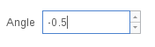
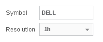

Annotation functions overview
=============================

.. contents:: :local:
    :depth: 2

``study`` annotation
--------------------

Every *indicator* [#strategy]_ script must contain at least one call of the annotation function
`study <https://www.tradingview.com/study-script-reference/#fun_study>`__ which has the following signature:

.. code-block:: text

    study(title, shorttitle, overlay, precision)

The given function determines the characteristics of all indicators as a
whole. Only ``title`` is a necessary argument which sets the name of the
indicator. This name will be used in the *Indicators'* dialogue.

``shorttitle`` is the short name of an indicator displayed in the
chart's legend. If it has not been specified, then it will use the
``title`` value.

``overlay`` is a logical type of argument. If it is true then the study
will be added as an overlay on top of the main series. If it is false
then it will be added on a separate chart pane; false is the default
setting.

``precision`` is a number of digits after the floating point for study
values on the price axis. Must be a non negative integer. Precision 0
has special rules for formatting very large numbers (like volume, e.g.
"5183" will be formatted as "5K"). Default value is 4.

``plot`` annotation
-------------------

The annotation `plot <https://www.tradingview.com/study-script-reference/#fun_plot>`__
accepts one mandatory argument --- the value of a *series* type --- and displays
it on the chart as a line. A very basic call looks like this:

::

    plot(close)

However, because there are automatic type conversions in Pine, instead
of a series type value, any numerical value can be transmitted. For
example:

::

    plot(125.2)

In this case, the value 125.2 will be automatically converted to a
series type value which will be the same number on every bar. The plot
will be represented as a horizontal line.

The annotation ``plot`` has a multitude of optional arguments, in
particular those which set the graph's display style: ``style``,
``color``, ``title``, ``linewidth``, ``transparency``, and others.

The parameter ``color`` can have a different effect depending on the
transmitted value. If it is set equal to a color type's constant, for
example ``red``, then the whole chart will be plotted with a *red* color::

    plot(close, color=red)

.. image:: images/Output_of_charts_plot_1.png

However, the argument ``color`` can receive an expression of a *series*
type of colored values as values. This series of colors will be used to
color the chart when rendered. For example::

    c = close >= open ? lime : red
    plot(close, color = c)

.. image:: images/Output_of_charts_plot_2.png

Interest also represents the argument ``offset`` of the function
``plot``. It specifies the shift used when the chart is plotted
(negative values shift the chart to the left, while positive values --- to
the right) [#offset_function]_. For example::

    study("My Script 12", overlay=true)
    plot(close, color=red, offset=-5)
    plot(close, color=lime, offset=5)

.. image:: images/Output_of_charts_plot_3.png

As can be seen in the screenshot, the *red* series has been shifted to the
left (since the argument's value ``offset`` is negative), while the *green*
series has been shifted to the right (its value ``offset`` is positive).

Barcoloring a series with ``barcolor``
--------------------------------------

The annotation function `barcolor <https://www.tradingview.com/study-script-reference/#fun_barcolor>`__ 
lets you specify a color for a bar
dependent on the fulfillment of a certain condition. The following
example script renders the *inside* and *outside* bars in different colors::

    study("barcolor example", overlay=true)
    isUp() => close > open
    isDown() => close <= open
    isOutsideUp() => high > high[1] and low < low[1] and isUp()
    isOutsideDown() => high > high[1] and low < low[1] and isDown()
    isInside() => high < high[1] and low > low[1]
    barcolor(isInside() ? yellow : isOutsideUp() ? aqua : isOutsideDown() ? purple : na)

.. image:: images/Barcoloring_a_series_barcolor_1.png

As you can see, when passing the ``na`` value, the colors stay the default
chart color.

Background coloring with ``bgcolor``
------------------------------------

Similar to the ``barcolor`` function, the `bgcolor <https://www.tradingview.com/study-script-reference/#fun_bgcolor>`__ 
function changes the color
of the background. Function will the color of that can be calculated in
an expression, and an optional parameter ``transp`` --- transparency from
0--100 range --- which is 90 by default.

As an example, here's a script for coloring trading sessions (try it on
EURUSD, 30 min resolution)::

    study("bgcolor example", overlay=true)
    timeinrange(res, sess) => time(res, sess) != 0
    premarket = #0050FF
    regular = #0000FF
    postmarket = #5000FF
    notrading = na
    sessioncolor = timeinrange("30", "0400-0930") ? premarket : timeinrange("30", "0930-1600") ? regular : timeinrange("30", "1600-2000") ? postmarket : notrading
    bgcolor(sessioncolor, transp=75)

.. image:: images/Background_coloring_bgcolor_1.png

Indicator inputs
----------------

`input <https://www.tradingview.com/study-script-reference/#fun_input>`__ annotations 
make it possible to indicate which variables in the
indicator's code are *incoming*. Widgets will be generated for the
variables on the indicator's (properties/attributes) page in order to
change the values via a more convenient way than modifying the script's
source code. You can also specify the title of the input in the form of
a short text string. The title is meant to explain the purpose of the
input, and you can specify lowest and highest possible values for
numerical inputs.

When the document is written, in Pine there are the following types of
inputs:

-  bool,
-  integer,
-  float,
-  string,
-  symbol,
-  resolution,
-  session,
-  source.

The following examples show how to create, each input and what
its widgets look like.

::

    b = input(title="On/Off", type=bool, defval=true)
    plot(b ? open : na)

.. figure:: images/Inputs_of_indicator_1.png
   
   Boolean input

::

    i = input(title="Offset", type=integer, defval=7, minval=-10, maxval=10)
    plot(offset(close, i))

.. figure:: images/Inputs_of_indicator_2.png

   Integer input

::

    f = input(title="Angle", type=float, defval=-0.5, minval=-3.14, maxval=3.14, step=0.2)
    plot(sin(f) > 0 ? close : open)

   Float input

::

    sym = input(title="Symbol", type=symbol, defval="SPY")
    res = input(title="Resolution", type=resolution, defval="60")
    plot(close, color=red)
    plot(security(sym, res, close), color=green)

   Symbol and resolution inputs

The symbol input widget has a built-in *symbol search* which is turned
on automatically when the ticker's first symbols are typed.

::

    s = input(title="Session", type=session, defval="24x7")
    plot(time(period, s))

.. figure:: images/Inputs_of_indicator_5.png

   Session input

::

    src = input(title="Source", type=source, defval=close)
    ma = sma(src, 9)
    plot(ma)

.. figure:: images/Inputs_of_indicator_6.png

   Source input

Price levels, ``hline``
-----------------------

The annotation function `hline <https://www.tradingview.com/study-script-reference/#fun_hline>`__ 
renders a horizontal line at a given
fixed price level. For example::

    study(title="Chaikin Oscillator", shorttitle="Chaikin Osc")
    short = input(3,minval=1), long = input(10,minval=1)
    osc = ema(accdist, short) - ema(accdist, long)
    plot(osc, color=red)
    hline(0, title="Zero", color=gray, linestyle=dashed)

.. image:: images/Price_levels_hline_1.png

A *number* must be the first argument of ``hline``. Values of a *series* type
are forbidden. It's possible to create a few horizontal lines with the
help of ``hline`` and fill in the background between them with a
translucent light using the function `fill <https://www.tradingview.com/study-script-reference/#fun_fill>`__.

Filling in the background with ``fill``
---------------------------------------

The `fill <https://www.tradingview.com/study-script-reference/#fun_fill>`__ 
annotation function lets you color the background between two
series, or two horizontal lines (created with ``hline``). The following
example illustrates how it works::

    study("fill Example")
    p1 = plot(sin(high))
    p2 = plot(cos(low))
    p3 = plot(sin(close))
    fill(p1, p3, color=red)
    fill(p2, p3, color=blue)
    h1 = hline(0)
    h2 = hline(1.0)
    h3 = hline(0.5)
    h4 = hline(1.5)
    fill(h1, h2, color=yellow)
    fill(h3, h4, color=lime)

.. image:: images/Filling_in_the_background_between_objects_with_fill_1.png

Please note that ``fill`` annotation is not designed to be used with ``plot`` and ``hline`` arguments simultaneously. 
As a workaround you may replace ``hline`` call with a ``plot(<constant number>)``. For example::

    study("Fill example 2")
    src = close, len = 10
    ma = sma(src, len)
    osc = 100 * (ma - src) / ma
    p = plot(osc)
    // NOTE: fill(p, hline(0)) wouldn't work, instead use this:
    fill(p, plot(0))

.. image:: images/Filling_in_the_background_between_objects_with_fill_2.png

You can set the filling color by using constants like ``color=red`` or
``color=#ff001a`` as well as complex expressions like ``color = close >=
open ? green : red``. Example::

    //@version=2
    study(title="Colored fill")
    line1=sma(close,5)
    line2=sma(close,20)
    p1 = plot(line1)
    p2 = plot(line2)
    fill(p1, p2, color = line1>line2 ? green : red)

.. image:: images/Filling_in_the_background_between_objects_with_fill_3.png

Alert conditions
----------------

The annotation function
`alertcondition <https://www.tradingview.com/study-script-reference/#fun_alertcondition>`__
allows you to create custom *alert conditions* in Pine indicators. One script may have one or more ``alertcondition`` calls.
The function has the following signature:

.. code-block:: text

    alertcondition(condition, title, message)

``condition``
   is a series of boolean (``true`` or ``false``) values that is used for alert.
   ``true`` means that the alert condition is met, alert
   should trigger. ``false`` means that the alert condition is not met, alert should not
   trigger. It is a required argument.

``title``
   is an optional argument that sets the name of the alert condition.

``message``
   is an optional argument that specifies text message to display
   when the alert fires.

Here is example of creating an alert condition::

    //@version=2
    study("Example of alertcondition")
    src = input(close)
    ma_1 = sma(src, 20)
    ma_2 = sma(src, 10)
    c = cross(ma_1, ma_2)
    alertcondition(c, title='Red crosses blue', message='Red and blue have crossed!')
    plot(ma_1, color=red)
    plot(ma_2, color=blue)

The function creates alert condition that is available in *Create Alert*
dialog. Please note, that alertcondition **does NOT start alerts programmatically**, 
it only gives you opportunity to create a custom
condition for *Create Alert* dialog. Alerts must be still started manually.
Also, an alert created with a custom ``alertcondition`` in Pine
code is not displayed on a chart.

To create an alert based on an alertcondition, one should apply a Pine indicator 
with an alertcontidion to the current chart, open the *Create Alert*
dialog, select the applied Pine code as main condition for the alert and
choose the specific alert condition (implemented in the code itself).

.. image:: images/Alertcondition_1.png

When alert fires, you'll see the message:

.. image:: images/Alertcondition_2.png

.. rubric:: Footnotes

.. [#strategy] There is also a similar `strategy <https://www.tradingview.com/study-script-reference/#fun_strategy>`__ 
   annotation which is used to create a :doc:`backtesting strategy <Strategies>` rather than an indicator.

.. [#offset_function] In Pine there is a built-in function
   `offset <https://www.tradingview.com/study-script-reference/#fun_offset>`__
   which also enables the values of a series to be shifted, but only to the
   right. At the same time the values 'out of range' of the current bar are
   discarded. The advantage of ``offset`` lies in the fact that its result
   can be used in other expressions to execute complex calculations. In the
   case of the argument ``offset`` of the function ``plot``, the shift appears
   to be merely a visual effect of the plot.