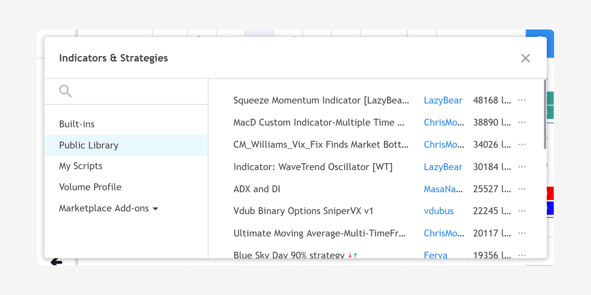
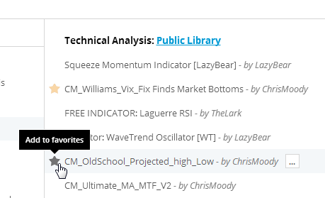
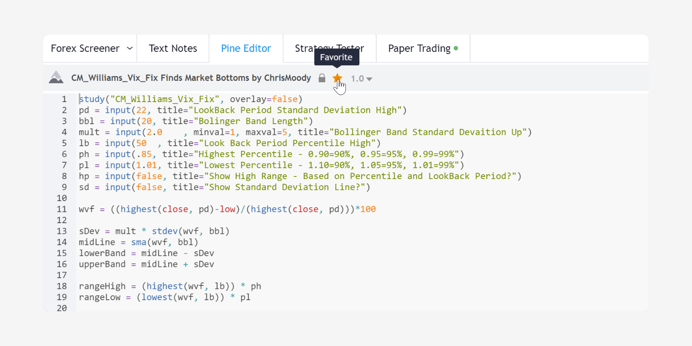
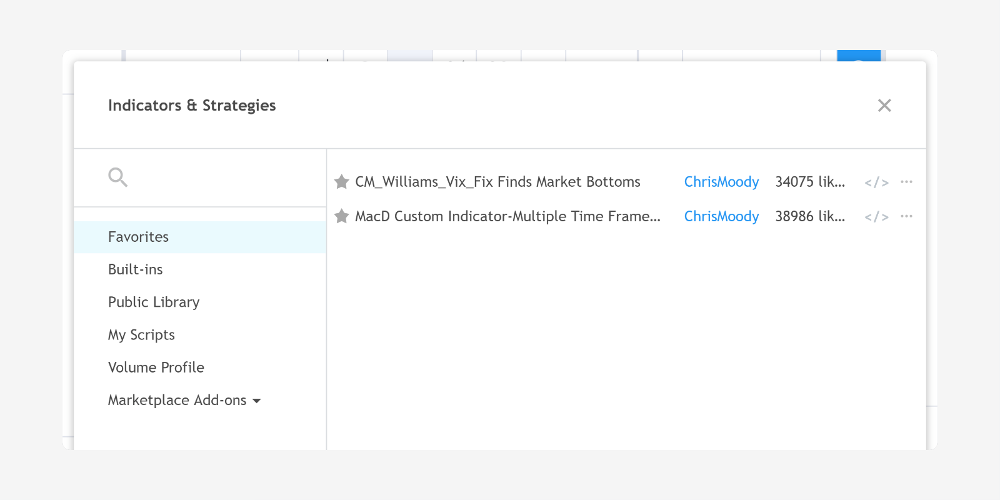
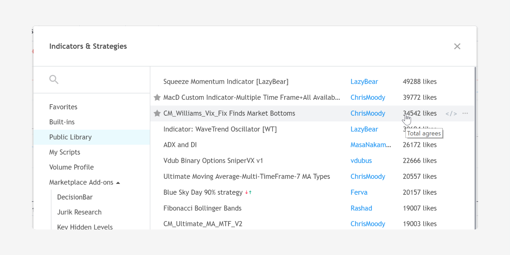
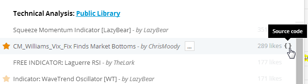
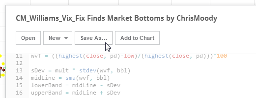
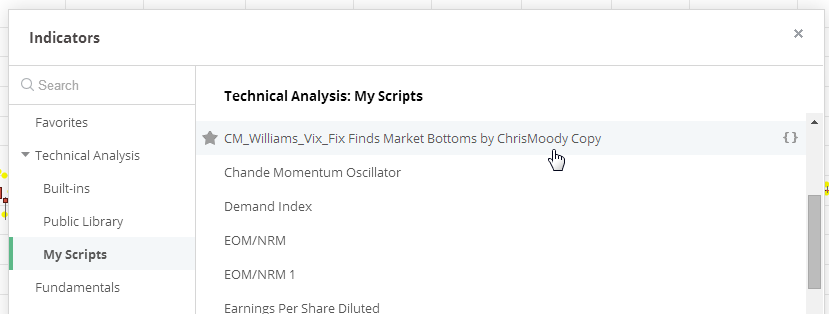
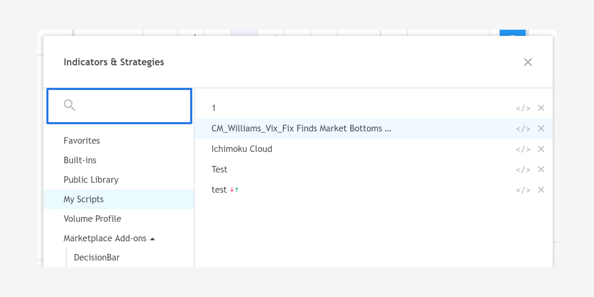

Public Library
==============

.. contents:: :local:
    :depth: 2

..    include:: <isonum.txt>

Description
-----------

On TradingView you may choose from our built-in scripts, from the user-published scripts in
the *Public Library*, or write your own custom scripts using Pine Script.
You can search the
library for scripts before writing one. You may also ask users
who publish scripts for help by sending them a private message (PM) on
TradingView.

The Public Library contains all user-published scripts. All
published scripts can be viewed either from the `Scripts <https://www.tradingview.com/script/>`__ section
of tradingview.com's page,
or from the *Indicators* |rarr| *Public Library* tab:

|Public_Library_tab|

Copying a script from the Public to your Personal Library
---------------------------------------------------------

To copy a script, use one of the two following methods:

#. Click the star next to the needed script in the Indicators window: |Add_to_Personal_Library|

#. Open the needed script from the `Scripts <https://www.tradingview.com/script/>`__ section
   and click the *Add to Favorite Scripts* button: |Add_to_Personal_Library_2|

The script will be added to your Favorites section in the Indicators
window, where you can easily find it when needed:

|Favorites_section|

Scripts in the *Indicators* window are sorted by popularity. Scripts with the most likes appear first:

|Sorted_by_popularity|

Editing a script from the Public Library
----------------------------------------

To edit a script from the Public Library:

#. Open the script (the script will be unavailable for editing and
   will be colored lighter than normal): |Open_the_script|

#. Click on the *Save As...* button, enter the desired name and save a copy in your
   personal library: |Save_as|

A saved copy of the script will appear in the list of your scripts in
the *Indicators* |rarr| *My Scripts* tab: |My_Scripts|

Now you can open and edit the script.

If the same script is published more than once, a notification on older
versions will appear, indicating a new version is available.

Searching for a script
----------------------

To search for a script, use the *Search* field in the *Indicators* dialog:

|Search_field|

This will search both your Personal and Public Library at the same time:

|Search|

You may also search for scripts from the tradingview.com home page
by first selecting *Scripts* from the *Ticker* dropdown menu and
entering your search criteria.

Educational videos
------------------

#. `Importing Custom Indicators <https://player.vimeo.com/video/86111066>`__
#. `Publishing Custom Indicators <https://player.vimeo.com/video/103138248>`__
#. `Pine Script Reference Material <https://player.vimeo.com/video/103135482>`__

.. |Search_field| image:: images/Search_field.png

