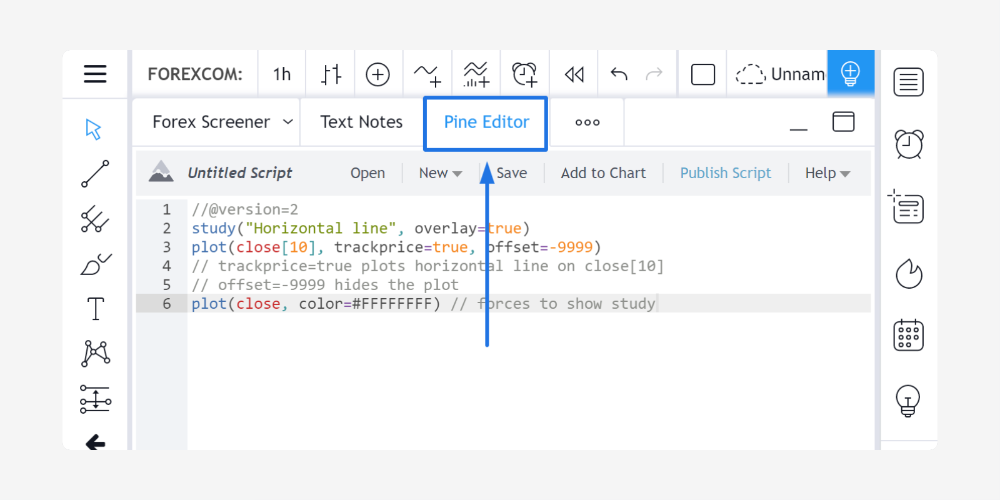
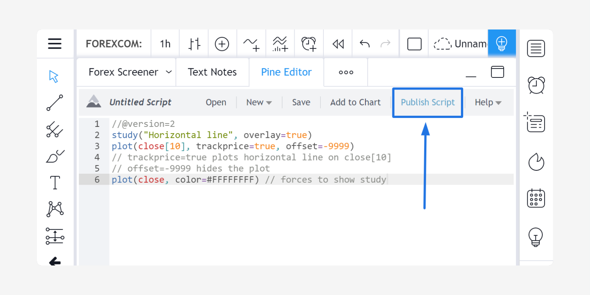
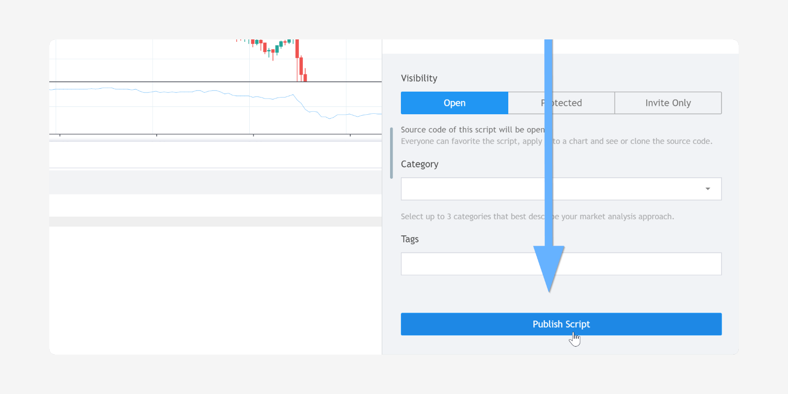
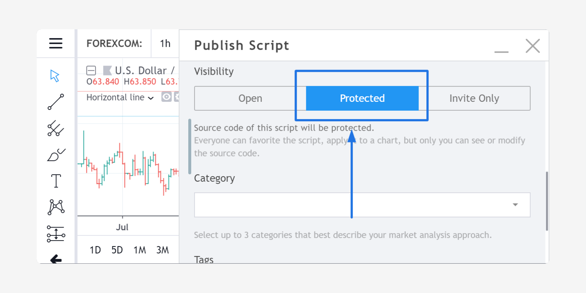
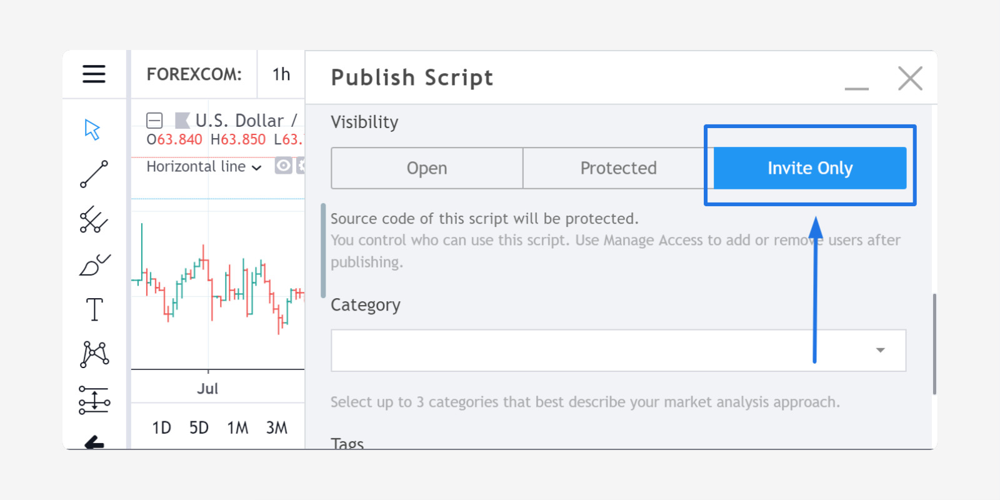
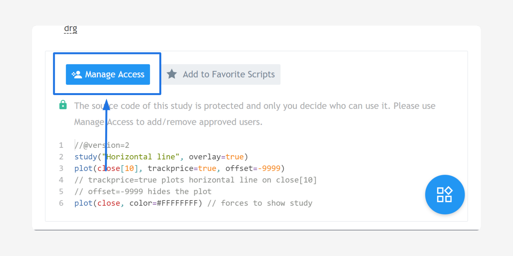

Publishing scripts
==================

.. contents:: :local:
    :depth: 2

Users who write their own scripts can publish them in the :doc:`Public_Library` to share their
scripts with other users. Each published script gets a page with a
description, screenshot and source code, so users can see what the
script is about before using it. If you want to protect your
script's code, you can publish your script using *Protected* or *Invite-Only* modes, which hide
the source code from other users.

Open source
-----------

To publish an *open source* Pine script:

#. Open Pine Script Editor: |Pine_editor|
#. Open/write the script.
#. Apply the script to the current chart and arrange the chart the way you want it to appear when it is published with your script.
#. Click the *Publish Script* button: |Publish_script_button|
#. Select the *Publish New Script* button: |Publish_script_new|
#. Enter the script's title, tags (optional) and description.
#. Click the *Publish Script* button.

The published script will be displayed in the `Public Library <https://www.tradingview.com/script/>`__,
which is available to all TradingView users. Any registered TradingView user will be able to make a copy of
your script.

Choosing a licence
^^^^^^^^^^^^^^^^^^

Choosing to use an open source license is entirely up to you. You are under no
obligation to do so. If you publish scripts with open source code you
may choose the license of your choice. You can include the license in
the comments section of your script (preferably in the beginning). Our
position on the matter is similar to that of
`GitHub <https://help.github.com/articles/licensing-a-repository/>`__.

Protected source
----------------

It is possible to publish scripts in *protected source* mode. This is a
high-demand feature that lets you share knowledge while protecting your
intellectual property. These scripts are available
in the :doc:`Public_Library` and any user can use them, but only the
author can see the source code. Users can view, comment and favorite
the script. It will also be available in the Public Library section of the
Indicators dialog box, and any user will be able to add this script to a chart. Only the
author, however, can view the source code of protected scripts. This is a great
option for those who want to share a script while protecting its code.

To publish a script using protected mode, simply choose *Protected* prior to
publishing from the script publication window:

|Protected_script_new|

Managed access
--------------

Authors can choose to manage who can access their scripts. This is great for
commercial vendors, or authors who want to protect their IP or share
with only a few select people. Authors who whish to sell access to their scripts
must arrange for off-site payment and then use TradingView's *Manage Access* feature to
provide access to customers.

To publish a script using the managed access mode, simply choose the *Invite Only* option prior to publishing
from the script's publication window.
Only users you specifically add will then be able to use your script.

|Invite_only_script_new|

On the published script's page, authors will see a *Manage Access* button, where they can add/remove
users and manage access rights.

|Manage_access_button|

Invite-only indicators are visible in the :doc:`Public_Library`,
but nobody can add them to a chart without
explicit permission from the author, and only the author can see the script's
source code. Users may view, comment and favorite the script.
TradingView does not take a percentage of revenue from script sales.

All your scripts published in managed access mode are shown in a
separate section of the Indicators window:

|Invite_only_tab|

.. |Invite_only_tab| image:: images/Invite_only_tab.png

