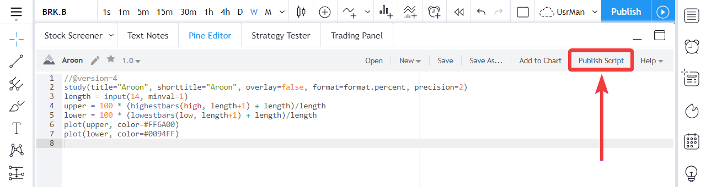
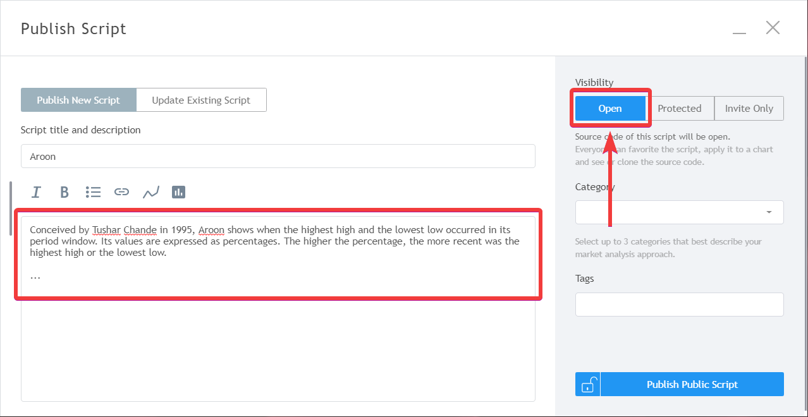
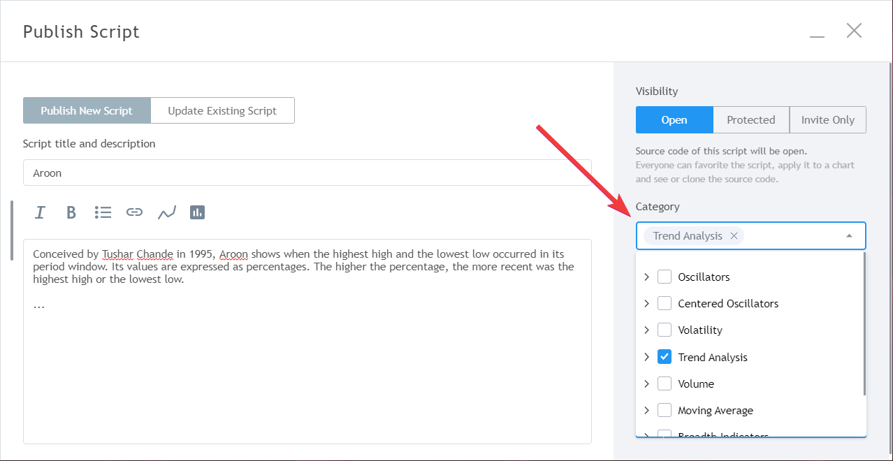
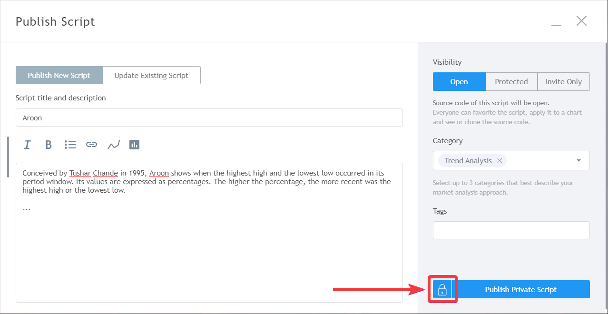
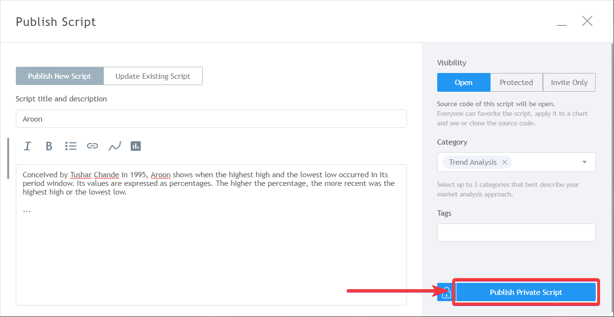
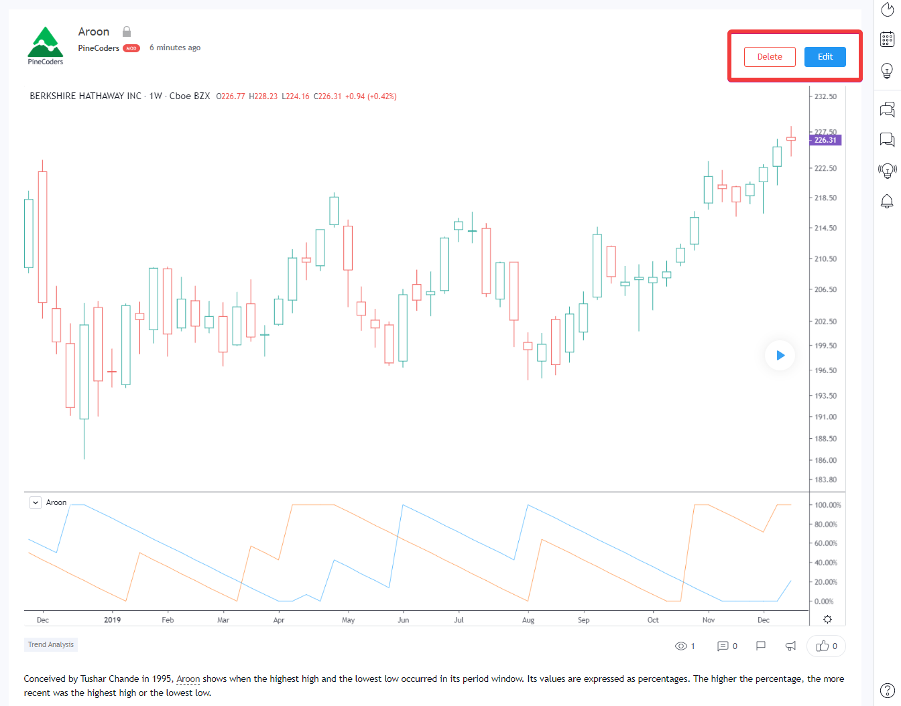
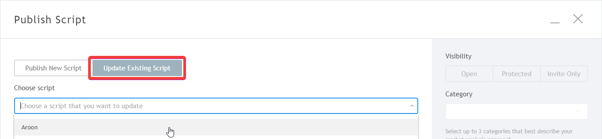
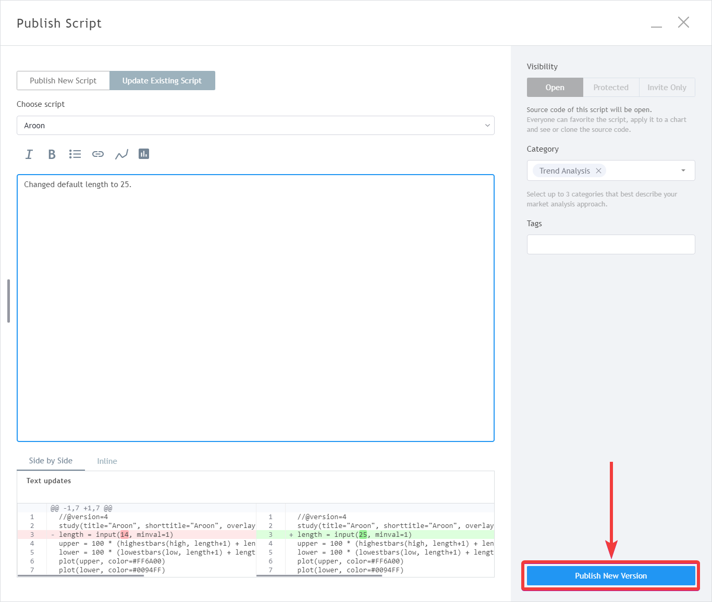

Publishing scripts
==================

.. contents:: :local:
    :depth: 2

Users who write scripts and wish to share them with others can publish them. If you write scripts for your own use only, you can save them in the Pine Editor; you do not need to publish them.

Public vs private scripts
-------------------------

You can share scripts with other users in two ways: **publicly** or **privately**. Either way you will be able to publish your script in *open source*, *protected* or *invite-only* mode.

When you publish a script
^^^^^^^^^^^^^^^^^^^^^^^^^

- Your script's name is determined by the ``title`` parameter's value in the script's ``study`` or ``strategy`` declaration statement.
- Your script must have a description explaining what your script does and how to use it.
- The chart published with you script is the one in use when you publish, including any other scripts or drawings on it.
- Once published, you will not be able to modify the script's original description.
- The script's code can later be updated. Each update can include *release notes* which will appear, dated, under your original description.
- Scripts can be liked, shared, commented on or reported by other users.
- Your published scripts appear under the *Scripts* tab of your user profile.
- A *script widget* and a *script page* are created for your script. The script widget is your script's placeholder showing in lists of scripts. It contains your script's title, chart and the first few lines of your description. When users click on your script widget, the script's page opens. It contains all the information relating to your script. 

Public scripts
^^^^^^^^^^^^^^

- Are published in TradingView's :doc:`Public_Library` where they become visible to the millions of users in the international TradingView community.
- Cannot be deleted.
- Must comply with our `script publishing House Rules <https://www.tradingview.com/house-rules/#scripts>`__ and are subject to moderation.
- Are accessible through the search functions for scripts.

Private scripts
^^^^^^^^^^^^^^^

- Are only published on your user profile's *Scripts* tab. If you want to share them with other users, use the script's url.
- Can be identified with the "X" icon in the top right of their widget, which is used to delete a private script.
- Are not moderated.
- Cannot be linked to or mentioned from public TradingView content (ideas, script descriptions, comments, chats, etc.).
- Are not accessible through the search functions for scripts.

Publishing modes
----------------

Open source
^^^^^^^^^^^

The Pine code of scripts published in open-source mode is available to all users. Open-source scripts on TradingView use the Mozilla license by default, but you may choose any license you want. You can find information on licensing at `GitHub <https://help.github.com/articles/licensing-a-repository/>`__.

Protected
^^^^^^^^^

The code of protected scripts is hidden from view and no one but its author can access it. While the script's code is not accessible, protected scripts can be used freely by any user.

Invite-only
^^^^^^^^^^^

The invite-only publishing mode protects both the script's code and its accecss. The script's publisher must explicitly grant access to each user of an invite-only script. This mode is useful to authors who want to control who can access their script. It can be used by script vendors providing paid access to their scripts. This feature is only available to Premium accounts. Special House Rules apply to invite-only publications, as well as to script vendors.

TradingView does not benefit from script sales. Transactions concerning invite-only scripts are strictly between users and vendors, and do not involve TradingView.

Invite-only scripts are the only type of public scripts for which paid access is allowed on TradingView.

On their invite-only script's page, authors will see a *Manage Access* button. The *Manage Access* window allows authors to control who has access to their script.

|Manage_access_button|

How to publish a script
-----------------------

#. Prepare your description offline. When you publish a new public script, you have a 15-minute window to make changes to your description after you click the *Publish Public Script* button.
#. Prepare your chart. Load your script on the chart and remove other scripts or drawings that won't help users understand your script. Your script's plots should be easy to identify on the chart that will be published with it.
#. Load your code in the Pine Editor if it isn't already.
#. Open the Pine Editor: |Publishing_scripts-01-EditorButton|
#. Click the *Publish Script* button: |Publishing_scripts-02-PublishButton|
#. Copy your description in the field below the script's title.
#. Select the publication mode you want for your script: Open, Protected or Invite-Only. We have selected *Open* for open source. |Publishing_scripts-03-Mode|
#. Select the appropriate categories for your script (at least one is mandatory) and enter optional custom tags. |Publishing_scripts-04-Category|
#. Choose whether you want to publish a public (default) script or a private one. Here we will be publishing a private scritp, so we have clicked on the lock icon to select a private publication. |Publishing_scripts-05-Lock|
#. Select the *Publish Private/Public Script* button: |Publishing_scripts-06-Publish|
#. A confirmation page appears. For public scripts you will have 15 minutes to make edits or cancel the publication. There is no delay for private scripts. |Publishing_scripts-07-Edit|

How to update a script
----------------------

#. Before updating your script, prepare your chart the same way you would for a new publication, as the current chart will update the one that appears in your script's page. The chart published whith your first publication of the script will remain on the script's widget.
#. As you would for a new publication, load your script in the Editor and click the *Publish Script* button.
#. Once in the *Publish Script* window, select the *Update Existing Script* button. Then select the script to update from the *Choose script* dropdown menu and enter your release notes to be published with the update. |Publishing_scripts-10-UpdateExistingScript|
#. Click the *Publish New Version* button. |Publishing_scripts-11-PublishNewVersion|

.. |Publishing_scripts-01-EditorButton| image:: images/Publishing_scripts-01-EditorButton.png

.. |Pine_editor| image:: images/Pine_editor.png
.. |Publish_script_button| image:: images/Publish_script_button.png
.. |Publish_script_new| image:: images/Publish_script_new.png
.. |Protected_script_new| image:: images/Protected_script_new.png
.. |Invite_only_script_new| image:: images/Invite_only_script_new.png
.. |Manage_access_button| image:: images/Manage_access_button.png
.. |Invite_only_tab| image:: images/Invite_only_tab.png

