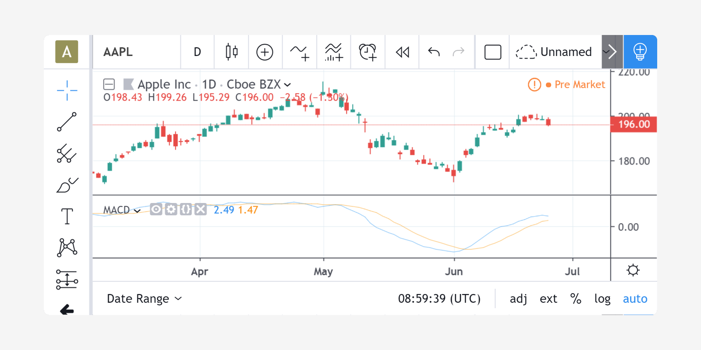

Quickstart guide
================

A script written in Pine is composed of functions and variables.
Functions contain instructions that describe the required calculations.
Variables save the values used or created during those
calculations.

A script must contain a ``study`` or ``strategy`` annotation which defines the script's
name and other properties. The script's body contains the functions
and variables necessary to calculate results which will be rendered
on a chart with a ``plot`` function, or some other function that plots the script's output.

Example of a Pine script
------------------------

Let's look at the implementation of the
`MACD <https://www.tradingview.com/wiki/MACD>`__ indicator in Pine:

.. code-block:: pine
    :linenos:

    //@version=4
    study("MACD")
    fast = 12, slow = 26
    fastMA = ema(close, fast)
    slowMA = ema(close, slow)
    macd = fastMA - slowMA
    signal = sma(macd, 9)
    plot(macd, color=color.blue)
    plot(signal, color=color.orange)

Line 1: ``//@version=4``
    This is a comment containing a compiler directive that tells the compiler the script will use version 4 of Pine.
Line 2: ``study("MACD")``
    Defines the name of the script that will appear on the chart as "MACD".
Line 3: ``fast = 12, slow = 26``
    Defines two integer variables: ``fast`` and ``slow``.
Line 4: ``fastMA = ema(close, fast)``
    Defines the variable ``fastMA``, containing the result of the
    EMA calculation (Exponential Moving Average) with a length equal
    to ``fast`` (12), on the ``close`` series, i.e., the closing price of bars.
Line 5: ``slowMA = ema(close, slow)``
    Defines the variable ``slowMA``, containing the result of the
    EMA calculation with a length equal to ``slow`` (26), from ``close``.
Line 6: ``macd = fastMA - slowMA``
    Defines the variable ``macd`` as the difference between the two EMAs.
Line 7: ``signal = sma(macd, 9)``
    Defines the variable ``signal`` as a smoothed value of
    ``macd`` using the SMA algorithm (Simple Moving Average) with
    a length of 9.
Line 8: ``plot(macd, color=color.blue)``
    Calls the ``plot`` function to output the variable ``macd`` using a blue line.
Line 9: ``plot(signal, color=color.orange)``
    Calls the ``plot`` function to output the variable ``signal`` using an orange line.

After adding the "MACD" script to the chart you will see the following:

Pine contains a variety of built-in functions for the most popular
algorithms (`SMA <https://www.tradingview.com/wiki/Moving_Average#Simple_Moving_Average_.28SMA.29>`__,
`EMA <https://www.tradingview.com/wiki/Moving_Average#Exponential_Moving_Average_.28EMA.29>`__,
`WMA <https://www.tradingview.com/wiki/Moving_Average#Weighted_Moving_Average_.28WMA.29>`__, etc.).
You can also define your custom functions. You will find a
description of all available built-in functions
`here <https://www.tradingview.com/pine-script-reference/v4/>`__.

"study" vs "strategy"
---------------------
Pine strategies are used to run backtests. In addition to normal script calculations, they also contain ``strategy.*`` calls to generate buy and sell orders. They can plot information on charts but cannot be used to generate alerts. See :doc:`/annotations/study_annotation`.

Pine studies, as the one in the previous example, also contain calculations and may plot information on charts, but cannot be used in backtesting. Studies containing ``alertcondition`` calls may be used to create alerts using the TradingView *Create Alert* dialog box. See :doc:`/essential/Strategies`.

Execution model of Pine scripts
-------------------------------

A Pine script is **not** like many normal programs that execute once and then stop. In the Pine runtime environment, a script runs in the equivalent of an invisible loop where it is executed once on each historical bar. When execution reaches the last, real-time bar, the script executes once every time price changes, then one final time when the real-time bar closes and becomes a historical bar.

By default, Pine *strategies* only execute once at the close of real-time bars, but they can also be instructed to execute on each price change, as *studies* do. See :doc:`/language/Execution_model`.

Series
------
The main data type used in Pine scripts is called a *series*. It is a continuous list of values that stretches back in time from the current bar and where one value exists for each bar. While this structure may remind many of an array, a Pine series is totally different and thinking in terms of arrays will be detrimental to understanding this key Pine concept. You can read about series :ref:`here <series>` and get more information on how to use them :ref:`here <history_referencing_operator>`.

Understanding scripts
---------------------
If you intend to write Pine scripts of any reasonable complexity, a good comprehension of both the Pine execution model and series is essential in understanding how Pine scripts work. If you have never worked with data organized in series before, you will need practice in putting them to work for you. When you familiarize yourself with Pine’s fundamental concepts, you will discover that by combining the use of series with our built-in functions designed to efficiently process series information, much can be accomplished in very few lines of Pine code.

Pine Editor
-----------

The Pine Editor is where you will be working on your scripts. To open it, click on the *Pine Editor* tab at the bottom of your TradingView chart. This will open up the editor's window. We will create our first working Pine script. Start by bringing up the “New” dropdown menu at the top right of the editor and choose *Blank indicator script*. Then copy the previous example script, select all code already in the editor and replace it with the example script. Click *Save*, choose a name and then click *Add to Chart*. The MACD indicator will appear in a separate *Pane* under the chart.

From here, you can change the script’s code. For example, change the last line’s ``color.orange`` for ``color.fuchsia``. When you save the script, the change will be reflected in the indicator’s pane. Your first Pine script is running!

Where to go from here?
----------------------

This documentation contains numerous examples of code used to illustrate how functions, variables and operators are used in Pine. By going through it, you will be able to both learn the foundations of Pine and study the example scripts.

The fastest way to learn a programming language is to read about key concepts and try them out with real code. As we’ve just done, copy this documentation’s examples in the editor and play with them. Explore! You won’t break anything.

You will also find examples of Pine scripts in the editor’s *New* dropdown menu and in TradingView's extensive Public Library of `scripts <https://www.tradingview.com/script/>`__ which contains thousands of open source Pine scripts. Enjoy and welcome to Pine!
