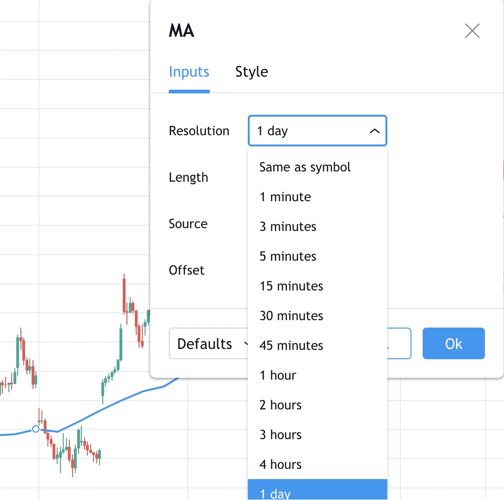
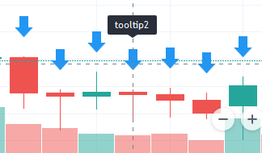

Release notes
=============

.. contents:: :local:
    :depth: 2

This page contains release notes of notable changes in Pine Script v4.

December 2020
--------------------------

New array types were added:

* ``array.new_line``
* ``array.new_label``
* ``array.new_string``

New functions were added:

* ``str.length`` - returns number of chars in source string.
* ``array.join`` - concatenates all of the elements in the array into a string and separates these elements with the specified separator.
* ``str.split`` - splits a string at a given substring separator.

November 2020
--------------------------

* New ``max_labels_count`` and ``max_lines_count`` parameters were added to the study and strategy functions. Now you can manage the number of lines and labels by setting values for these parameters from 1 to 500.

New function was added:

* ``array.range`` - return the difference between the min and max values in the array.

October 2020
--------------------------

The behavior of ``rising`` and ``falling`` functions have changed. For example, ``rising(close,3)`` is now calculated as following::

    close[0] > close[1] and close[1] > close[2] and close[2] > close[3]
    
September 2020
--------------------------

Added support for ``input.color`` to the ``input()`` function. Now you can provide script users with color selection through the script’s "Settings/Inputs" tab with the same color widget used throughout the TradingView user interface. Learn more about this feature in our `blog <https://www.tradingview.com/blog/en/create-color-inputs-in-pine-20751/>`_:

::

    //@version=4
    study("My Script", overlay = true)
    color c_labelColor = input(color.green, "Main Color", input.color)
    var l = label.new(bar_index, close, yloc = yloc.abovebar, text = "Colored label")
    label.set_x(l, bar_index)
    label.set_color(l, c_labelColor)
    
.. image:: images/input_color.png

Added support for arrays and functions for working with them. You can now use the powerful new array feature to build custom datasets. See our `User Manual page on arrays <https://www.tradingview.com/pine-script-docs/en/v4/essential/Arrays.html>`__ and our `blog <https://www.tradingview.com/blog/en/arrays-are-now-available-in-pine-script-20052/>`_::

    //@version=4
    study("My Script")
    a = array.new_float(0)
    for i = 0 to 5
        array.push(a, close[i] - open[i])
    plot(array.get(a, 4))

The following functions now accept a series length parameter. Learn more about this feature in our `blog <https://www.tradingview.com/blog/en/pine-functions-support-dynamic-length-arguments-20554/>`_:

* `alma <https://www.tradingview.com/pine-script-reference/v4/#fun_alma>`__
* `change <https://www.tradingview.com/pine-script-reference/v4/#fun_change>`__
* `highest <https://www.tradingview.com/pine-script-reference/v4/#fun_highest>`__
* `highestbars <https://www.tradingview.com/pine-script-reference/v4/#fun_highestbars>`__
* `linreg <https://www.tradingview.com/pine-script-reference/v4/#fun_linreg>`__
* `lowest <https://www.tradingview.com/pine-script-reference/v4/#fun_lowest>`__
* `lowestbars <https://www.tradingview.com/pine-script-reference/v4/#fun_lowestbars>`__
* `mom <https://www.tradingview.com/pine-script-reference/v4/#fun_mom>`__
* `sma <https://www.tradingview.com/pine-script-reference/v4/#fun_sma>`__
* `sum <https://www.tradingview.com/pine-script-reference/v4/#fun_sum>`__
* `vwma <https://www.tradingview.com/pine-script-reference/v4/#fun_vwma>`__
* `wma <https://www.tradingview.com/pine-script-reference/v4/#fun_wma>`__

::

    //@version=4
    study("My Script", overlay = true)
    length = input(10, "Length", input.integer, minval = 1, maxval = 100)
    avgBar = avg(highestbars(length), lowestbars(length))
    float dynLen = nz(abs(avgBar) + 1, length)
    dynSma = sma(close, int(dynLen))
    plot(dynSma)

August 2020
--------------------------

* Optimized script compilation time. Scripts now compile 1.5 to 2 times faster.

July 2020
--------------------------

* Minor bug fixes and improvements.

June 2020
--------------------------

* New ``resolution`` parameter was added to the ``study`` function. Now you can add MTF functionality to scripts and decide the timeframe you want the indicator to run on. 

Please note that you need to reapply the indicator in order for the `resolution` parameter to appear.

* The ``tooltip`` argument was added to the ``label.new`` function along with the ``label.set_tooltip`` function::

    //@version=4
    study("My Script", overlay=true)
    var l=label.new(bar_index, close, yloc=yloc.abovebar, text="Label")
    label.set_x(l,bar_index)
    label.set_tooltip(l, "Label Tooltip")
    

* Added an ability to create `alerts on strategies <https://www.tradingview.com/chart/?solution=43000481368>`__.

* A new function `line.get_price <https://www.tradingview.com/pine-script-reference/v4/#fun_line{dot}get_price>`__ can be used to determine the price level at which the line is located on a certain bar.

* New `label styles <https://www.tradingview.com/pine-script-reference/v4/#fun_label{dot}new>`__ allow you to position the label pointer in any direction.

.. image:: images/new_label_styles.png

* Find and Replace was added to Pine Editor. To use this, press CTRL+F (find) or CTRL+H (find and replace).

.. image:: images/FindReplace.jpg

* ``timezone`` argument was added for time functions. Now you can specify timezone for ``second``, ``minute``, ``hour``, ``year``, ``month``, ``dayofmonth``, ``dayofweek`` functions::

    //@version=4
    study("My Script")
    plot(hour(1591012800000, "GMT+1"))

* ``syminfo.basecurrency`` variable was added. Returns the base currency code of the current symbol. For EURUSD symbol returns EUR.

May 2020
--------------------------

* ``else if`` statement was added

* The behavior of ``security`` function has changed: the ``expression`` parameter can be series or tuple.

April 2020
--------------------------
New function was added:

* ``quandl`` - request quandl data for a symbol

March 2020
--------------------------

New function was added:

* ``financial`` - request financial data for a symbol

New functions for common indicators were added:

* ``cmo`` - Chande Momentum Oscillator
* ``mfi`` - Money Flow Index
* ``bb`` - Bollinger Bands
* ``bbw`` - Bollinger Bands Width
* ``kc`` - Keltner Channels
* ``kcw`` - Keltner Channels Width 
* ``dmi`` - DMI/ADX
* ``wpr`` - Williams % R 
* ``hma`` - Hull Moving Average
* ``supertrend`` - SuperTrend

Added a detailed description of all the fields in the `Strategy Tester Report <https://www.tradingview.com/chart/?solution=43000561856/>`__

February 2020
--------------------------

* New Pine indicator VWAP Anchored was added. Now you can specify the time period: Session, Month, Week, Year.

* Fixed a problem with calculating ``percentrank`` function. Now it can return a zero value, which did not happen before due to an incorrect calculation.

* The default ``transparency`` parameter for the ``plot``, ``plotshape``, and ``plotchar`` functions is now 0%.

* For the functions ``plot``, ``plotshape``, ``plotchar``, ``plotbar``, ``plotcandle``, ``plotarrow``, you can set the ``display`` parameter, which controls the display of the plot. The following values can be assigned to it:

  * ``display.none`` - the plot is not displayed
  * ``display.all`` - the plot is displayed (Default)

* The ``textalign`` argument was added to the ``label.new`` function along with the ``label.set_textalign`` function. Using those, you can control the alignment of the label's text::

    //@version=4
    study("My Script", overlay = true)
    var l = label.new(bar_index, high, text="Right\n aligned\n text", textalign=text.align_right)
    label.set_xy(l, bar_index, high)

  .. image:: images/Label_text_align.png

January 2020
--------------------------
  
New built-in variables were added:

* ``iii`` - Intraday Intensity Index
* ``wvad`` - Williams Variable Accumulation/Distribution
* ``wad`` - Williams Accumulation/Distribution
* ``obv`` - On Balance Volume
* ``pvt`` - Price-Volume Trend
* ``nvi`` - Negative Volume Index 
* ``pvi`` - Positive Volume Index
   
New parameters were added for ``strategy.close``:

* ``qty`` -  the number of contracts/shares/lots/units to exit a trade with
* ``qty_percent`` - defines the percentage of entered contracts/shares/lots/units to exit a trade with
* ``comment`` - addtional notes on the order
    
New parameter was added for ``strategy.close_all``:

* ``comment`` - additional notes on the order

December 2019
--------------------------
* Warning messages were added.

  For example, if you don't specify exit parameters for ``strategy.exit`` - ``profit``, ``limit``, ``loss``, ``stop`` or one of the following pairs: ``trail_offset`` and ``trail_price`` / ``trail_points`` - you will see a warning message in the console in the Pine editor.
* Increased the maximum number of arguments in ``max``, ``min``, ``avg`` functions. Now you can use up to ten arguments in these functions.  

October 2019
--------------------------
* ``plotchar`` function now supports most of the Unicode symbols::

    //@version=4
    study("My Script", overlay=true)
    plotchar(open > close, char="🐻")

  .. image:: images/Bears_in_plotchar.png

* New ``bordercolor`` argument of the ``plotcandle`` function allows you to change the color of candles' borders::

    //@version=4
    study("My Script")
    plotcandle(open, high, low, close, title='Title', color = open < close ? color.green : color.red, wickcolor=color.black, bordercolor=color.orange)

* New variables added:
  
  * ``syminfo.description`` - returns a description of the current symbol
  * ``syminfo.currency`` - returns the currency code of the current symbol (EUR, USD, etc.)
  * ``syminfo.type`` - returns the type of the current symbol (stock, futures, index, etc.)

September 2019
--------------------------

New parameters to the ``strategy`` function were added:

* ``process_orders_on_close`` allows the broker emulator to try to execute orders after calculating the strategy at the bar's close

* ``close_entries_rule`` allows to define the sequence used for closing positions

Some fixes were made:

* ``fill`` function now works correctly with ``na`` as the ``color`` parameter value

* ``sign`` function now calculates correctly for literals and constants

``str.replace_all (source, target, replacement)`` function was added. It replaces each occurrence of a ``target`` string in the ``source`` string with a ``replacement`` string

July-August 2019
--------------------------

New variables added: 

* ``timeframe.isseconds`` returns true when current resolution is in seconds
    
* ``timeframe.isminutes`` returns true when current resolution is in minutes
    
* ``time_close`` returns the current bar's close time 

The behavior of some functions, variables and operators has changed:

* The ``time`` variable returns the correct open time of the bar for more special cases than before

* An optional *seconds* parameter of the ``timestamp`` function allows you to set the time to within seconds 

* ``security`` function:
  
  * Added the possibility of requesting resolutions in seconds:

    1, 5, 15, 30 seconds (chart resolution should be less than or equal to the requested resolution)
    
  * Reduced the maximum value that can be requested in some of the other resolutions:
    
    from 1 to 1440 minutes
    
    from 1 to 365 days  
    
    from 1 to 52 weeks
    
    from 1 to 12 months

* Changes to the evaluation of ternary operator branches:

  In Pine v3, during the execution of a ternary operator, both its branches are calculated, so when this script is added to the chart, a long position is opened, even if the long() function is not called::

    //@version=3
    strategy(title = "My Strategy")
    long() =>
        strategy.entry("long", true, 1, when = open > high[1])
        1
    c = 0
    c := true ? 1 : long()
    plot(c)
    
  Pine v4 contains built-in functions with side effects ( ``line.new`` and ``label.new`` ). If calls to these functions are present in both branches of a ternary operator, both function calls would be executed following v3 conventions. Thus, in Pine v4, only the branch corresponding to the evaluated condition is calculated. While this provides a viable solution in some cases, it will modify the behavior of scripts which depended on the fact that both branches of a ternary were evaluated. The solution is to pre-evaluate expressions prior to the ternary operator. The conversion utility takes this requirement into account when converting scripts from v3 to v4, so that script behavior will be identical in v3 and v4.

June 2019
--------------------------

* Support for drawing objects. Added *label* and *line* drawings
* ``var`` keyword for one time variable initialization
* Type system improvements:

  * *series string* data type
  * functions for explicit type casting
  * syntax for explicit variable type declaration
  * new *input* type forms

* Renaming of built-ins and a version 3 to 4 converter utility
* ``max_bars_back`` function to control series variables internal history buffer sizes
* Pine Script documentation versioning

