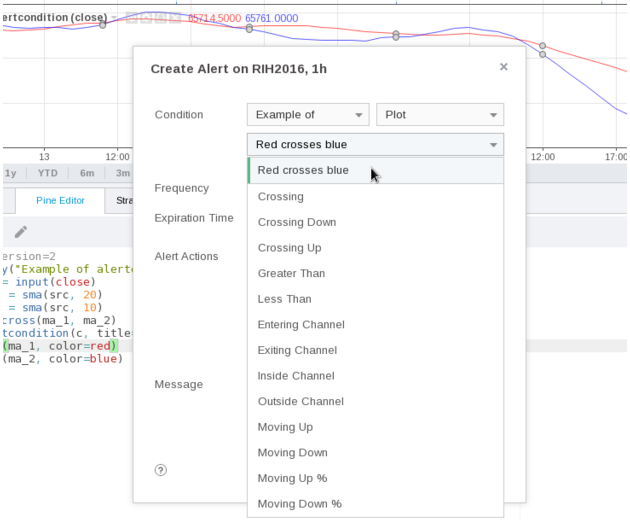
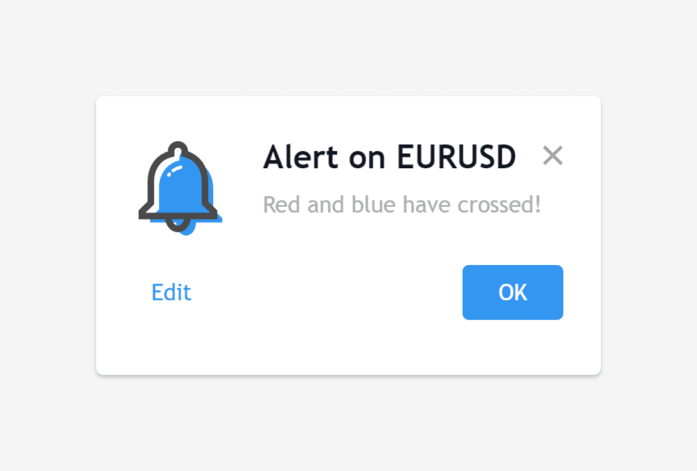

Alert conditions
----------------

The
`alertcondition <https://www.tradingview.com/pine-script-reference/v4/#fun_alertcondition>`__ annotation function
allows you to create custom *alert conditions* in Pine studies. One study may contain more than one ``alertcondition`` call.
While the presence of ``alertcondition`` calls in a Pine **strategy** script will not cause a compilation error,
alerts cannot be created from them.

The ``alertcondition`` function has the following signature:

.. code-block:: text

    alertcondition(condition, title, message)

``condition``
   is a series of boolean (``true`` or ``false``) values used to trigger the alert.
   ``true`` means the alert condition is met and the alert
   should trigger. ``false`` means the alert condition is not met and the alert should not
   trigger. It is a required argument.

``title``
   is an optional argument that sets the name of the alert condition as it will appear in TradingView's *Create Alert* dialog box.

``message``
   is an optional argument that specifies the text message to display
   when the alert fires. The text will appear in the *Message* field of the *Create Alert* dialog box,
   and can then be modified before the alert is created.

Here is an example of code creating an alert condition::

    //@version=4
    study("Example of alertcondition")
    src = input(close)
    ma_1 = sma(src, 20)
    ma_2 = sma(src, 10)
    c = cross(ma_1, ma_2)
    alertcondition(c, title='Red crosses blue', message='Red and blue have crossed!')
    plot(ma_1, color=color.red)
    plot(ma_2, color=color.blue)

The ``alertcondition`` function makes the alert available in the *Create Alert*
dialog box. Please note that the ``alertcondition`` **does NOT start alerts programmatically**;
it only gives you the opportunity to create an alert from it
in the *Create Alert* dialog box. Alerts must always be created manually.
An alert created from an ``alertcondition`` in the script's
code does not display anything on the chart, except the message when it triggers.

To create an alert based on an ``alertcondition``, one should apply a Pine study
containing at least one ``alertcondition`` call to the current chart, open the *Create Alert*
dialog box, select the study as the main condition for the alert, and then
choose one of the specific alert conditions defined in the study's code.

When the alert fires, you will see the following message:

When an alert is created, TradingView saves the following information with the
alert so that it can run independently in the cloud: the study's code, the 
current *Setting/Inputs* (including modifications made by the user), 
the chart's main symbol and timeframe. If you want any changes to this information to
be reflected in an existing alert's behavior, you will need to delete the 
alert and create a new one in the new context.
