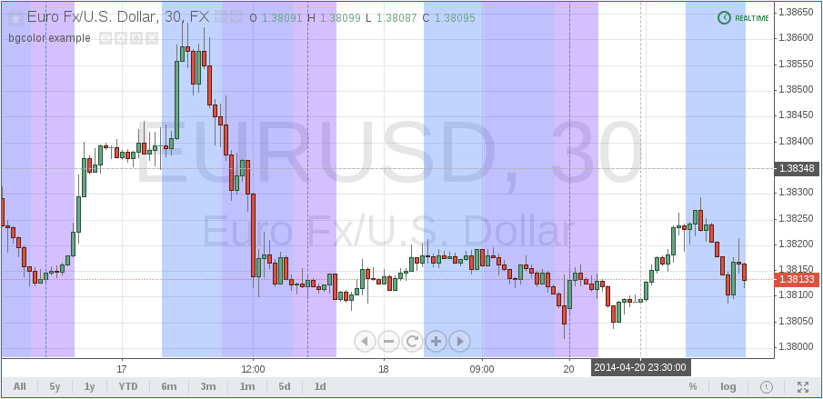

Background coloring with bgcolor
--------------------------------

The `bgcolor <https://www.tradingview.com/pine-script-reference/v4/#fun_bgcolor>`__
annotation function changes the color
of the script's background. If the script is running in ``overlay=true`` mode,
then it will color the chart's background.
The color used in ``bgcolor`` can be calculated in
an expression and an optional ``transp`` parameter (0--100, default 90) allows
control over the transparency level.

Here is a script that colors the background of trading sessions (try it on
EURUSD, at *30 minutes* resolution)::

    //@version=4
    study("bgcolor example", overlay=true)
    timeinrange(res, sess) => time(res, sess) != 0
    premarket = #0050FF
    regular = #0000FF
    postmarket = #5000FF
    color notrading = na
    sessioncolor = timeinrange("30", "0400-0930") ? premarket :
      timeinrange("30", "0930-1600") ? regular :
      timeinrange("30", "1600-2000") ? postmarket : notrading
    bgcolor(sessioncolor, transp=75)

