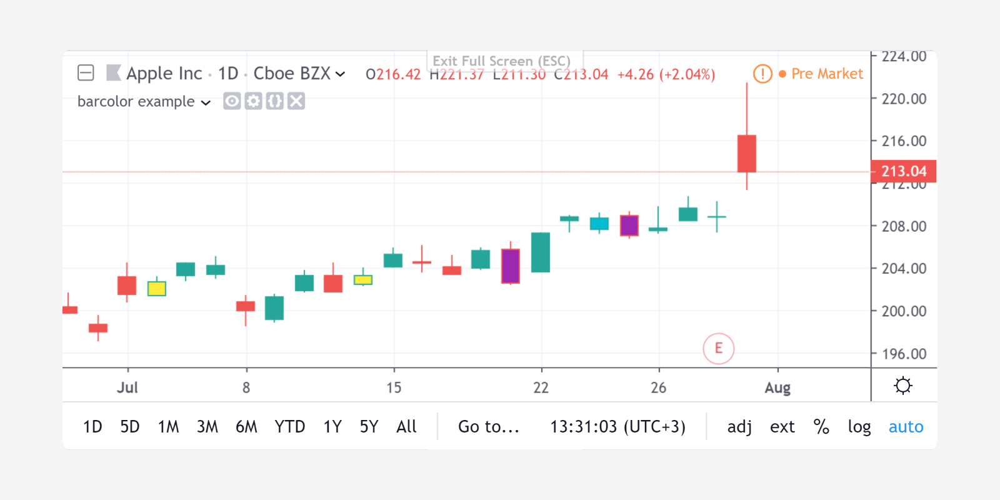

Barcoloring a series with barcolor
----------------------------------

The `barcolor <https://www.tradingview.com/pine-script-reference/v4/#fun_barcolor>`__
annotation function lets you specify the color of bars.
The coloring can be conditional. The following
script renders *inside* and *outside* bars in different colors::

    //@version=4
    study("barcolor example", overlay=true)
    isUp() => close > open
    isDown() => close <= open
    isOutsideUp() => high > high[1] and low < low[1] and isUp()
    isOutsideDown() => high > high[1] and low < low[1] and isDown()
    isInside() => high < high[1] and low > low[1]
    barcolor(isInside() ? color.yellow : isOutsideUp() ? color.aqua : isOutsideDown() ? color.purple : na)

As you can see, the ``na`` value leaves bars as is.

``barcolor`` works whether the script is running in ``overlay=true`` mode or not.
