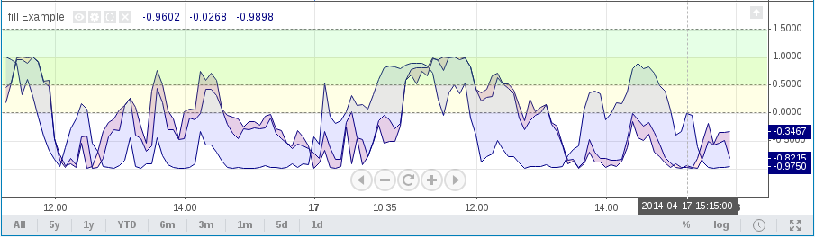
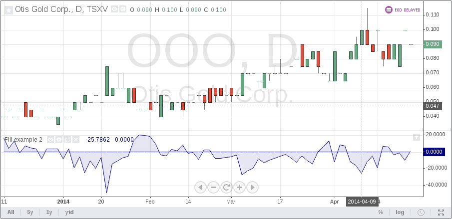
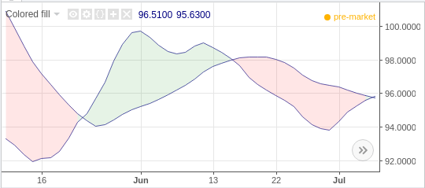

Filling the background with fill
--------------------------------

The `fill <https://www.tradingview.com/pine-script-reference/v4/#fun_fill>`__
annotation function lets you color the background between two plotted
series or two horizontal lines created with ``hline``. The following
example illustrates how ``fill`` works::

    //@version=4
    study("fill Example")
    p1 = plot(sin(high))
    p2 = plot(cos(low))
    p3 = plot(sin(close))
    fill(p1, p3, color=color.red)
    fill(p2, p3, color=color.blue)
    h1 = hline(0)
    h2 = hline(1.0)
    h3 = hline(0.5)
    h4 = hline(1.5)
    fill(h1, h2, color=color.yellow)
    fill(h3, h4, color=color.lime)

Please note that the ``fill`` annotation cannot be used with ``plot`` and ``hline`` arguments simultaneously.
As a workaround you may replace ``hline`` calls with a ``plot(<constant number>)``. For example::

    //@version=4
    study("Fill example 2")
    src = close, len = 10
    ma = sma(src, len)
    osc = 100 * (ma - src) / ma
    p = plot(osc)
    // NOTE: fill(p, hline(0)) wouldn't work, instead use this:
    fill(p, plot(0))

You can set the fill color by using constants like ``color=color.red`` or
``color=#ff001a``, as well as complex expressions like ``color = close >=
open ? color.green : color.red``. Example::

    //@version=4
    study(title="Colored fill")
    line1=sma(close, 5)
    line2=sma(close, 20)
    p1 = plot(line1)
    p2 = plot(line2)
    fill(p1, p2, color = line1 > line2 ? color.green : color.red)

