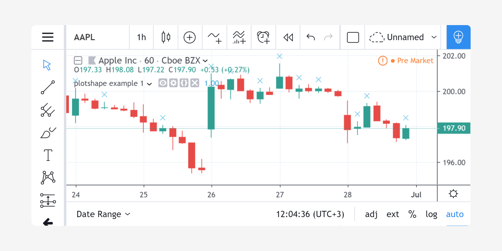
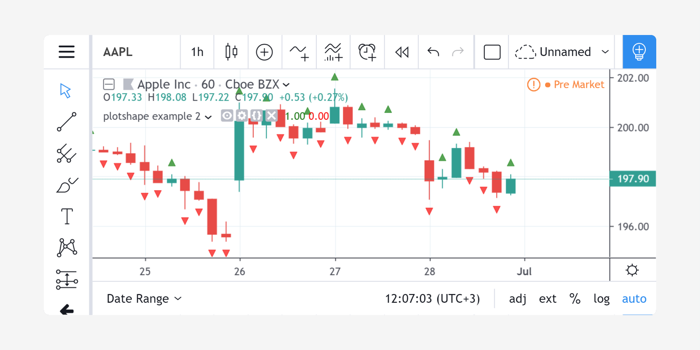
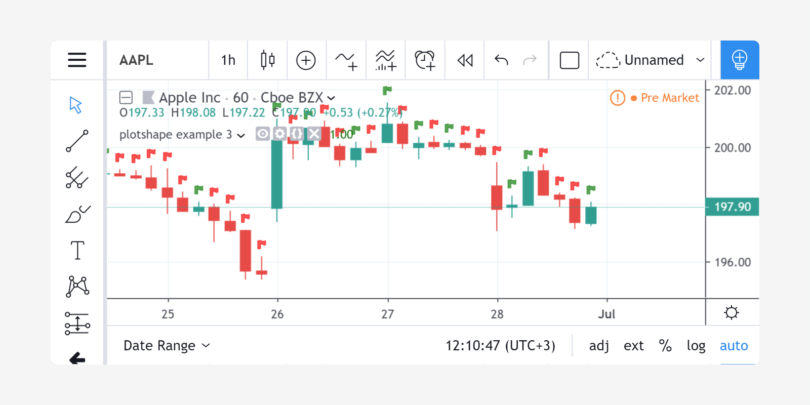
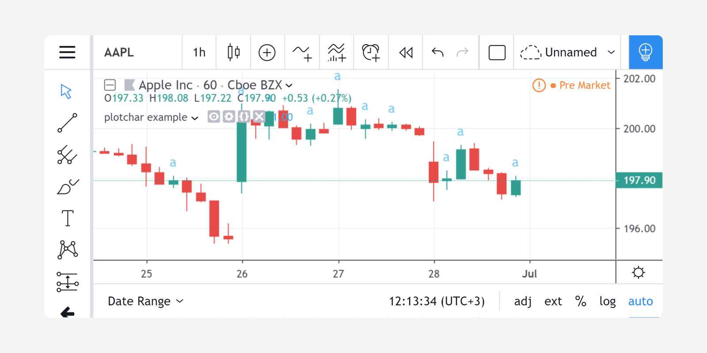
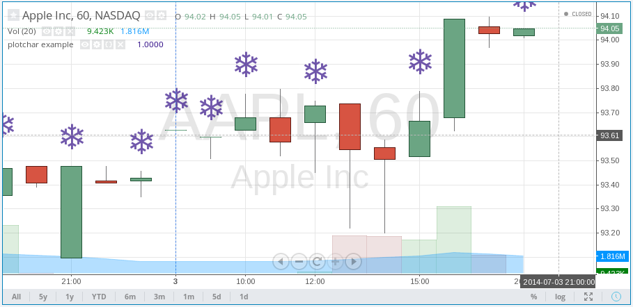
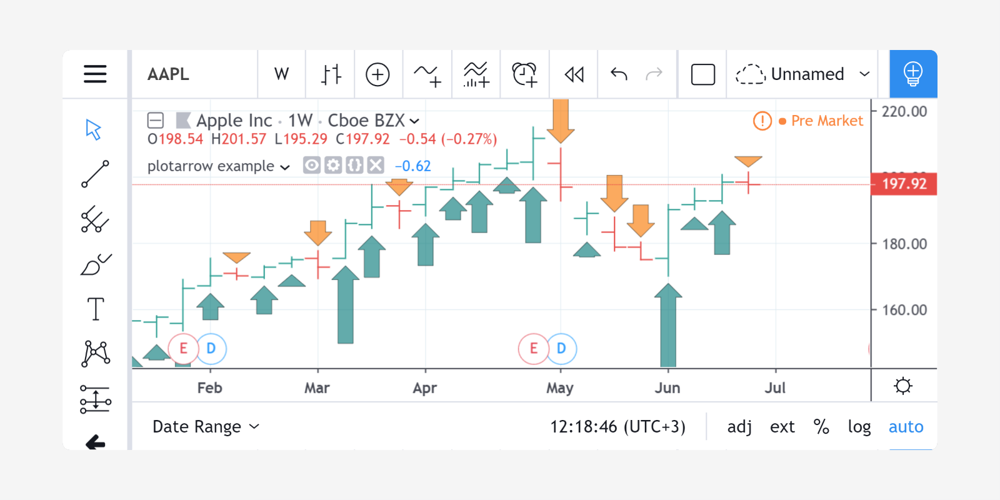

Plotting shapes, chars and arrows
=================================

.. contents:: :local:
    :depth: 2

There are situations where you need to mark or highlight specific bars on a chart, and where
a usual line plot using ``plot`` may not be optimal.
Although it may be possible to do so using
``plot`` with ``style=plot.style_circles`` or ``style=plot.style_cross``,
it is often easier to use the ``plotshape``, ``plotchar`` and ``plotarrow`` annotation functions.

plotshape
---------

The `plotshape <https://www.tradingview.com/pine-script-reference/v4/#fun_plotshape>`__
function can display a variety of shapes. The script below will draw an "X"
above all green bars:

::

    study('plotshape example 1', overlay=true)
    data = close >= open
    plotshape(data, style=shape.xcross)

The first parameter, ``data``, is used as a series of logical
values. The crosses are drawn on each true value. Nothing is drawn on false
or ``na`` values. You may use a series of logical values or numbers as the first argument of
``plotshape``. A 0 or ``na`` is considered a false
value, any other value is considered true.

By changing the value of the ``style`` parameter, it is possible to vary the
shape. The available styles are:

+--------------------------+-------------------------------------------------+-------------------------------------------------+
| Shape Name               | Shape                                           | Shape with Text                                 |
+==========================+=================================================+=================================================+
| ``shape.xcross``         | |Plotshape_xcross|                              | |Xcross_with_text|                              |
+--------------------------+-------------------------------------------------+-------------------------------------------------+
| ``shape.cross``          | |Plotshape_cross|                               | |Cross_with_text|                               |
+--------------------------+-------------------------------------------------+-------------------------------------------------+
| ``shape.circle``         | |Plotshape_circle|                              | |Circle_with_text|                              |
+--------------------------+-------------------------------------------------+-------------------------------------------------+
| ``shape.triangleup``     | |Plotshape_triangleup|                          | |Triangleup_with_text|                          |
+--------------------------+-------------------------------------------------+-------------------------------------------------+
| ``shape.triangledown``   | |Plotshape_triangledown|                        | |Triangledown_with_text|                        |
+--------------------------+-------------------------------------------------+-------------------------------------------------+
| ``shape.flag``           | |Plotshape_flag|                                | |Flag_with_text|                                |
+--------------------------+-------------------------------------------------+-------------------------------------------------+
| ``shape.arrowup``        | |Plotshape_arrowup|                             | |Arrowup_with_text|                             |
+--------------------------+-------------------------------------------------+-------------------------------------------------+
| ``shape.arrowdown``      | |Plotshape_arrowdown|                           | |Arrowdown_with_text|                           |
+--------------------------+-------------------------------------------------+-------------------------------------------------+
| ``shape.square``         | |Plotshape_square|                              | |Square_with_text|                              |
+--------------------------+-------------------------------------------------+-------------------------------------------------+
| ``shape.diamond``        | |Plotshape_diamond|                             | |Diamond_with_text|                             |
+--------------------------+-------------------------------------------------+-------------------------------------------------+
| ``shape.labelup``        | |Plotshape_labelup|                             | |Labelup_with_text|                             |
+--------------------------+-------------------------------------------------+-------------------------------------------------+
| ``shape.labeldown``      | |Plotshape_labeldown|                           | |Labeldown_with_text|                           |
+--------------------------+-------------------------------------------------+-------------------------------------------------+

.. |Plotshape_xcross| image:: images/Plotshape_xcross.png
.. |Xcross_with_text| image:: images/Xcross_with_text.png
.. |Plotshape_cross| image:: images/Plotshape_cross.png
.. |Cross_with_text| image:: images/Cross_with_text.png
.. |Plotshape_circle| image:: images/Plotshape_circle.png
.. |Circle_with_text| image:: images/Circle_with_text.png
.. |Plotshape_triangleup| image:: images/Plotshape_triangleup.png
.. |Triangleup_with_text| image:: images/Triangleup_with_text.png
.. |Plotshape_triangledown| image:: images/Plotshape_triangledown.png
.. |Triangledown_with_text| image:: images/Triangledown_with_text.png
.. |Plotshape_flag| image:: images/Plotshape_flag.png
.. |Flag_with_text| image:: images/Flag_with_text.png
.. |Plotshape_arrowup| image:: images/Plotshape_arrowup.png
.. |Arrowup_with_text| image:: images/Arrowup_with_text.png
.. |Plotshape_arrowdown| image:: images/Plotshape_arrowdown.png
.. |Arrowdown_with_text| image:: images/Arrowdown_with_text.png
.. |Plotshape_square| image:: images/Plotshape_square.png
.. |Square_with_text| image:: images/Square_with_text.png
.. |Plotshape_diamond| image:: images/Plotshape_diamond.png
.. |Diamond_with_text| image:: images/Diamond_with_text.png
.. |Plotshape_labelup| image:: images/Plotshape_labelup.png
.. |Labelup_with_text| image:: images/Labelup_with_text.png
.. |Plotshape_labeldown| image:: images/Plotshape_labeldown.png
.. |Labeldown_with_text| image:: images/Labeldown_with_text.png

The default position where ``plotshape`` draws shapes is above bars. To
use another position, use the
``location`` parameter. The following script draws a green
``shape.triangleup`` *above* the green bars and a red ``shape.triangledown``
*below* the red bars:

::

    //@version=4
    study('plotshape example 2', overlay=true)
    data = close >= open
    plotshape(data, style=shape.triangleup,
                     location=location.abovebar, color=color.green)
    plotshape(not data, style=shape.triangledown,
                     location=location.belowbar, color=color.red)

Possible values for the ``location`` parameter are:

-  ``location.abovebar`` --- above a bar.
-  ``location.belowbar`` --- below a bar.
-  ``location.top`` --- top of the script's *y* space.
-  ``location.bottom`` --- bottom of the script's *y* space.
-  ``location.absolute`` --- any position in the *y* space.

``location.absolute`` can be used when the shapes need to
be positioned more precisely in the script's *y* space. The first parameter of the function
is then used as a *y* coordinate.

'plotshape example 2' illustrates how the shape's
color can be defined using the ``color`` parameter and
expressions which will calculate the shape's color
depending on conditions at runtime. For example::

    study('plotshape example 3', overlay=true)
    data = close >= open
    plotshape(true, style=shape.flag, color=data ? color.green : color.red)

In the given example, the first parameter of the function ``plotshape`` is
``true``, which means that a shape is displayed at every bar.
The color is calculated by the ``color=data ? color.green : color.red`` expression.

Other features of the ``plotshape`` function:

-  Set the name of a displayed series of data using the
   ``title`` parameter.
-  Shift a series of shapes to the left/right using the
   ``offset`` parameter.
-  Set the transparency of shapes with the ``transp`` parameter.
-  Use the ``text`` parameter to display a short text above/below the shape.
   You may use ``\n`` to separate text lines.

plotchar
--------

The main difference between ``plotshape`` and `plotchar <https://www.tradingview.com/pine-script-reference/v4/#fun_plotchar>`__
is that with ``plotchar``, the shape is an ASCII or Unicode symbol (provided it's supported by the TradingView standard font)
defined with the ``char`` parameter. For example::

    study('plotchar example', overlay=true)
    data = close >= open
    plotchar(data, char='a')

The default character is ★ (U+2605, the "BLACK STAR" character). It's possible to use any letter or digit and many symbols,
for example: ❤, ☀, €, ⚑, ❄, ◆, ⬆, ⬇.

The next example uses the "SNOWFLAKE" (❄, U+2744) character::

    study('plotchar example', overlay=true)
    data = close >= open
    plotchar(data, char='❄')

Like ``plotshape``, the ``plotchar`` function allows you to:

-  Set a shape's color with a constant or complex arithmetic expression using the ``color`` parameter.
-  Set a shape's location with the ``location`` parameter.
-  Set the name of a displayed series of data using the ``title`` parameter.
-  Shift a series of shapes left/right using the ``offset`` parameter.
-  Set the transparency of shapes using the ``transp`` parameter.
-  Use the ``text`` parameter to display a short text above/below the shape.
   You may use ``\n`` to separate text lines.

plotarrow
---------

The `plotarrow <https://www.tradingview.com/pine-script-reference/v4/#fun_plotarrow>`__
annotation function allows for up/down arrows to be displayed on
the chart. The arrow length is not the same on each bar and is
calculated from the first parameter's value.

The first ``series`` parameter of the ``plotarrow`` function is used to place
arrows on the chart using the following logic:

-  If the ``series`` value on the current bar is greater than 0, then an *up
   arrow* will be drawn, the length of which will be proportional to the
   relative value of the series on that bar in relation to other series values.
-  If the ``series`` value on the current bar is less than 0, then a *down
   arrow* will be drawn, the length of which will be proportional to the
   relative value of the series on that bar in relation to other series values.
-  If the ``series`` value on the current bar is equal to 0 or ``na`` then the
   arrow is not displayed.

Here is a simple script that illustrates how the ``plotarrow`` function works::

    study("plotarrow example", overlay=true)
    codiff = close - open
    plotarrow(codiff, colorup=teal, colordown=orange, transp=40)

As you can see, the greater the relative value of the ``close - open`` difference,
the longer the arrow. If ``close - open`` is greater than zero, then an up
arrow is rendered. When ``close - open`` is less than zero, a down arrow is rendered.

In another example, we'll start from the *Chaikin
Oscillator* script in the built-in scripts and display it as an overlay above
a chart using arrows::

    study("Chaikin Oscillator Arrows", overlay=true)
    short = input(3,minval=1), long = input(10,minval=1)
    osc = ema(accdist, short) - ema(accdist, long)
    plotarrow(osc)

.. image:: images/Plotarrow_example_2.png

This screenshot shows the original *Chaikin Oscillator* alongside the
script for better understanding.

As was stated earlier, the height of the arrow is proportional to
the relative value of the first series parameter. The maximum and minimum possible sizes for the arrows (in
pixels) can be set using the ``minheight`` and ``maxheight`` parameters.

Additionally, the ``plotarrow`` function allows you to:

-  Set the name of a displayed series of data using the ``title`` parameter.
-  Set the color of an *up arrow* using the ``colorup`` parameter.
-  Set the color of a *down arrow* using the ``colordown`` parameter.
-  Shift a series of arrows left/right using the ``offset`` parameter.
-  Set the transparency of arrows with the ``transp`` parameter.

It's important to note that the ``colorup`` and ``colordown`` parameters must receive a
constant value of the *color* type. Using expressions for determining
color (as is done in ``plot``, ``plotshape`` or ``plotchar``) is not allowed.
