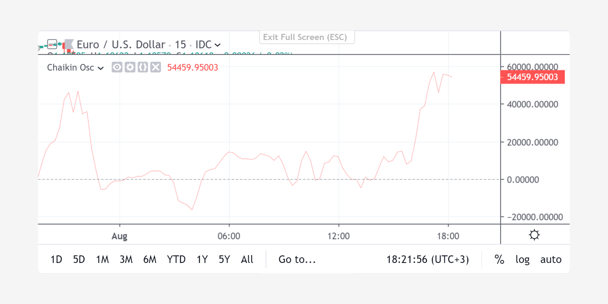

Price levels, hline
-------------------

The `hline <https://www.tradingview.com/pine-script-reference/v4/#fun_hline>`__
annotation function renders a horizontal line at a given level. For example::

    //@version=4
    study(title="Chaikin Oscillator", shorttitle="Chaikin Osc")
    short = input(3, minval=1)
    long = input(10, minval=1)
    osc = ema(accdist, short) - ema(accdist, long)
    plot(osc, color=color.red)
    hline(0, title="Zero", color=color.gray, linestyle=hline.style_dashed)

A *number* must be the first argument of ``hline``. Values of *series* type
are forbidden. It's possible to create a few horizontal lines with the
help of ``hline`` and fill the background between them with a
translucent color using `fill <https://www.tradingview.com/pine-script-reference/v4/#fun_fill>`__.
