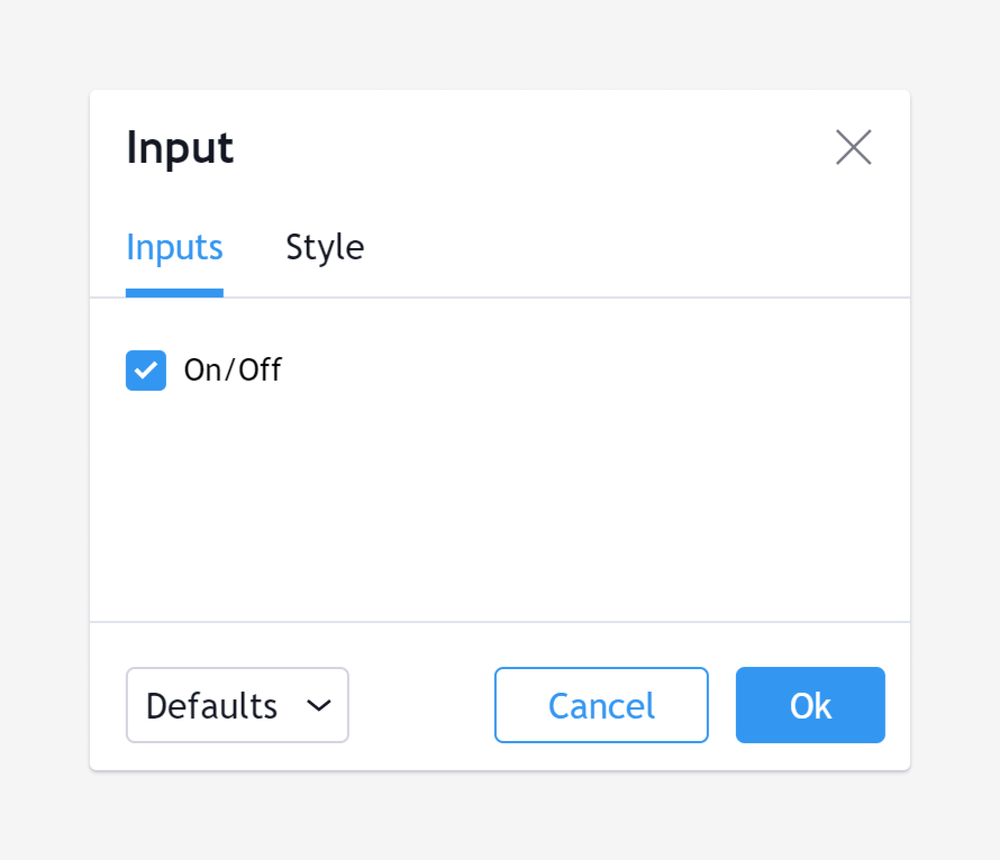
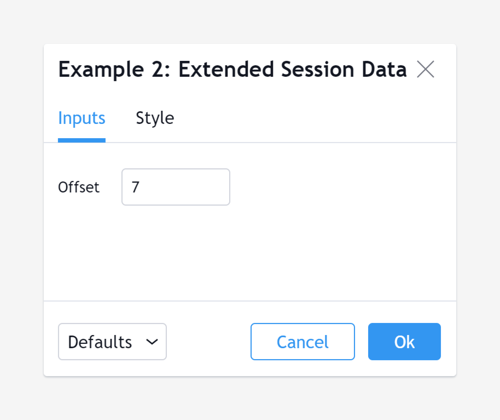
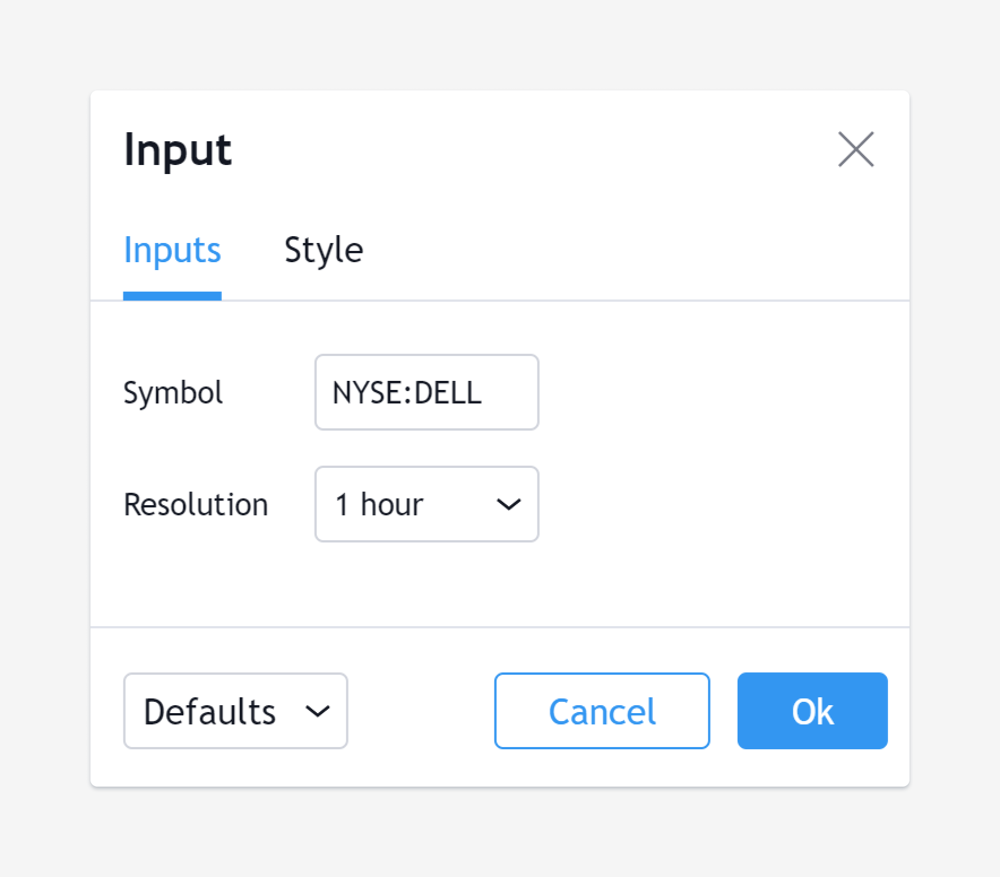
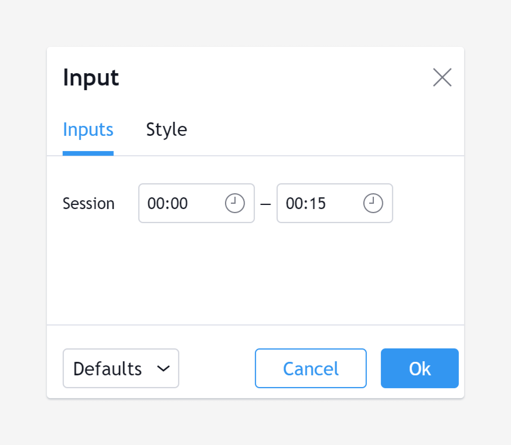
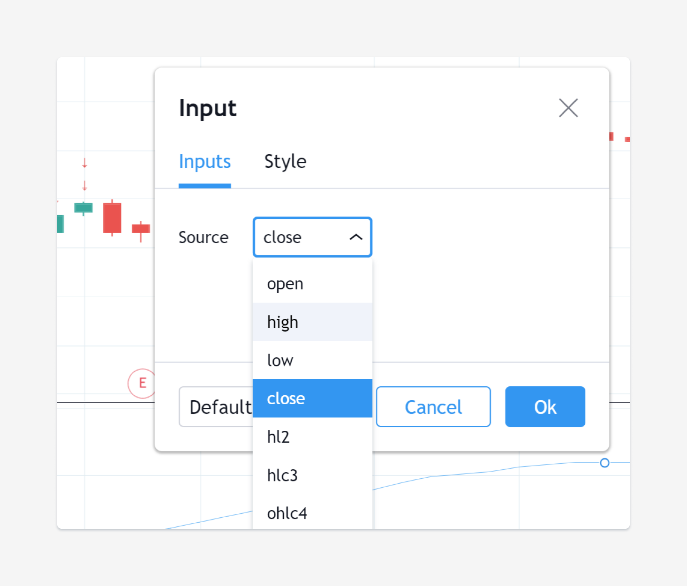
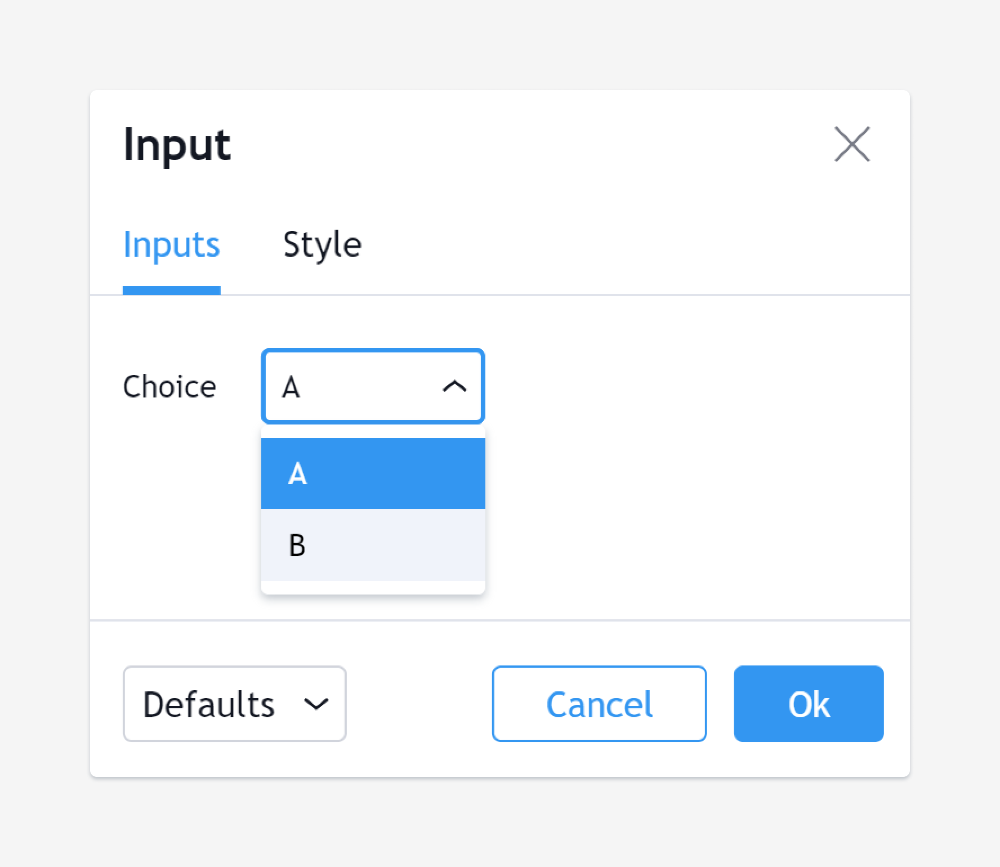

Script inputs
-------------

The `input <https://www.tradingview.com/pine-script-reference/v4/#fun_input>`__
annotation function makes it possible for script users to modify selected
values which the script can then use in its calculation or logic,
without the need to modify the script's code.

Specific widgets are supplied in the *Settings/Inputs* dialog box
for each type of input. A description of the value as well as minimum/maximum
values and a step increment can also be defined. If the type of the input variable
cannot be inferred at compile time, it can be explicitly defined using the ``type`` parameter.

Pine supports the following types of input:

-  input.bool,
-  input.integer,
-  input.float,
-  input.string,
-  input.symbol,
-  input.resolution,
-  input.session,
-  input.source.

The following examples show how to create each type of input and what
its widget looks like.

Boolean input
^^^^^^^^^^^^^
::

    b = input(title="On/Off", type=input.bool, defval=true)
    plot(b ? open : na)

Integer input
^^^^^^^^^^^^^
::

    i = input(title="Offset", type=input.integer, defval=7, minval=-10, maxval=10)
    plot(offset(close, i))

Float input
^^^^^^^^^^^
::

    f = input(title="Angle", type=input.float, defval=-0.5, minval=-3.14, maxval=3.14, step=0.2)
    plot(sin(f) > 0 ? close : open)

Symbol and resolution inputs
^^^^^^^^^^^^^^^^^^^^^^^^^^^^
::

    sym = input(title="Symbol", type=input.symbol, defval="SPY")
    res = input(title="Resolution", type=input.resolution, defval="60")
    plot(close, color=color.red)
    plot(security(sym, res, close), color=color.green)

The symbol input widget has a built-in *symbol search* which activates
automatically when the ticker's first characters are typed.

Session input
^^^^^^^^^^^^^
::

    s = input(title="Session", type=input.session, defval="24x7")
    plot(time(timeframe.period, s))

Source input
^^^^^^^^^^^^^
::

    src = input(title="Source", type=input.source, defval=close)
    ma = sma(src, 9)
    plot(ma)

options parameter
^^^^^^^^^^^^^^^^^
The ``options`` parameter is useful to provide users with a list
of constant values they can choose from using a dropdown menu.
::

    choice = input(title="Choice", defval="A", options=["A", "B"])
    plot(choice == "A" ? close : choice == "B" ? open : na)
	

