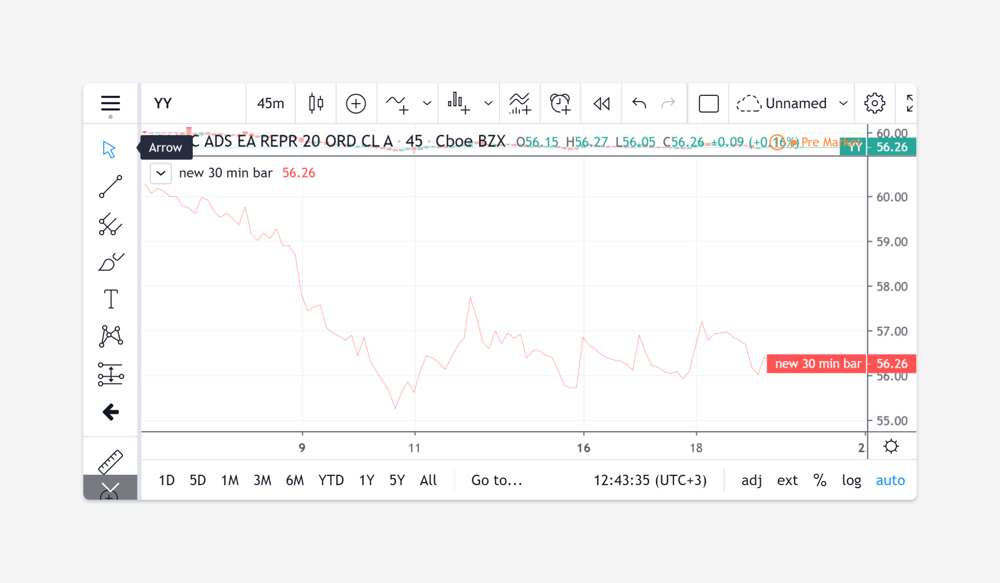
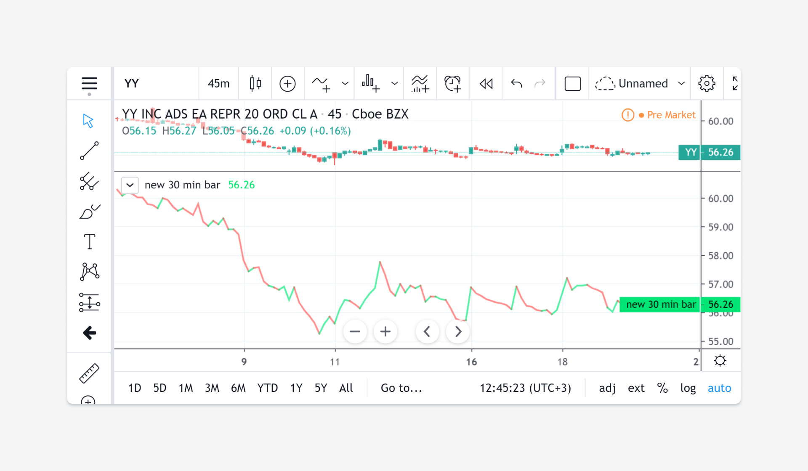
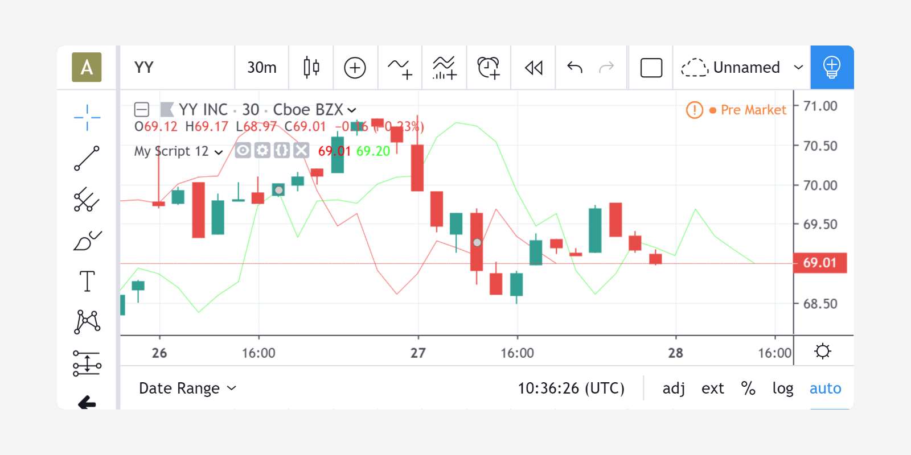

plot annotation
---------------

The `plot <https://www.tradingview.com/pine-script-reference/v4/#fun_plot>`__ annotation function
has one mandatory parameter: a value of *series* type, which it displays
as a line. A basic call looks like this:

::

    plot(close)

Pine's automatic type conversions makes it possible to also use
any numeric value as an argument. For example:

::

    plot(125.2)

In this case, the value 125.2 will automatically be converted to a
series type value which will be the same number on every bar. The plot
will be represented as a horizontal line.

The ``plot`` annotation has many optional parameters, in
particular those which set the line's display style: ``style``,
``color``, ``linewidth``, ``transparency``, and others.

The value of the ``color`` parameter can be defined in different ways.
If it is a color constant, for
example ``color.red``, then the whole line will be plotted using a *red* color::

    plot(close, color=color.red)

The value of ``color`` can also be an expression of a *series*
type of color values. This series of colors will be used to
color the rendered line. For example::

    c = close >= open ? color.lime : color.red
    plot(close, color = c)

The ``offset`` parameter specifies the shift used when the line is plotted
(negative values shift to the left while positive values shift to
the right) [#offset_function]_. For example::

    //@version=4
    study("My Script 12", overlay=true)
    plot(close, color=color.red, offset=-5)
    plot(close, color=color.lime, offset=5)

As can be seen in the screenshot, the *red* series has been shifted to the
left (since the argument's value is negative), while the *green*
series has been shifted to the right (its value is positive).

.. rubric:: Footnotes

.. [#offset_function] In Pine there is a built-in
   `offset <https://www.tradingview.com/pine-script-reference/v4/#fun_offset>`__ function
   which shifts the values of a series to the right while discarding 'out of range' values.
   The advantage of the ``offset`` function lies in the fact that its result
   can be used in other expressions to execute complex calculations. In the
   case of ``plot`` function's ``offset`` parameter, the shift is only cosmetic;
   the actual values in the series are not moved.
