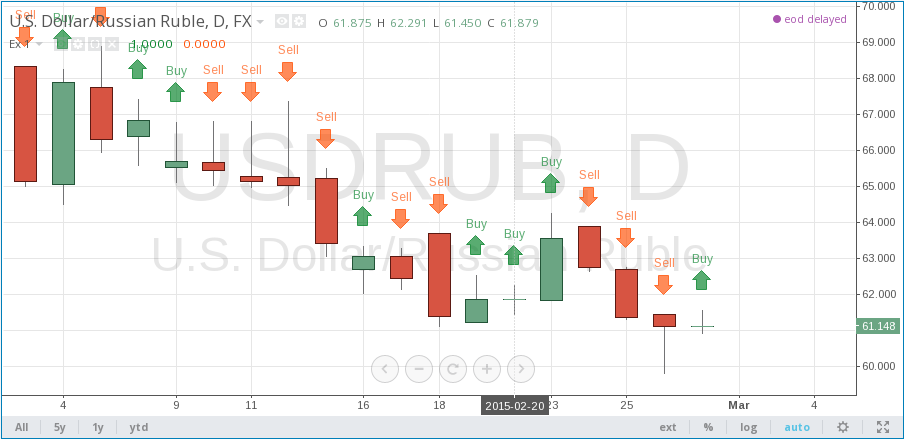

HOWTOs
======

.. contents:: :local:
    :depth: 2

Get real OHLC price on a Heikin Ashi chart
------------------------------------------

Suppose, we have a Heikin Ashi chart (or Renko, Kagi, PriceBreak etc)
and we've added a pine script on it:

::

    //@version=4
    study("Visible OHLC", overlay=true)
    c = close
    plot(c)

You may see that variable ``c`` is a Heikin Ashi *close* price which is not
the same as real OHLC price. Because ``close`` built-in variable is always
a value that corresponds to a visible bar (or candle) on the chart.

So, how do we get the real OHLC prices in Pine Script code, if current
chart type is non-standard? We should use ``security`` function in
combination with ``tickerid`` function. Here is an example::

    //@version=4
    study("Real OHLC", overlay=true)
    t = tickerid(syminfo.prefix, syminfo.ticker)
    realC = security(t, timeframe.period, close)
    plot(realC)

In a similar way we may get other OHLC prices: *open*, *high* and *low*.

Get non-standard OHLC values on a standard chart
------------------------------------------

Backtesting on non-standard chart types (e.g. Heikin Ashi or Renko) is not recommended because the bars on these kinds of charts do not represent real price movement that you would encounter while trading. If you want your strategy to enter and exit on real prices but still use Heikin Ashi-based signals, you can use the same method to get Heikin Ashi values on a regular candlestick chart::

    //@version=4
    strategy("BarUpDn Strategy", overlay=true, default_qty_type = strategy.percent_of_equity, default_qty_value = 10)
    maxIdLossPcnt = input(1, "Max Intraday Loss(%)", type=input.float)
    strategy.risk.max_intraday_loss(maxIdLossPcnt, strategy.percent_of_equity)
    needTrade() => close > open and open > close[1] ? 1 : close < open and open < close[1] ? -1 : 0
    trade = security(heikinashi(syminfo.tickerid), timeframe.period, needTrade())
    if (trade == 1)
        strategy.entry("BarUp", strategy.long)
    if (trade == -1)
        strategy.entry("BarDn", strategy.short)

Plot arrows on the chart
------------------------

You may use plotshape with style ``shape.arrowup`` and
``shape.arrowdown``::

    //@version=4
    study('Ex 1', overlay=true)
    data = close >= open
    plotshape(data, color=color.lime, style=shape.arrowup, text="Buy")
    plotshape(not data, color=color.red, style=shape.arrowdown, text="Sell")

You may use ``plotchar`` function with any unicode character::

    //@version=4
    study('buy/sell arrows', overlay=true)
    data = close >= open
    plotchar(data, char='↓', color=color.lime, text="Buy")
    plotchar(data, char='↑', location=location.belowbar, color=color.red, text="Sell")

.. image:: images/Buy_sell_chart2.png

Plot a dynamic horizontal line
------------------------------

There is function ``hline`` in pine. But it is now limited to only plot
constant value. Here is a Pine Script with workaround to plot changing
hline::

    //@version=4
    study("Horizontal line", overlay=true)
    plot(close[10], trackprice=true, offset=-9999)
    // trackprice=true plots horizontal line on close[10]
    // offset=-9999 hides the plot
    plot(close, color=#FFFFFFFF)  // forces to show study

Plot a vertical line on condition
---------------------------------

::

    //@version=4
    study("Vertical line", overlay=true, scale=scale.none)
    // scale.none means do not resize the chart to fit this plot
    // if the bar being evaluated is the last baron the chart (the most recent bar), then cond is true
    cond = barstate.islast
    // when cond is true, plot a histogram with a line with height value of 100,000,000,000,000,000,000.00
    // (10 to the power of 20)
    // when cond is false, plot no numeric value (nothing is plotted)
    // use the style of histogram, a vertical bar
    plot(cond ? 10e20 : na, style=plot.style_histogram)

Access the previous value
-------------------------

::

    //@version=4
    //...
    s = 0.0
    s := nz(s[1]) // Accessing previous values
    if (condition)
        s := s + 1

Get a 5-days high
-----------------

Lookback 5 days from the current bar, find the highest bar, plot a star
character at that price level above the current bar

|Mark the highest bar within a 5 day lookback window range|

::

    //@version=4
    study("Range Analysis", overlay=true)

    // find which bar is 5 days away from the current time
    milliseconds_in_5days = 1000 * 60 * 60 * 24 * 5  // millisecs * secs * min * hours * days
    // plot(milliseconds_in_5days, title="ms in 5d", style=circles) //debug
    // subtract timestamp of the bar being examined from the current time
    // if value is less than 5 days ago, set variable "leftborder" as true
    // this is set true at the bar being examined as the left border of the 5 days lookback window range
    leftborder = timenow - time < milliseconds_in_5days  // true or na when false
    // plot(leftborder ? 1 : na, title="bar within leftborder")  //debug
    // plot(time, title="bartime") //debug
    // plot(timenow - time, title="timenow minus bartime")  //debug

    // treat the last bar (most recent bar) as the right edge of the lookback window range
    rightborder = barstate.islast

    // initialize variable "max" as na
    max = float(na)

    // if bar being examined is not within the lookback window range (i.e., leftborder = false)
    // change the variable "max" to be na
    // else, test if value of "max" stored in the previous bar is na
    // (bcuz first bar being examined in the lookback window will not have a previous value ),
    // if it is na, use the high of the current bar,
    // else, use the value of "max" stored in the previous bar
    max := not leftborder ? na : na(max[1]) ? high : max[1]
    // plot(max ? max : na, title="max b4 compare")  // debug

    // compare high of current bar being examined with previous bar's high
    // if curr bar high is higher than the max bar high in the lookback window range
    if high > max  // we have a new high
        max := high  // change variable "max" to use current bar's high value
        max
    // else keep the previous value of max as the high bar within this lookback window range
    // plot(max ? max : na, title="max after compare")  //debug

    // if examining the last bar (newest bar, rightborder is true)
    // set variable "val" to the previous value of series variable "max"
    // else set to na so nothing is plotted
    val = rightborder ? max[1] : na

    // if val is true (a number, not na)
    // plot character
    // since no character is specified, a "star" will be plotted
    // location.absolute uses the value of val as the y axis value
    // the x axis location will be the last bar (newest bar)
    plotchar(val, size=size.normal, location=location.absolute)

    // fill the background of the 5 days lookback window range with aqua color
    bgcolor(leftborder and not rightborder ? color.aqua : na, transp=70)

Count bars in a dataset
-----------------------

Get a count of all the bars in the loaded dataset. Might be useful for
calculating flexible lookback periods based on number of bars.

::

    //@version=4
    study("Bar Count", overlay=true, scale=scale.none)
    plot(bar_index + 1, style=plot.style_histogram)

Enumerate bars in a day
-----------------------

::

    //@version=4
    study("My Script", overlay=true, scale=scale.none)

    is_new_day() =>
        d = dayofweek
        na(d[1]) or d != d[1]

    plot(barssince(is_new_day()), style=plot.style_cross)

Find the highest and lowest values for the entire dataset
---------------------------------------------------------

::

    //@version=4
    study("My Script")

    biggest(series) =>
        max = 0.0
        max := nz(max[1], series)
        if series > max
            max := series
        max

    smallest(series) =>
        min = 0.0
        min := nz(min[1], series)
        if series < min
            min := series
        min

    plot(biggest(close), color=color.green)
    plot(smallest(close), color=color.red)

Query the last non-na value
---------------------------

You can use the script below to avoid gaps in a series::

    //@version=4
    study("My Script")
    series = close >= open ? close : na
    vw = valuewhen(not na(series), series, 0)
    plot(series, style=plot.style_linebr, color=color.red)  // series has na values
    plot(vw)  // all na values are replaced with the last non-empty value

.. |Mark the highest bar within a 5 day lookback window range| image:: images/Wiki_howto_range_analysis.png
