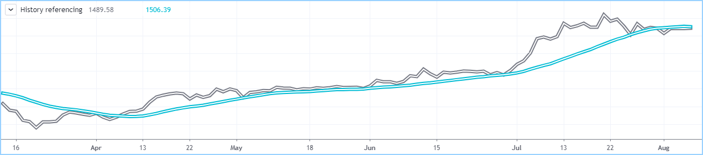
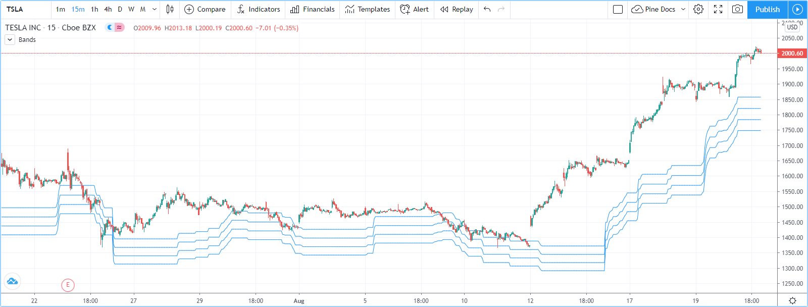
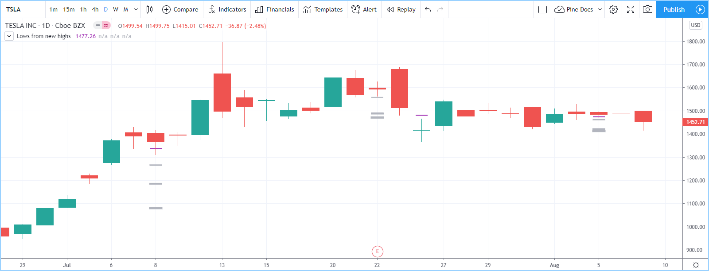
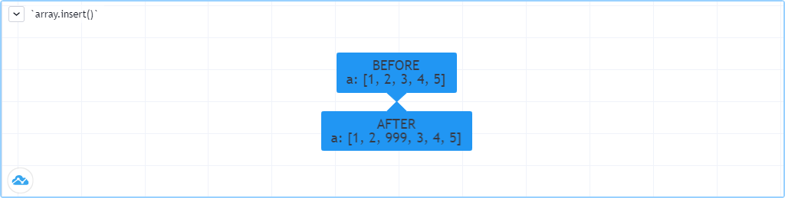
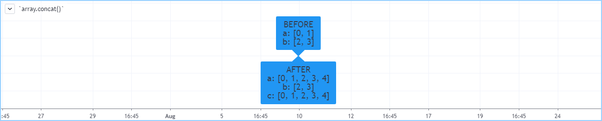
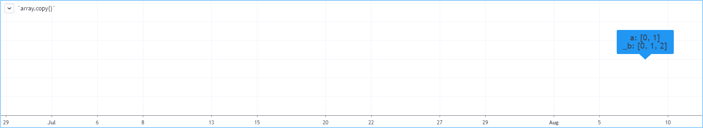
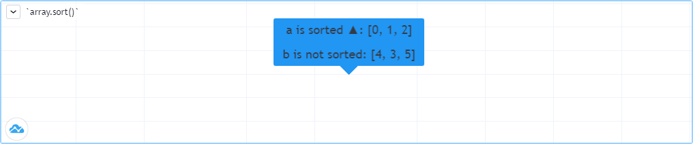
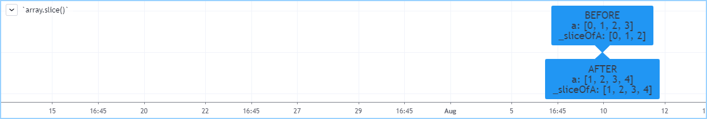

Arrays
======

.. contents:: :local:
    :depth: 2

Introduction
------------

Arrays can be used to store multiple values in one data structure. Think of them as a better way to handle cases where you would
otherwise need a set of variables named ``price00``, ``price01`` and ``price02``. Arrays are an advanced feature used for scripts 
requiring intricate data-handling. If you are a beginning Pine programmer, you may consider studying other, more accessible Pine features 
before you tackle arrays.

Pine arrays are one-dimensional. All elements of an array are of the same type, which can be *int*, *float*, *bool* or *color*, always of *series* form. 
Arrays are referenced using an array *id*, similar to label and line id's. 
Pine does not use an indexing operator to reference individual array elements;
instead, functions like `array.get() <https://www.tradingview.com/pine-script-reference/v4/#fun_array{dot}get>`__ 
and `array.set() <https://www.tradingview.com/pine-script-reference/v4/#fun_array{dot}set>`__ are used to read and write values of array elements. 
Array values can be used in all Pine expressions and functions where a value of *series* form is allowed.

Elements within an array are referred to using an *index*, which starts at 0 and extends to the number or elements in the array, minus one.
Arrays in Pine can be sized dynamically, so the number of elements in the array can be modified within one iteration of the script on a bar,
and vary across bars. Multiple arrays can be used in the same script. The size of arrays is limited to 100,000.

.. note:: We will use "beginning" of an array to designate index 0, and "end" of an array to designate the array's element with the highest index value. We will also extend the meaning of *array* to include array *id's*, for the sake of brevity.

Declaring arrays
----------------

The following syntax can be used to declare arrays::

    <type>[] <identifier> = <expression>
    var <type>[] <identifier> = <expression>

The ``[]`` modifier is appended to the type name when declaring arrays. However, since type-specific functions are always used to create arrays,
the ``<type>[]`` part of the declaration is redundant, except if you initialize an array variable to ``na``, as in the following example where
we declare an array variable named ``prices``. The variable will be used to designate an array containing *float* values,  
but no array is created by this declaration yet. For the moment, the array variable contains no valid array id, its value being ``na``::

    float[] prices = na

When declaring an array and the ``<expression>`` is not ``na``, one of the ``array.new_<type>(size, initial_value)`` functions must be used. 
The arguments of both the ``size`` and ``initial_value`` parameters can be *series*, to allow dynamic sizing and initialization of array elements.
The following example creates an array containing zero *float* elements, 
and this time, the array id returned by the `array.new_float() <https://www.tradingview.com/pine-script-reference/v4/#fun_array{dot}new_float>`__
function call is assigned to ``prices``::

    prices = array.new_float(0)

Similar array creation functions exist for the other types of array elements: 
`array.new_int() <https://www.tradingview.com/pine-script-reference/v4/#fun_array{dot}new_int>`__,
`array.new_bool() <https://www.tradingview.com/pine-script-reference/v4/#fun_array{dot}new_bool>`__ and 
`array.new_color() <https://www.tradingview.com/pine-script-reference/v4/#fun_array{dot}new_color>`__.

When declaring an array, you can initialize all elements in the array using the ``initial_value`` parameter. 
When no argument is supplied for ``initial_value``, the array elements are initialized to ``na``.
The following declaration creates and array id named ``prices``.
The array is created with two elements, each initialized with the value of the ``close`` built-in variable on that bar::

    prices = array.new_float(2, close)

There is currently no way to initialize multiple array elements with different values in one statement, 
whether upon declaration or post-declaration. One is planned in the near future.

Using the 'var' keyword
^^^^^^^^^^^^^^^^^^^^^^^

The `var <https://www.tradingview.com/pine-script-reference/v4/#op_var>`__ keyword can be used when declaring arrays. 
It works just as it does for other variables; it causes the declaration to only 
be executed on the first iteration of the script on the dataset's bar at ``bar_index`` zero. Because the array is never re-initialized on subsequent bars, 
its value will persist across bars, as the script iterates on them.

When an array declaration is done using ``var`` and a new value is pushed at the end of the array on each bar, the array will grow by one on each bar and be of size ``bar_index`` plus one (bar_index starts at zero) by the time the script executes on the last bar, as this code will do::

    //@version=4
    study("Using `var`")
    var a = array.new_float(0)
    array.push(a, close)
    if barstate.islast
        label.new(bar_index, 0, "Array size: " + tostring(array.size(a)) + "\nbar_index: " + tostring(bar_index), size = size.large)

The same code without the ``var`` keyword would re-declare the array on each bar. After execution of the ``array.push()`` call, 
the array would thus be of size one on all the dataset's bars.

Reading and writing array values
--------------------------------

Values can be written to existing individual array elements using 
`array.set(id, index, value) <https://www.tradingview.com/pine-script-reference/v4/#fun_array{dot}set>`__, 
and read using `array.get(id, index) <https://www.tradingview.com/pine-script-reference/v4/#fun_array{dot}get>`__.
As is the case whenever an array index is used in your code, it is imperative that the index never be greater than 
the array's size, minus one (because array indices start at zero). You can obtain the size of an array by using the 
`array.size(id) <https://www.tradingview.com/pine-script-reference/v4/#fun_array{dot}size>`__ function.

The following example uses `array.set() <https://www.tradingview.com/pine-script-reference/v4/#fun_array{dot}set>`__ 
to initialize an array of colors to instances of one base color using different transparency levels. 
It then fetches the proper array element to use it in a `bgcolor() <https://www.tradingview.com/pine-script-reference/v4/#fun_bgcolor>`__ call::

    //@version=4
    study("Distance from high", "", true)
    i_lookBack = input(100)
    c_fillColor = color.green
    var c_fills = array.new_color(5)
    // Initialize the array elements with progressively lighter shades of the fill color.
    array.set(c_fills, 0, color.new(c_fillColor, 70))
    array.set(c_fills, 1, color.new(c_fillColor, 75))
    array.set(c_fills, 2, color.new(c_fillColor, 80))
    array.set(c_fills, 3, color.new(c_fillColor, 85))
    array.set(c_fills, 4, color.new(c_fillColor, 90))
    
    // Find the offset to highest high. Change its sign because the function returns a negative value.
    lastHiBar = - highestbars(high, i_lookBack)
    // Convert the offset to an array index, capping it to 4 to avoid a runtime error.
    // The index used by `array.get()` will be the equivalent of `floor(fillNo)`.
    fillNo = min(lastHiBar / (i_lookBack / 5), 4)
    // Set background to a progressively lighter fill with increasing distance from location of highest high.
    bgcolor(array.get(c_fills, fillNo))
    // Plot key values to the Data Window for debugging.
    plotchar(lastHiBar, "lastHiBar", "", location.top, size = size.tiny)
    plotchar(fillNo, "fillNo", "", location.top, size = size.tiny)

|Arrays-ReadingAndWriting-DistanceFromHigh.png|

Another technique that can be used to initialize the elements in an array is to declare the array with size zero, and then populate it using 
`array.push() <https://www.tradingview.com/pine-script-reference/v4/#fun_array{dot}push>`__ 
to append **new** elements to the end of the array, increasing the size of the array by one at each call. 
The following code is functionally identical to the initialization section from the preceding script. Note that we do not use ``var`` to declare the array in this case.
If we did, the set of pushes would add 5 new elements to the array on each bar, since the array would propagate over successive bars::

    c_fills = array.new_color(0)
    // Initialize the array elements with progressively lighter shades of the fill color.
    array.push(c_fills, color.new(c_fillColor, 70))
    array.push(c_fills, color.new(c_fillColor, 75))
    array.push(c_fills, color.new(c_fillColor, 80))
    array.push(c_fills, color.new(c_fillColor, 85))
    array.push(c_fills, color.new(c_fillColor, 90))

The `array.fill(id, value, index_from, index_to) <https://www.tradingview.com/pine-script-reference/v4/#fun_array{dot}fill>`__ function 
can be used to fill contiguous sets of array elements with a value. Used without the last two optional parameters, the function fills the whole array, so::

    a = array.new_float(10, close)

and::

    a = array.new_float(10)
    array.fill(a, close)

are equivalent, but::

    a = array.new_float(10)
    array.fill(a, close, 1, 3)

only fills the second and third elements (at index 1 and 2) of the array with ``close``. 
Note how `array.fill() <https://www.tradingview.com/pine-script-reference/v4/#fun_array{dot}fill>`__'s 
last parameter, ``index_to``, needs to be one greater than the last index to be filled. 
The remaining elements will hold the ``na`` value, as no intialization value was provided when the array was declared.

Scope
-----

Arrays can be declared in a script's global scope, as well as in the local scope of a function or an ``if`` branch.
One major distinction between Pine arrays and variables declared in the global scope, is that global arrays can be modified from within the local scope of a function.
This new capability can be used to implement global variables that can be both read and set from within any function in the script. 
We use it here to calculate progressively lower or higher levels::

    //@version=4
    study("Bands", "", true)
    i_factor = 1 + (input(-2., "Step %") / 100)
    // Use the lowest average OHLC in last 50 bars from 10 bars back as the our base level.
    level = array.new_float(1, lowest(ohlc4, 50)[10])
    
    f_nextLevel(_val) =>
        _newLevel = array.get(level, 0) * _val
        // Write new level to the global array so it can be used as the base in the next call to this function.
        array.set(level, 0, _newLevel)
        _newLevel
    
    plot(f_nextLevel(1))
    plot(f_nextLevel(i_factor))
    plot(f_nextLevel(i_factor))
    plot(f_nextLevel(i_factor))

|Arrays-Scope-Bands.png|

History referencing
-------------------

Past instances of array elements can be referenced using Pine's ``[ ]`` history-referencing operator because they are series. 
Arrays ids, however, are not series. Their historical values cannot be referenced. 
In the following example, we fetch the previous bar's ``close`` value in two, equivalent ways. The first method used for ``previousClose1`` 
uses the previous bar's instance of the array's element. The second method used for ``previousClose2`` is the usual way Pine coders would go about it::

    //@version=4
    study("History referencing")
    a = array.new_float(1)
    array.set(a, 0, close)
    previousClose1 = array.get(a, 0)[1]
    previousClose2 = close[1]
    plot(previousClose1, "previousClose1", color.gray, 6)
    plot(previousClose2, "previousClose2", color.white, 2)

Note that since an array id's  historical values cannot be referenced, the following code is not allowed::

    previousClose1 = array.get(a[1], 0)

Array elements being series, Pine's functions will operate on them as they ususally do with series variables.
In the following example we add two, equivalent calculations of a moving average to our previous code example::

    //@version=4
    study("History referencing")
    a = array.new_float(1)
    array.set(a, 0, close)

    previousClose1 = array.get(a, 0)[1]
    previousClose2 = close[1]
    plot(previousClose1, "previousClose1", color.gray, 6)
    plot(previousClose2, "previousClose2", color.white, 2)

    ma1 = sma(array.get(a, 0), 20)
    ma2 = sma(close, 20)
    plot(ma1, "ma1", color.aqua, 6)
    plot(ma2, "ma2", color.white, 2)

|Arrays-HistoryReferencing.png|

Inserting and removing array elements
-------------------------------------

Inserting
^^^^^^^^^

Three functions can be used to insert new elements in an array.

`array.unshift() <https://www.tradingview.com/pine-script-reference/v4/#fun_array{dot}unshift>`__ 
inserts a new element at the beginning of an array, at index zero, and shifts any existing elements right by one.

`array.insert() <https://www.tradingview.com/pine-script-reference/v4/#fun_array{dot}insert>`__ 
can insert a new element at any position in the array. Its ``index`` parameter is the index where the new element will be added. 
The element existing at the index used in the function call and any others to its right are shifted one place to the right::

    //@version=4
    study("`array.insert()`")
    a = array.new_float(5, 0)
    for _i = 0 to 4
        array.set(a, _i, _i + 1)
    if barstate.islast
        label.new(bar_index, 0, "BEFORE\na: " + tostring(a), size = size.large)
        array.insert(a, 2, 999)    
        label.new(bar_index, 0, "AFTER\na: " + tostring(a), style = label.style_label_up, size = size.large)

|Arrays-InsertingAndRemovingArrayElements-Insert.png|

`array.push() <https://www.tradingview.com/pine-script-reference/v4/#fun_array{dot}push>`__ 
will add a new element at the end of an array.

Removing
^^^^^^^^

Four functions can be used to remove elements from an array. The first three will return the value of the removed element.

`array.remove() <https://www.tradingview.com/pine-script-reference/v4/#fun_array{dot}remove>`__ 
removes the element at the ``index`` value used, and returns that element's value.

`array.shift() <https://www.tradingview.com/pine-script-reference/v4/#fun_array{dot}shift>`__ 
removes the first element from an array and returns its value.

`array.pop() <https://www.tradingview.com/pine-script-reference/v4/#fun_array{dot}pop>`__ 
removes the last element of an array and returns its value.

`array.clear() <https://www.tradingview.com/pine-script-reference/v4/#fun_array{dot}clear>`__ 
will remove all elements in the array.

Using an array as a stack
^^^^^^^^^^^^^^^^^^^^^^^^^

Stacks are LIFO (last in, first out) constructions. They behave somewhat like a vertical pile of books to which books can only be added or removed one at a time,
always from the top. Pine arrays can be used as a stack, in which case you will use the 
`array.push() <https://www.tradingview.com/pine-script-reference/v4/#fun_array{dot}push>`__ and 
`array.pop() <https://www.tradingview.com/pine-script-reference/v4/#fun_array{dot}pop>`__ 
functions to add and remove elements at the end of the array.

``array.push(prices, close)`` will add a new element to the end of the ``prices`` array, increasing the array's size by one.

``array.pop(prices)`` will remove the end element from the ``prices`` array, return its value and decrease the array's size by one.

See how the functions are used here to remember successive lows in rallies::

    //@version=4
    study("Lows from new highs", "", true)
    var lows = array.new_float(0)
    flushLows = false
    
    // Remove last element from the stack when `_cond` is true.
    f_array_pop(_id, _cond) => _cond and array.size(_id) > 0 ? array.pop(_id) : float(na)
    
    if rising(high, 1)
        // Rising highs; push a new low on the stack.
        array.push(lows, low)
        // Force the return type of this `if` block to be the same as that of the next block.
        bool(na)
    else if array.size(lows) >= 4 or low < array.min(lows)
        // We have at least 4 lows or price has breached the lowest low;
        // sort lows and set flag indicating we will plot and flush the levels.
        array.sort(lows, order.ascending)
        flushLows := true
    
    // If needed, plot and flush lows.
    lowLevel = f_array_pop(lows, flushLows)
    plot(lowLevel, "Low 1", low > lowLevel ? color.silver : color.purple, 2, plot.style_linebr)
    lowLevel := f_array_pop(lows, flushLows)
    plot(lowLevel, "Low 2", low > lowLevel ? color.silver : color.purple, 3, plot.style_linebr)
    lowLevel := f_array_pop(lows, flushLows)
    plot(lowLevel, "Low 3", low > lowLevel ? color.silver : color.purple, 4, plot.style_linebr)
    lowLevel := f_array_pop(lows, flushLows)
    plot(lowLevel, "Low 4", low > lowLevel ? color.silver : color.purple, 5, plot.style_linebr)
    
    if flushLows
        // Clear remaining levels after the last 4 have been plotted.
        array.clear(lows)

|Arrays-InsertingAndRemovingArrayElements-LowsFromNewHighs.png|

Using an array as a queue
^^^^^^^^^^^^^^^^^^^^^^^^^

Queues are FIFO (first in, first out) constructions. They behave somewhat like cars arriving at a red light. 
New cars are queued at the end of the line, and the first car to leave will be the first one that arrived to the red light. 
In the following code example, we will be starting with an empty queue. 
We will add new values to the end of the array. When we remove a value from the queue, we will remove the oldest value, 
which is always sitting at the beginning of the array, at index zero. 
We can use `array.push() <https://www.tradingview.com/pine-script-reference/v4/#fun_array{dot}push>`__ 
to append new values at the end of the array, and we will be using 
`array.shift() <https://www.tradingview.com/pine-script-reference/v4/#fun_array{dot}shift>`__ 
to remove the array's first element when we need to de-queue and element::

    //@version=4
    study("Show last n High Pivots", "", true)
    i_pivotCount = input(10)
    i_pivotLegs  = input(3)

    f_tickFormat() =>
        _s = tostring(syminfo.mintick)
        _s := str.replace_all(_s, "25", "00")
        _s := str.replace_all(_s, "5",  "0")
        _s := str.replace_all(_s, "1",  "0")

    var pivotBars = array.new_int(0)
    label pLabel = na
    pHi = pivothigh(i_pivotLegs, i_pivotLegs)
    if not na(pHi)
        // New pivot found; append the bar_index of the new pivot to the end of the array.
        array.push(pivotBars, bar_index - i_pivotLegs)
        if array.size(pivotBars) > i_pivotCount
            // The queue was already full; remove its oldest element,
            // using it to delete the oldest label in the queue.
            label.delete(pLabel[bar_index - array.shift(pivotBars)])

        pLabel := label.new(bar_index[i_pivotLegs], pHi, tostring(pHi, f_tickFormat()))

Calculations on arrays
----------------------

While series variables can be viewed as a horizontal set of values stretching back in time, Pine's one-dimensional arrays can be viewed as vertical structures 
residing on each bar. As an array's set of elements is not a series, Pine's usual mathematical functions are not allowed on them. Special-purpose functions must be used 
to operate on all of an array's values. The available functions are: 
`array.avg() <https://www.tradingview.com/pine-script-reference/v4/#fun_array{dot}avg>`__, 
`array.min() <https://www.tradingview.com/pine-script-reference/v4/#fun_array{dot}min>`__, 
`array.max() <https://www.tradingview.com/pine-script-reference/v4/#fun_array{dot}max>`__, 
`array.median() <https://www.tradingview.com/pine-script-reference/v4/#fun_array{dot}median>`__, 
`array.mode() <https://www.tradingview.com/pine-script-reference/v4/#fun_array{dot}mode>`__, 
`array.standardize() <https://www.tradingview.com/pine-script-reference/v4/#fun_array{dot}standardize>`__, 
`array.stdev() <https://www.tradingview.com/pine-script-reference/v4/#fun_array{dot}stdev>`__, 
`array.sum() <https://www.tradingview.com/pine-script-reference/v4/#fun_array{dot}sum>`__, 
`array.variance() <https://www.tradingview.com/pine-script-reference/v4/#fun_array{dot}variance>`__, 
`array.covariance() <https://www.tradingview.com/pine-script-reference/v4/#fun_array{dot}covariance>`__.

Note that contrary to the usual mathematical functions in Pine, those used on arrays do not return ``na`` when one or more values they 
calculate on have ``na`` values.

Manipulating arrays
-------------------

Concatenation
^^^^^^^^^^^^^

Two arrays can be merged—or concatenated—using `array.concat() <https://www.tradingview.com/pine-script-reference/v4/#fun_array{dot}concat>`__. 
When arrays are concatenated, the second array is appended to the end of the first, 
so the first array is modified while the second one remains intact. The function returns the array id of the first array::

    //@version=4
    study("`array.concat()`")
    a = array.new_float(0)
    b = array.new_float(0)
    array.push(a, 0)
    array.push(a, 1)
    array.push(b, 2)
    array.push(b, 3)
    if barstate.islast
        label.new(bar_index, 0, "BEFORE\na: " + tostring(a) + "\nb: " + tostring(b), size = size.large)
        _c = array.concat(a, b)
        array.push(_c, 4)
        label.new(bar_index, 0, "AFTER\na: " + tostring(a) + "\nb: " + tostring(b) + "\nc: " + tostring(_c), style = label.style_label_up, size = size.large)

|Arrays-ManipulatingArrays-Concat2.png|

Copying
^^^^^^^

You can copy an array using `array.copy() <https://www.tradingview.com/pine-script-reference/v4/#fun_array{dot}copy>`__. 
Here we copy the array ``a`` to a new array named ``_b``::

    //@version=4
    study("`array.copy()`")
    a = array.new_float(0)
    array.push(a, 0)
    array.push(a, 1)
    if barstate.islast
        _b = array.copy(a)
        array.push(_b, 2)
        label.new(bar_index, 0, "a: " + tostring(a) + "\n_b: " + tostring(_b), size = size.large)

Note that simply using ``_b = a`` in the previous example would not have copied the array, but only its id. 
From thereon, both variables would point to the same array, so using either one would affect the same array.

|Arrays-ManipulatingArrays-Copy.png|

Sorting
^^^^^^^

Arrays can be sorted in either ascending or descending order using `array.sort() <https://www.tradingview.com/pine-script-reference/v4/#fun_array{dot}sort>`__. 
The ``order`` parameter is optional and defaults to `order.ascending <https://www.tradingview.com/pine-script-reference/v4/#fun_array{dot}order.ascending>`__. 
As all ``array.*()`` function arguments, it is of form *series*, so can be determined at runtime, as is done here. 
Note that in the example, which array is sorted is also determined at runtime::

    //@version=4
    study("`array.sort()`")
    a = array.new_float(0)
    b = array.new_float(0)
    array.push(a, 2)
    array.push(a, 0)
    array.push(a, 1)
    array.push(b, 4)
    array.push(b, 3)
    array.push(b, 5)
    if barstate.islast
        _barUp = close > open
        array.sort(_barUp ? a : b, _barUp ? order.ascending : order.descending)
        label.new(bar_index, 0, 
          "a " + (_barUp ? "is sorted ▲: " : ": ") + tostring(a) + 
          "\n\nb " + (_barUp ? ": " : "is sorted ▼: ") + tostring(b), size = size.large)

|Arrays-ManipulatingArrays-Sort.png|

Reversing
^^^^^^^^^

Use ``array.reverse()`` to reverse an array::

    //@version=4
    study("`array.reverse()`")
    a = array.new_float(0)
    array.push(a, 0)
    array.push(a, 1)
    array.push(a, 2)
    if barstate.islast
        array.reverse(a)
        label.new(bar_index, 0, "a: " + tostring(a))

Slicing
^^^^^^^

Slicing an array using `array.slice() <https://www.tradingview.com/pine-script-reference/v4/#fun_array{dot}slice>`__ 
creates a shallow copy of a subset of the parent array. 
You determine the size of the subset to slice using the ``index_from`` and ``index_to`` parameters. 
The ``index_to`` argument must be one greater than the end of the subset you want to slice. 

The shallow copy created by the slice acts like a window on the parent array's content. 
The indices used for the slice define the window's position and size over the parent array. 
If, as in the example below, a slice is created from the first three elements of an array (indices 0 to 2),
then regardless of changes made to the parent array, and as long as it contains at least three elements, 
the shallow copy will always contain the parent array's first three elements.

Additionally, once the shallow copy is created, operations on the copy are mirrored on the parent array. 
Adding an element to the end of the shallow copy, as is done in the following example, 
will widen the window by one element and also insert that element in the parent array at index 3.
In this example, to slice the subset from index 0 to index 2 of array ``a``, we must use ``_sliceOfA = array.slice(a, 0, 3)``::

    //@version=4
    study("`array.slice()`")
    a = array.new_float(0)
    array.push(a, 0)
    array.push(a, 1)
    array.push(a, 2)
    array.push(a, 3)
    if barstate.islast
        // Create a shadow of elements at index 1 and 2 from array `a`.
        _sliceOfA = array.slice(a, 0, 3)
        label.new(bar_index, 0, "BEFORE\na: " + tostring(a) + "\n_sliceOfA: " + tostring(_sliceOfA))
        // Remove first element of parent array `a`.
        array.remove(a, 0)
        // Add a new element at the end of the shallow copy, thus also affecting the original array `a`.
        array.push(_sliceOfA, 4)
        label.new(bar_index, 0, "AFTER\na: " + tostring(a) + "\n_sliceOfA: " + tostring(_sliceOfA), style = label.style_label_up)

|Arrays-ManipulatingArrays-Slice.png|

Searching arrays
----------------

We can test if a value is part of an array with the 
`array.includes() <https://www.tradingview.com/pine-script-reference/v4/#fun_array{dot}includes>`__ function, 
which returns true if the element is found.
We can find the first occurrence of a value in an array by using the 
`array.indexof() <https://www.tradingview.com/pine-script-reference/v4/#fun_array{dot}indexof>`__ function. 
The first occurence is the one with the lowest index.
We can also find the last occurrence of a value with 
`array.lastindexof() <https://www.tradingview.com/pine-script-reference/v4/#fun_array{dot}lastindexof>`__::

    //@version=4
    study("Searching in arrays")
    _value = input(1)
    a = array.new_float(0)
    array.push(a, 0)
    array.push(a, 1)
    array.push(a, 2)
    array.push(a, 1)
    if barstate.islast
        _valueFound      = array.includes(a, _value)
        _firstIndexFound = array.indexof(a, _value)
        _lastIndexFound  = array.lastindexof(a, _value)
        label.new(bar_index, 0, "a: " + tostring(a) + 
          "\nFirst " + tostring(_value) + (_firstIndexFound != -1 ? " value was found at index: " + tostring(_firstIndexFound) : " value was not found.") +
          "\nLast " + tostring(_value)  + (_lastIndexFound  != -1 ? " value was found at index: " + tostring(_lastIndexFound) : " value was not found."))

Error handling
--------------

Malformed ``array.*()`` call syntax in Pine scripts will cause the usual **compiler** error messages to appear in Pine Editor's console, at the bottom of the window, 
when you save a script. Refer to the `Pine Reference Manual <https://www.tradingview.com/pine-script-reference/v4/>`__ 
when in doubt regarding the exact syntax of function calls.

Scripts using arrays can also throw **runtime** errors, which appear in place of the indicator's name on charts. 
We discuss those runtime errors in this section.

Index xx is out of bounds. Array size is yy
^^^^^^^^^^^^^^^^^^^^^^^^^^^^^^^^^^^^^^^^^^^

This will most probably be the most frequent error you encounter. It will happen when you reference an inexistent array index. 
The "xx" value will be the value of the faulty index you tried to use, and "yy" will be the size of the array. 
Recall that array indices start at zero—not one—and end at the array's size, minus one. An array of size 3's last valid index is thus ``2``.

To avoid this error, you must make provisions in your code logic to prevent using an index lying outside of the array's index boundaries. 
This code will generate the error because the last index we use in the loop is outside the valid index range for the array::

    //@version=4
    study("Out of bounds index")
    a = array.new_float(3)
    for _i = 1 to 3
        array.set(a, _i, _i)
    plot(array.pop(a))

The correct ``for`` statement is::

    for _i = 0 to 2

When you size arrays dynamically using a field in your script's *Settings/Inputs* tab, protect the boundaries of that value using 
`input() <https://www.tradingview.com/pine-script-reference/v4/#fun_input>`__'s ``minval`` and ``maxval`` parameters::

    //@version=4
    study("Protected array size")
    i_size = input(10, "Array size", minval = 1, maxval = 100000)
    a = array.new_float(i_size)
    for _i = 0 to i_size - 1
        array.set(a, _i, _i)
    plot(array.size(a))

Cannot modify an array when its id is 'na'
^^^^^^^^^^^^^^^^^^^^^^^^^^^^^^^^^^^^^^^^^^

When an array id is initialized to ``na``, operations on it are not allowed, since no array exists. 
All that exists at that point is an array variable containing the ``na`` value rather that a valid array id pointing to an existing array. 
Note that an array created with no elements in it, as you do when you use ``a = array.new_int(0)``, has a valid id nonetheless. 
This code will throw the error we are discussing::

    //@version=4
    study("Out of bounds index")
    int[] a = na
    array.push(a, 111)
    label.new(bar_index, 0, "a: " + tostring(a))

To avoid it, create an array with size zero using::

    int[] a = array.new_int(0)

or::

    a = array.new_int(0)

Array is too large. Maximum size is 100000
^^^^^^^^^^^^^^^^^^^^^^^^^^^^^^^^^^^^^^^^^^

This error will appear if your code attempts to declare an array with a size greater than 100,000. 
It will also occur if, while dynamically appending elements to an array, a new element would increase the array's size past the maximum.

Cannot create an array with a negative size
^^^^^^^^^^^^^^^^^^^^^^^^^^^^^^^^^^^^^^^^^^^

We haven't found any use for arrays of negative size yet, but if you ever do, we may allow them )

Cannot use `shift()` if array is empty.
^^^^^^^^^^^^^^^^^^^^^^^^^^^^^^^^^^^^^^^

This error will occur if `array.shift() <https://www.tradingview.com/pine-script-reference/v4/#fun_array{dot}shift>`__ 
is called to remove the first element of an empty array.

Cannot use `pop()` if array is empty.
^^^^^^^^^^^^^^^^^^^^^^^^^^^^^^^^^^^^^

This error will occur if `array.pop() <https://www.tradingview.com/pine-script-reference/v4/#fun_array{dot}pop>`__ 
is called to remove the last element of an empty array.

Index 'from' should be less than index 'to'
^^^^^^^^^^^^^^^^^^^^^^^^^^^^^^^^^^^^^^^^^^^

When two indices are used in functions such as `array.slice() <https://www.tradingview.com/pine-script-reference/v4/#fun_array{dot}slice>`__, 
the first index must always be smaller than the second one.

Slice is out of bounds of the parent array
^^^^^^^^^^^^^^^^^^^^^^^^^^^^^^^^^^^^^^^^^^

This message occurs whenever the parent array's size is modified in such a way that it makes the shallow copy 
created by a slice point outside the boundaries of the parent array. This code will reproduce it because after creating a slice 
from index 3 to 4 (the last two elements of our five-element parent array), we remove the parent's first element, 
making its size four and its last index 3. From that moment on, the shallow copy which is still poiting to the "window" at 
the parent array's indices 3 to 4, is pointing out of the parent array's boundaries::

    //@version=4
    study("Slice out of bounds")
    a = array.new_float(5, 0)
    b = array.slice(a, 3, 5)
    array.remove(a, 0)
    c = array.indexof(b, 2)
    plot(c)

.. |Arrays-ReadingAndWriting-DistanceFromHigh.png| image:: ../images/Arrays-ReadingAndWriting-DistanceFromHigh.png

