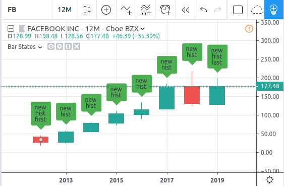
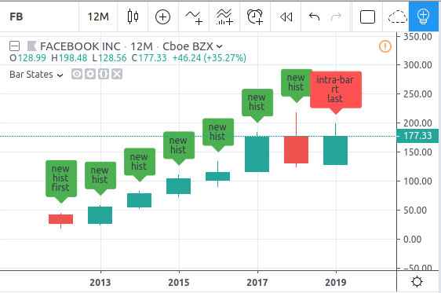
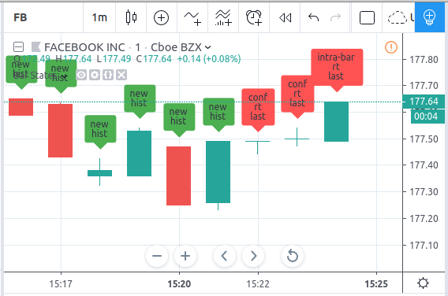

Bar states. Built-in variables barstate.*
=========================================

A set of built-in variables of the ``barstate`` namespace allows users to define the bar states
for which scripts actions are performed:

-  ``barstate.isfirst`` --- ``true`` if the current bar is the first in the
   whole range of bars available, ``false`` otherwise.

-  ``barstate.islast`` --- ``true`` if the current bar is the last in the
   whole range of bars available, ``false`` otherwise. This flag helps to detect *the last historical bar*.

-  ``barstate.ishistory`` --- ``true`` if the current data update is a historical bar update, ``false`` otherwise (thus it is realtime).

-  ``barstate.isrealtime`` --- ``true`` if the current data update is a real-time bar update,
   ``false`` otherwise (thus it is historical). Note that every realtime bar is also the *last* one.

-  ``barstate.isnew`` --- ``true`` if the current data update is the first (opening) update of a new bar,
   ``false`` otherwise.

-  ``barstate.isconfirmed`` --- ``true`` if the current data update is the last (closing) update of the current bar,
   ``false`` otherwise. The next data update will be an opening update of a new bar [#isconfirmed]_.

All historical bars are considered *new* bars. That is because of the fact that the script receives them in a sequential order
from the oldest to the newer ones. For bars that update in realtime, a bar
is considered new only at the opening tick of this bar.

Here is an example of a script using ``barstate.*`` variables::

    //@version=4
    study("Bar States", overlay = true)
    first = barstate.isfirst
    last = barstate.islast

    hist = barstate.ishistory
    rt = barstate.isrealtime

    new = barstate.isnew
    conf = barstate.isconfirmed

    t = new ? "new" : conf ? "conf" : "intra-bar"
    t := t + (hist ? "\nhist" : rt ? "\nrt" : "")
    t := t + (first ? "\nfirst" : last ? "\nlast" : "")
    label.new(bar_index, na, yloc=yloc.abovebar, text=t,
    color=hist ? color.green : color.red)

We begin by adding the "Bar States" study to a yearly chart and take a screenshot before any realtime update is received.
This shows the *first* and the *last* bars, and the fact that all bars are *new* ones:

When a realtime update is received, the picture changes slightly. The current bar is no longer a historical bar, it has become a realtime bar. Additionally, it is neither *new* nor *confirmed*, which we indicate with the *intra-bar* text in the label.

This is a screenshot of the same symbol at a *1 minute* timeframe, after a few realtime bars have elapsed.
The elapsed realtime bars show the *confirmed* state.

.. rubric:: Footnotes

.. [#isconfirmed] Variable ``barstate.isconfirmed`` returns the state of current chart symbol data only.
   It does not take into account any secondary symbol data requested with the ``security`` function.
