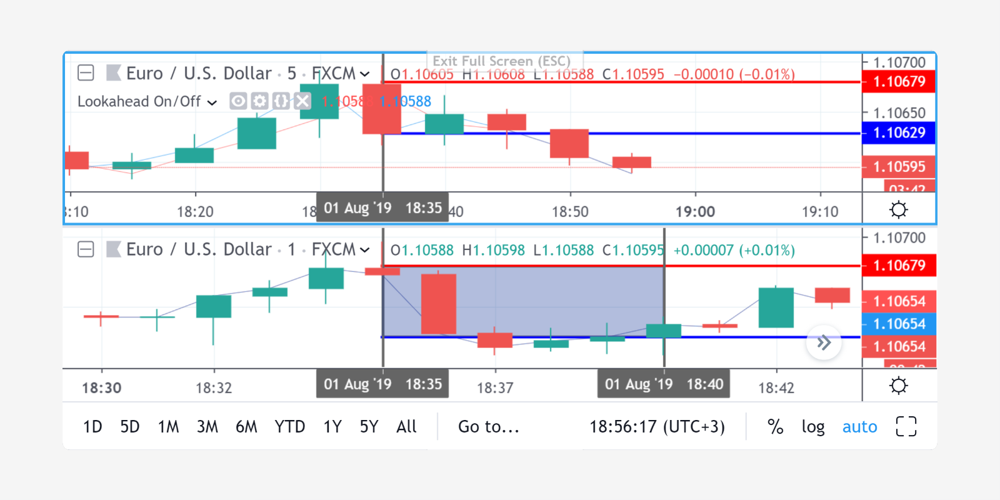
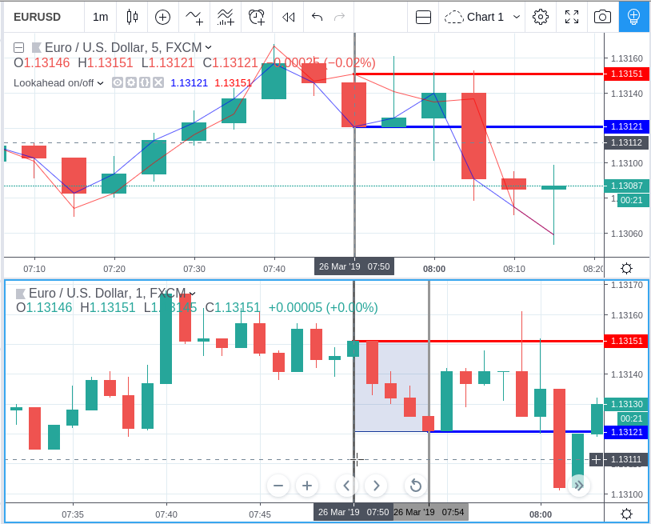

Context switching: the "security" function
==========================================

.. contents:: :local:
    :depth: 2

The ``security`` function enables scripts to request data from 
symbols and/or resolutions other than the ones a script is running on.

"security" function
-------------------

Let's assume the following script is running on an IBM chart at 1min. It
will display the *close* price of the IBM symbol, but at 15min resolution.

::

    //@version=4
    study("Example security 1", overlay=true)
    ibm_15 = security("NYSE:IBM", "15", close)
    plot(ibm_15)

The `security <https://www.tradingview.com/study-script-reference/v4/#fun_security>`__ 
function's first argument is the name of the requested symbol. The second
argument is the required resolution and the third one is an expression
which will be calculated on the requested series *within* the ``security`` call.

The name of the symbol can be defined using two variants: with a prefix that
contains the exchange (or data provider), or without it. For example:
``"NYSE:IBM"``, ``"BATS:IBM"`` or ``"IBM"``. When an exchange is not provided,
BATS will be used as the default. The current symbol name is stored in the 
`syminfo.ticker <https://www.tradingview.com/pine-script-reference/v4/#var_syminfo{dot}ticker>`__ and 
`syminfo.tickerid <https://www.tradingview.com/pine-script-reference/v4/#var_syminfo{dot}tickerid>`__
built-in variables. ``syminfo.ticker`` contains the value of the
symbol name without its exchange prefix, for example ``"MSFT"``. 
``syminfo.tickerid`` contains the value of the symbol name with its exchange prefix, for example,
``"BATS:MSFT"`` or ``"NASDAQ:MSFT"``. It is recommended to use ``syminfo.tickerid`` to avoid
ambiguity in the values returned by ``security``.

.. TODO write about syminfo.tickerid in extended format and function tickerid

The second argument of the ``security`` function, ``resolution`` (i.e., the *timeframe*), is
also a string. All intraday resolutions are defined using a
number of minutes. The lowest resolution is *one minute* which is indicated by the
literal ``"1"``. It is possible to request any [#minutes]_ number of minutes: ``"5"``, ``"10"``,
``"21"``, etc. *Hourly* resolution is also set by minutes [#hours]_. For example, the
following lines signify an hour, two hours and four hours respectively:
``"60"``, ``"120"``, ``"240"``. A resolution with a value of *1 day* is set by the
symbols ``"D"`` or ``"1D"``. It's possible to request any number of days: ``"2D"``,
``"3D"``, etc. *Weekly* and *monthly* resolutions are set in a similar way: ``"W"``,
``"1W"``, ``"2W"``, ..., ``"M"``, ``"1M"``, ``"2M"``. ``"M"`` and ``"1M"`` have the same one month
resolution value. ``"W"`` and ``"1W"`` have the same weekly resolution value. The
third parameter of the security function can be any arithmetic
expression or a function call, which will be calculated in the context of the chosen series.
The resolution of the main chart's symbol is stored in the  
`timeframe.period <https://www.tradingview.com/pine-script-reference/v4/#var_timeframe{dot}period>`__
built-in variable.

Using the ``security`` function, users can view a 1min chart while
displaying an SMA (or any other expression) from any other resolution
(i.e., daily, weekly, monthly)::

    //@version=4
    study(title="High Time Frame MA", overlay=true)
    src = close, len = 9
    out = sma(src, len)
    out1 = security(syminfo.tickerid, 'D', out)
    plot(out1)

One can declare the following variable:

::

    spread = high - low

and calculate it at 1min, 15min and 60min::

    spread_1 = security(tickerid, '1', spread)
    spread_15 = security(tickerid, '15', spread)
    spread_60 = security(tickerid, '60', spread)

The ``security`` function 
returns a series which is then adapted to the time scale of
the current chart's symbol. This result can be either shown directly on
the chart (i.e., with ``plot``), or used in further calculations. 
The "Advance Decline Line" script illustrates a more
involved use of ``security``::

    //@version=4
    study(title = "Advance Decline Ratio", shorttitle="ADR")
    ratio(t1, t2, source) => 
        s1 = security(t1, timeframe.period, source)
        s2 = security(t2, timeframe.period, source)
        s1 / s2
    plot(ratio("USI:ADVN.NY", "USI:DECL.NY", close))

The script requests two additional securities. The results of the
requests are then used in an arithmetic formula. As a result, we have a
stock market indicator used by investors to measure the number of
individual stocks participating in an upward or downward trend (`read
more <https://en.wikipedia.org/wiki/Advance%E2%80%93decline_line>`__).

.. _barmerge_gaps_and_lookahead:

Barmerge gaps and lookahead
---------------------------

There are two switches that define how requested data will be mapped to the
current timeframe.

First one --- ``gaps`` --- controls gaps in data. Default value is 
`barmerge.gaps_off <https://www.tradingview.com/study-script-reference/v4/#var_barmerge{dot}gaps_off>`__, data is
merged continiously (without ``na``-gaps). All the gaps (if any) are filled with the previous nearest non-``na`` value.
If `barmerge.gaps_on <https://www.tradingview.com/study-script-reference/v4/#var_barmerge{dot}gaps_on>`__ then data will
be merged possibly with gaps (``na`` values).

Second one --- ``lookahead`` --- was added in :ref:`Pine Script version
3 <release_notes_v3>`. The parameter has two possible values:
`barmerge.lookahead_off <https://www.tradingview.com/study-script-reference/v4/#var_barmerge{dot}lookahead_off>`__
and
`barmerge.lookahead_on <https://www.tradingview.com/study-script-reference/v4/#var_barmerge{dot}lookahead_on>`__
to switch between the new (version 3) and old behavior (version 2 and 1)
of the
`security <https://www.tradingview.com/study-script-reference/v4/#fun_security>`__
function.

Here is an example that
shows the behavioral difference of the security function on a 5 minute
chart::

    //@version=4
    study('My Script', overlay=true)
    a = security(syminfo.tickerid, '60', low, lookahead=barmerge.lookahead_off)
    plot(a, color=color.red)
    b = security(syminfo.tickerid, '60', low, lookahead=barmerge.lookahead_on)
    plot(b, color=color.lime)

.. image:: /appendix/images/V3.png

The green line on the chart is the *low* price of an hourly bar that is
requested with *lookahead on*. It's the old behavior of the security
function, implemented in Pine Script v2. The green line based on
historical data is displayed at the price level of an hourly *low* right
after a new hourly bar is created (dotted blue vertical lines). The red
line is a *low* price of an hourly bar that is requested with *lookahead
off*. In this case the requested *low* price of an hourly historical bar
will be given only on the last minute bar of the requested hour, when an
hourly bar's *low* won't return future data. The fuchsia dotted line
represents the beginning of real-time data. You can see that
``barmerge.lookahead_on`` and ``barmerge.lookahead_off`` based on
real-time data behaves the same way according to
``barmerge.lookahead_off``.

.. _understanding_lookahead:

Understanding lookahead
-----------------------

There are many published scripts with the following lines::

    //@version=2
    //...
    a = security(tickerid, 'D', close[1]) // It's barmerge.lookahead_on, because version is 2

The expression in security (``close[1]``) is a value of ``close`` of the
previous day, which is why the construction **doesn't use future data**.

In Pine Script version 3 (or later) we can rewrite this in two different ways, using
``barmerge.lookahead_on`` or ``barmerge.lookahead_off``. If you use
``barmerge.lookahead_on``, then it's quite simple::

    //@version=4
    //...
    a = security(syminfo.tickerid, 'D', close[1], lookahead=barmerge.lookahead_on)

Because original construction doesn't use data from future it is
possible to rewrite it using ``barmerge.lookahead_off``. If you use
``barmerge.lookahead_off``, the script becomes more complex, but gives
you an understanding of how the lookahead parameter works::

    //@version=4
    //...
    indexHighTF = barstate.isrealtime ? 1 : 0
    indexCurrTF = barstate.isrealtime ? 0 : 1
    a0 = security(syminfo.tickerid, 'D', close[indexHighTF], lookahead=barmerge.lookahead_off)
    a = a0[indexCurrTF]

When an indicator is based on historical data (i.e.,
``barstate.isrealtime`` equals ``false``), we take the current *close* of
the daily resolution and shift the result of ``security`` function call one bar to the
right in the current resolution. When an indicator is calculated on
real-time data, we take the *close* of the previous day without shifting the
``security`` data.

.. _requesting_data_of_a_lower_timeframe:

Requesting data of a lower timeframe
------------------------------------

``security`` function was designed to request data of a timeframe *higher*
than the current chart timeframe. For example, if you have a 60 minute chart,
you can request 240, D, W (or any higher timeframe) and plot the
results.

It's not recommended to request data of a timeframe *lower* that the current chart timeframe
(for example 1 minute data from 5 minute chart). The main problem with such a case is that 
some part of a 1 minute data will be inevitably lost, as it's impossible to display it on a 5 minute 
chart and not to break the time axis. So the ``security`` behaviour could be rather weird. 
The next example illustrates this::
    
    // Add this script on a "5" minute chart
    //@version=4
    study("Lookahead On/Off", overlay=true, precision=5)
    l_on = security(syminfo.tickerid, "1", close, lookahead=barmerge.lookahead_on)
    l_off = security(syminfo.tickerid, "1", close, lookahead=barmerge.lookahead_off)
    plot(l_on, color=color.red)
    plot(l_off, color=color.blue)

This study plots two lines which correspond to different values of ``lookahead`` parameter.
Red line shows data returned by ``security`` with ``lookahead=barmerge.lookahead_on``, blue line --- with ``lookahead=barmerge.lookahead_off``.
Let us look at the 5 minute bar that starts at 07:50. The red line at this bar has value of 1.13151 which corresponds to 
a value of *the first of the five 1 minute bars* that fall into the time range 07:50--07:54. 
On the other hand, the blue line at the same bar has value of 1.13121 which corresponds to 
*the last of the five 1 minute bars* of the same time range.

.. rubric:: Footnotes

.. [#minutes] Actually the highest supported minute resolution is "1440" (which is a number of minutes in 24 hours).

.. [#hours] Requesting data of ``"1h"`` or ``"1H"`` resolution would result in an error. Use ``"60"`` instead.
