Drawings
========

.. contents:: :local:
    :depth: 2

Starting with Pine v4, indicators and strategies can
create *drawing objects* on the chart. Two types of
drawings are currently supported: *label* and *line*.
You will find one instance of each on the following chart:

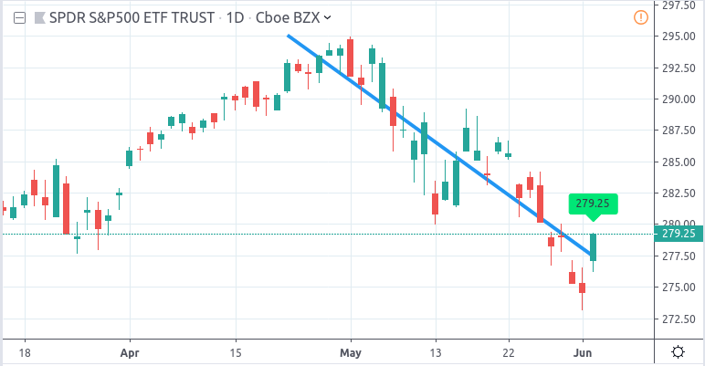

.. note:: On TradingView charts, a complete set of *Drawing Tools*
  allows users to create and modify drawings using mouse actions. While they may look similar to
  drawing objects created with Pine code, they are essentially different entities.
  Drawing objects created using Pine code cannot be modified with mouse actions.

The new line and label drawings in Pine v4 allow you to create indicators with more sophisticated
visual components, e.g., pivot points, support/resistance levels,
zig zag lines, labels containing dynamic text, etc.

In contrast to indicator plots (plots are created with functions ``plot``, ``plotshape``, ``plotchar``),
drawing objects can be created on historical bars as well as in the future, where no bars exist yet.

Creating drawings
-----------------

Pine drawing objects are created with the `label.new <https://www.tradingview.com/pine-script-reference/v4/#fun_label{dot}new>`__
and `line.new <https://www.tradingview.com/pine-script-reference/v4/#fun_line{dot}new>`__ functions.
While each function has many parameters, only the coordinates are mandatory.
This is an example of code used to create a label on every bar::

    //@version=4
    study("My Script", overlay=true)
    label.new(bar_index, high)

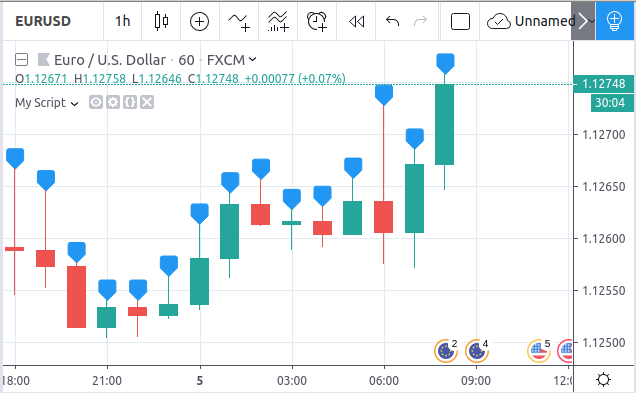

The label is created with the parameters ``x=bar_index`` (the index of the current bar,
`bar_index <https://www.tradingview.com/pine-script-reference/v4/#var_bar_index>`__) and ``y=high`` (high price of the current bar).
When a new bar opens, a new label is created on it. Label objects created on previous bars stay on the chart
until the indicator deletes them with an explicit call of the `label.delete <https://www.tradingview.com/pine-script-reference/v4/#fun_label{dot}delete>`__
function, or until the automatic garbage collection process removes them.

Here is a modified version of the same script that shows the values of the ``x`` and ``y`` coordinates used to create the labels::

    //@version=4
    study("My Script", overlay=true)
    label.new(bar_index, high, style=label.style_none,
              text="x=" + tostring(bar_index) + "\ny=" + tostring(high))

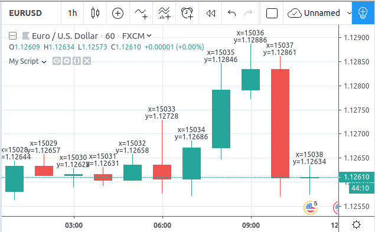

In this example labels are shown without background coloring (because of parameter ``style=label.style_none``) but with
dynamically created text (``text="x=" + tostring(bar_index) + "\ny=" + tostring(high)``) that prints label coordinates.

This is an example of code that creates line objects on a chart::

    //@version=4
    study("My Script", overlay=true)
    line.new(x1=bar_index[1], y1=low[1], x2=bar_index, y2=high)

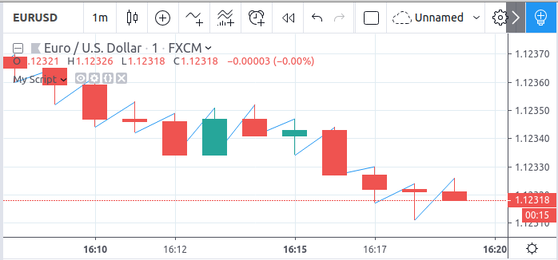

Calculation of drawings on bar updates
--------------------------------------

Drawing objects are subject to both *commit* and *rollback* actions, which affect the behavior of a script when it executes
in the realtime bar, :doc:`/language/Execution_model`.

This script demonstrates the effect of rollback when running in the realtime bar::

    //@version=4
    study("My Script", overlay=true)
    label.new(bar_index, high)

While ``label.new`` creates a new label on every iteration of the script when price changes in the realtime bar,
the most recent label created in the script's previous iteration is also automatically deleted because of rollback before the next iteration. Only the last label created before the realtime bar's close will be committed, and will thus persist.

.. _drawings_coordinates:

Coordinates
-----------

Drawing objects are positioned on the chart according to *x* and *y* coordinates using a combination of 4 parameters: ``x``, ``y``, ``xloc`` and ``yloc``. The value of ``xloc`` determines whether ``x`` will hold a bar index or time value. When ``yloc=yloc.price``, ``y`` holds a price. ``y`` is ignored when ``yloc`` is set to `yloc.abovebar <https://www.tradingview.com/pine-script-reference/v4/#var_yloc{dot}abovebar>`__ or `yloc.belowbar <https://www.tradingview.com/pine-script-reference/v4/#var_yloc{dot}belowbar>`__.

If a drawing object uses `xloc.bar_index <https://www.tradingview.com/pine-script-reference/v4/#var_xloc{dot}bar_index>`__, then
the x-coordinate is treated as an absolute bar index. The bar index of the current bar can be obtained from the built-in variable ``bar_index``. The bar index of previous bars is ``bar_index[1]``, ``bar_index[2]`` and so on. ``xloc.bar_index`` is the default value for x-location parameters of both label and line drawings.

If a drawing object uses `xloc.bar_time <https://www.tradingview.com/pine-script-reference/v4/#var_xloc{dot}bar_time>`__, then
the x-coordinate is treated as a UNIX time in milliseconds. The start time of the current bar can be obtained from the built-in variable ``time``.
The bar time of previous bars is ``time[1]``, ``time[2]`` and so on. Time can also be set to an absolute time point with the
`timestamp <https://www.tradingview.com/pine-script-reference/v4/#fun_timestamp>`__ function.

The ``xloc.bar_time`` mode makes it possible to place a drawing object in the future, to the right of the current bar. For example::

    //@version=4
    study("My Script", overlay=true)
    dt = time - time[1]
    if barstate.islast
        label.new(time + 3*dt, close, xloc=xloc.bar_time)

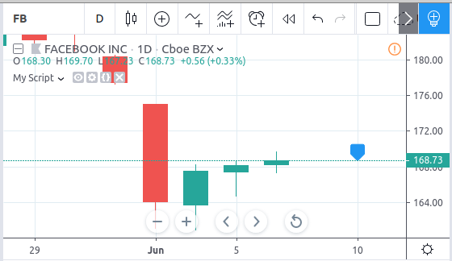

This code places a label object in the future. X-location logic works identically for both label and line drawings.

In contrast, y-location logic is different for label and line drawings.
Pine's *line* drawings always use `yloc.price <https://www.tradingview.com/pine-script-reference/v4/#var_yloc{dot}price>`__,
so their y-coordinate is always treated as an absolute price value.

Label drawings have additional y-location values: `yloc.abovebar <https://www.tradingview.com/pine-script-reference/v4/#var_yloc{dot}abovebar>`__ and
`yloc.belowbar <https://www.tradingview.com/pine-script-reference/v4/#var_yloc{dot}belowbar>`__.
When they are used, the value of the ``y`` parameter is ignored and the drawing object is placed above or below the bar.

Modifying drawings
------------------

A drawing object can be modified after its creation. The ``label.new`` and ``line.new`` functions return
a reference to the created drawing object (of type *series label* and *series line* respectively).
This reference can then be used as the first argument to the ``label.set_*`` and ``line.set_*`` functions used to modify drawings.
For example::

    //@version=4
    study("My Script", overlay=true)
    l = label.new(bar_index, na)
    if close >= open
        label.set_text(l, "green")
        label.set_color(l, color.green)
        label.set_yloc(l, yloc.belowbar)
        label.set_style(l, label.style_labelup)
    else
        label.set_text(l, "red")
        label.set_color(l, color.red)
        label.set_yloc(l, yloc.abovebar)
        label.set_style(l, label.style_labeldown)

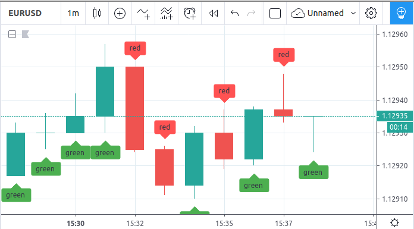

This simple script first creates a label on the current bar and then it writes a reference to it in a variable ``l``.
Then, depending on whether the current bar is rising or falling (condition ``close >= open``), a number of label drawing properties are modified:
text, color, *y* coordinate location (``yloc``) and label style.

One may notice that ``na`` is passed as the ``y`` argument to the ``label.new`` function call. The reason for this is that
the example's label uses either ``yloc.belowbar`` or ``yloc.abovebar`` y-locations, which don't require a y value.
A finite value for ``y`` is needed only if a label uses ``yloc.price``.

The available *setter* functions for label drawings are:

    * `label.set_color <https://www.tradingview.com/pine-script-reference/v4/#fun_label{dot}set_color>`__ --- changes color of label
    * `label.set_size <https://www.tradingview.com/pine-script-reference/v4/#fun_label{dot}set_size>`__ --- changes size of label
    * `label.set_style <https://www.tradingview.com/pine-script-reference/v4/#fun_label{dot}set_style>`__ --- changes :ref:`style of label <drawings_label_styles>`
    * `label.set_text <https://www.tradingview.com/pine-script-reference/v4/#fun_label{dot}set_text>`__ --- changes text of label
    * `label.set_textcolor <https://www.tradingview.com/pine-script-reference/v4/#fun_label{dot}set_textcolor>`__ --- changes color of text
    * `label.set_x <https://www.tradingview.com/pine-script-reference/v4/#fun_label{dot}set_x>`__ --- changes x-coordinate of label
    * `label.set_y <https://www.tradingview.com/pine-script-reference/v4/#fun_label{dot}set_y>`__ --- changes y-coordinate of label
    * `label.set_xy <https://www.tradingview.com/pine-script-reference/v4/#fun_label{dot}set_xy>`__ --- changes both x and y coordinates of label
    * `label.set_xloc <https://www.tradingview.com/pine-script-reference/v4/#fun_label{dot}set_xloc>`__ --- changes x-location of label
    * `label.set_yloc <https://www.tradingview.com/pine-script-reference/v4/#fun_label{dot}set_yloc>`__ --- changes y-location of label
    * `label.set_tooltip <https://www.tradingview.com/pine-script-reference/v4/#fun_label{dot}set_tooltip>`__ --- changes tooltip of label

The available *setter* functions for line drawings are:

    * `line.set_color <https://www.tradingview.com/pine-script-reference/v4/#fun_line{dot}set_color>`__ --- changes color of line
    * `line.set_extend <https://www.tradingview.com/pine-script-reference/v4/#fun_line{dot}set_extend>`__ --- changes attribute that makes:

      - ``extend.none`` - a line segment
      - ``extend.left``/``extend.right`` - a ray
      - ``extend.both`` - an endless line

    * `line.set_style <https://www.tradingview.com/pine-script-reference/v4/#fun_line{dot}set_style>`__ --- changes :ref:`style of line <drawings_line_styles>`
    * `line.set_width <https://www.tradingview.com/pine-script-reference/v4/#fun_line{dot}set_width>`__ --- changes width of line
    * `line.set_xloc <https://www.tradingview.com/pine-script-reference/v4/#fun_line{dot}set_xloc>`__ --- changes x-location of line (both x1 and x2)
    * `line.set_x1 <https://www.tradingview.com/pine-script-reference/v4/#fun_line{dot}set_x1>`__ --- changes x1-coordinate of line
    * `line.set_y1 <https://www.tradingview.com/pine-script-reference/v4/#fun_line{dot}set_y1>`__ --- changes y1-coordinate of line
    * `line.set_xy1 <https://www.tradingview.com/pine-script-reference/v4/#fun_line{dot}set_xy1>`__ --- changes both x1 and y1 coordinates of line
    * `line.set_x2 <https://www.tradingview.com/pine-script-reference/v4/#fun_line{dot}set_x2>`__ --- changes x2-coordinate of line
    * `line.set_y2 <https://www.tradingview.com/pine-script-reference/v4/#fun_line{dot}set_y2>`__ --- changes y2-coordinate of line
    * `line.set_xy2 <https://www.tradingview.com/pine-script-reference/v4/#fun_line{dot}set_xy2>`__ --- changes both x2 and y2 coordinates of line at once

.. _drawings_label_styles:

Label styles
------------

Various styles can be applied to labels with either the `label.new <https://www.tradingview.com/pine-script-reference/v4/#fun_label{dot}new>`__ or
`label.set_style <https://www.tradingview.com/pine-script-reference/v4/#fun_label{dot}set_style>`__
function:

+--------------------------------+-------------------------------------------------+-------------------------------------------------+
| Label style name               | Label                                           | Label with text                                 |
+================================+=================================================+=================================================+
| ``label.style_none``           |                                                 | |label_style_none_t|                            |
+--------------------------------+-------------------------------------------------+-------------------------------------------------+
| ``label.style_xcross``         | |label_style_xcross|                            | |label_style_xcross_t|                          |
+--------------------------------+-------------------------------------------------+-------------------------------------------------+
| ``label.style_cross``          | |label_style_cross|                             | |label_style_cross_t|                           |
+--------------------------------+-------------------------------------------------+-------------------------------------------------+
| ``label.style_triangleup``     | |label_style_triangleup|                        | |label_style_triangleup_t|                      |
+--------------------------------+-------------------------------------------------+-------------------------------------------------+
| ``label.style_triangledown``   | |label_style_triangledown|                      | |label_style_triangledown_t|                    |
+--------------------------------+-------------------------------------------------+-------------------------------------------------+
| ``label.style_flag``           | |label_style_flag|                              | |label_style_flag_t|                            |
+--------------------------------+-------------------------------------------------+-------------------------------------------------+
| ``label.style_circle``         | |label_style_circle|                            | |label_style_circle_t|                          |
+--------------------------------+-------------------------------------------------+-------------------------------------------------+
| ``label.style_arrowup``        | |label_style_arrowup|                           | |label_style_arrowup_t|                         |
+--------------------------------+-------------------------------------------------+-------------------------------------------------+
| ``label.style_arrowdown``      | |label_style_arrowdown|                         | |label_style_arrowdown_t|                       |
+--------------------------------+-------------------------------------------------+-------------------------------------------------+
| ``label.style_labelup``        | |label_style_labelup|                           | |label_style_labelup_t|                         |
+--------------------------------+-------------------------------------------------+-------------------------------------------------+
| ``label.style_labeldown``      | |label_style_labeldown|                         | |label_style_labeldown_t|                       |
+--------------------------------+-------------------------------------------------+-------------------------------------------------+
| ``label.style_square``         | |label_style_square|                            | |label_style_square_t|                          |
+--------------------------------+-------------------------------------------------+-------------------------------------------------+
| ``label.style_diamond``        | |label_style_diamond|                           | |label_style_diamond_t|                         |
+--------------------------------+-------------------------------------------------+-------------------------------------------------+

.. |label_style_xcross| image:: images/label.style_xcross.png
.. |label_style_cross| image:: images/label.style_cross.png
.. |label_style_triangleup| image:: images/label.style_triangleup.png
.. |label_style_triangledown| image:: images/label.style_triangledown.png
.. |label_style_flag| image:: images/label.style_flag.png
.. |label_style_circle| image:: images/label.style_circle.png
.. |label_style_arrowup| image:: images/label.style_arrowup.png
.. |label_style_arrowdown| image:: images/label.style_arrowdown.png
.. |label_style_labelup| image:: images/label.style_labelup.png
.. |label_style_labeldown| image:: images/label.style_labeldown.png
.. |label_style_square| image:: images/label.style_square.png
.. |label_style_diamond| image:: images/label.style_diamond.png

.. |label_style_none_t| image:: images/label.style_none_t.png
.. |label_style_xcross_t| image:: images/label.style_xcross_t.png
.. |label_style_cross_t| image:: images/label.style_cross_t.png
.. |label_style_triangleup_t| image:: images/label.style_triangleup_t.png
.. |label_style_triangledown_t| image:: images/label.style_triangledown_t.png
.. |label_style_flag_t| image:: images/label.style_flag_t.png
.. |label_style_circle_t| image:: images/label.style_circle_t.png
.. |label_style_arrowup_t| image:: images/label.style_arrowup_t.png
.. |label_style_arrowdown_t| image:: images/label.style_arrowdown_t.png
.. |label_style_labelup_t| image:: images/label.style_labelup_t.png
.. |label_style_labeldown_t| image:: images/label.style_labeldown_t.png
.. |label_style_square_t| image:: images/label.style_square_t.png
.. |label_style_diamond_t| image:: images/label.style_diamond_t.png

.. _drawings_line_styles:

Line styles
-----------

Various styles can be applied to lines with either the
`line.new <https://www.tradingview.com/pine-script-reference/v4/#fun_line{dot}new>`__ or
`line.set_style <https://www.tradingview.com/pine-script-reference/v4/#fun_line{dot}set_style>`__
function:

+--------------------------------+-------------------------------------------------+
| Line style name                | Line                                            |
+================================+=================================================+
| ``line.style_solid``           | |line_style_solid|                              |
+--------------------------------+-------------------------------------------------+
| ``line.style_dotted``          | |line_style_dotted|                             |
+--------------------------------+-------------------------------------------------+
| ``line.style_dashed``          | |line_style_dashed|                             |
+--------------------------------+-------------------------------------------------+
| ``line.style_arrow_left``      | |line_style_arrow_left|                         |
+--------------------------------+-------------------------------------------------+
| ``line.style_arrow_right``     | |line_style_arrow_right|                        |
+--------------------------------+-------------------------------------------------+
| ``line.style_arrow_both``      | |line_style_arrow_both|                         |
+--------------------------------+-------------------------------------------------+

.. |line_style_solid| image:: images/line.style_solid.png
.. |line_style_dotted| image:: images/line.style_dotted.png
.. |line_style_dashed| image:: images/line.style_dashed.png
.. |line_style_arrow_left| image:: images/line.style_arrow_left.png
.. |line_style_arrow_right| image:: images/line.style_arrow_right.png
.. |line_style_arrow_both| image:: images/line.style_arrow_both.png

Deleting drawings
-----------------

The `label.delete <https://www.tradingview.com/pine-script-reference/v4/#fun_label{dot}delete>`__
and `line.delete <https://www.tradingview.com/pine-script-reference/v4/#fun_line{dot}delete>`__
functions delete *label* and *line* drawing objects from the chart.

Here is Pine code that keeps just one label drawing object on the current bar,
*deleting the old ones*::

    //@version=4
    study("Last Bar Close 1", overlay=true)

    c = close >= open ? color.lime : color.red
    l = label.new(bar_index, na,
      text=tostring(close), color=c,
      style=label.style_labeldown, yloc=yloc.abovebar)

    label.delete(l[1])

.. image:: images/Last_Bar_Close_1.png

On every new bar update of the "Last Bar Close 1" study, a new label object is created and written to variable ``l``.
Variable ``l`` is of type *series label*, so the ``[]`` operator is used to get the previous bar's label object.
That previous label is then passed to the ``label.delete`` function to delete it.

Functions ``label.delete`` and ``line.delete`` do nothing if the ``na`` value is used as an id, which makes code like the following unnecessary::

    if not na(l[1])
        label.delete(l[1])

The previous script's behavior can be reproduced using another approach::

    //@version=4
    study("Last Bar Close 2", overlay=true)

    var label l = na
    label.delete(l)
    c = close >= open ? color.lime : color.red
    l := label.new(bar_index, na,
      text=tostring(close), color=c,
      style=label.style_labeldown, yloc=yloc.abovebar)

When the study "Last Bar Close 2" gets a new bar update, variable ``l`` is still referencing the old label object created on the previous bar. This label is deleted with the ``label.delete(l)`` call. A new label is then created and its id saved to ``l``. Using this approach there is no need to use the ``[]`` operator.

Note the use of the new Pine v4 :ref:`var keyword <variable_declaration>`. It creates variable ``l`` and initializes it with the ``na`` value only once. ``label.delete(l)`` would have no object to delete if it weren't for the fact that ``l`` is initialized only once.

There is yet another way to achieve the same objective as in the two previous scripts, this time by modifying the label rather than deleting it::

    //@version=4
    study("Last Bar Close 3", overlay=true)

    var label l = label.new(bar_index, na,
      style=label.style_labeldown, yloc=yloc.abovebar)

    c = close >= open ? color.lime : color.red
    label.set_color(l, c)
    label.set_text(l, tostring(close))
    label.set_x(l, bar_index)

Once again, the use of new :ref:`var keyword <variable_declaration>` is essential. It is what allows the ``label.new`` call to be
executed only once, on the very first historical bar.

Examples of classic indicators
------------------------------

Pivot Points Standard
^^^^^^^^^^^^^^^^^^^^^

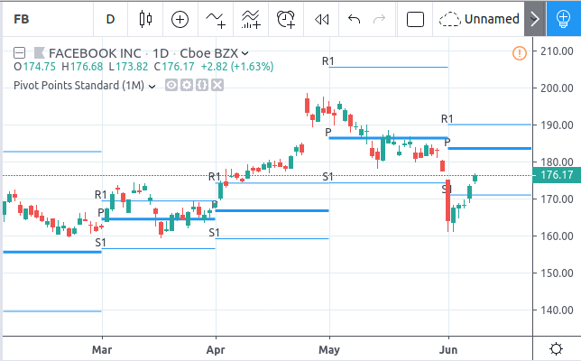

::

    //@version=4
    study("Pivot Points Standard", overlay=true)
    higherTF = input("D", type=input.resolution)
    prevCloseHTF = security(syminfo.tickerid, higherTF, close[1], lookahead=true)
    prevOpenHTF = security(syminfo.tickerid, higherTF, open[1], lookahead=true)
    prevHighHTF = security(syminfo.tickerid, higherTF, high[1], lookahead=true)
    prevLowHTF = security(syminfo.tickerid, higherTF, low[1], lookahead=true)

    pLevel = (prevHighHTF + prevLowHTF + prevCloseHTF) / 3
    r1Level = pLevel * 2 - prevLowHTF
    s1Level = pLevel * 2 - prevHighHTF

    var line r1Line = na
    var line pLine = na
    var line s1Line = na

    if pLevel[1] != pLevel
        line.set_x2(r1Line, bar_index)
        line.set_x2(pLine, bar_index)
        line.set_x2(s1Line, bar_index)
        line.set_extend(r1Line, extend.none)
        line.set_extend(pLine, extend.none)
        line.set_extend(s1Line, extend.none)
        r1Line := line.new(bar_index, r1Level, bar_index, r1Level, extend=extend.right)
        pLine := line.new(bar_index, pLevel, bar_index, pLevel, width=3, extend=extend.right)
        s1Line := line.new(bar_index, s1Level, bar_index, s1Level, extend=extend.right)
        label.new(bar_index, r1Level, "R1", style=label.style_none)
        label.new(bar_index, pLevel, "P", style=label.style_none)
        label.new(bar_index, s1Level, "S1", style=label.style_none)

    if not na(pLine) and line.get_x2(pLine) != bar_index
        line.set_x2(r1Line, bar_index)
        line.set_x2(pLine, bar_index)
        line.set_x2(s1Line, bar_index)

Pivot Points High/Low
^^^^^^^^^^^^^^^^^^^^^

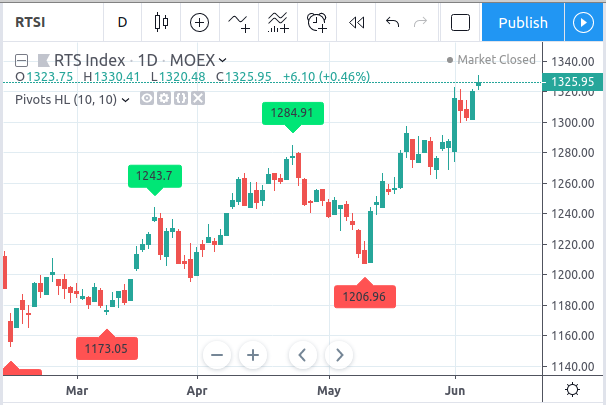

::

    //@version=4
    study("Pivot Points High Low", shorttitle="Pivots HL", overlay=true)
    
    lenH = input(title="Length High", type=input.integer, defval=10, minval=1)
    lenL = input(title="Length Low", type=input.integer, defval=10, minval=1)
    
    fun(src, len, isHigh, _style, _yloc, _color) =>
        p = nz(src[len])
        isFound = true
        for i = 0 to len - 1
            if isHigh and src[i] > p
                isFound := false
    
            if not isHigh and src[i] < p
                isFound := false
        
        for i = len + 1 to 2 * len
            if isHigh and src[i] >= p
                isFound := false
    
            if not isHigh and src[i] <= p
                isFound := false
    
        if isFound
            label.new(bar_index[len], p, tostring(p), style=_style, yloc=_yloc, color=_color)
    
    fun(high, lenH, true, label.style_labeldown, yloc.abovebar, color.lime)
    fun(low, lenL, false, label.style_labelup, yloc.belowbar, color.red)

Linear Regression
^^^^^^^^^^^^^^^^^

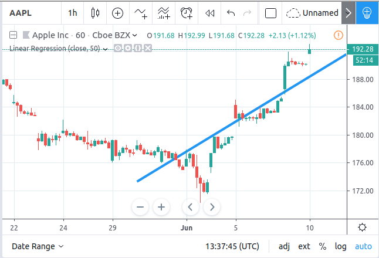

::

    //@version=4
    study("Linear Regression", shorttitle="LinReg", overlay=true)
    
    upperMult = input(title="Upper Deviation", defval=2)
    lowerMult = input(title="Lower Deviation", defval=-2)
    
    useUpperDev = input(title="Use Upper Deviation", defval=true)
    useLowerDev = input(title="Use Lower Deviation", defval=true)
    showPearson = input(title="Show Pearson's R", defval=true)
    extendLines = input(title="Extend Lines", defval=false)
    
    len = input(title="Count", defval=100)
    src = input(title="Source", defval=close)
    
    extend = extendLines ? extend.right : extend.none
    
    calcSlope(src, len) =>
        if not barstate.islast or len <= 1
            [float(na), float(na), float(na)]
        else
            sumX = 0.0
            sumY = 0.0
            sumXSqr = 0.0
            sumXY = 0.0
            for i = 0 to len - 1
                val = src[i]
                per = i + 1.0
                sumX := sumX + per
                sumY := sumY + val
                sumXSqr := sumXSqr + per * per
                sumXY := sumXY + val * per
            slope = (len * sumXY - sumX * sumY) / (len * sumXSqr - sumX * sumX)
            average = sumY / len
            intercept = average - slope * sumX / len + slope
            [slope, average, intercept]
    
    [s, a, i] = calcSlope(src, len)
    
    startPrice = i + s * (len - 1)
    endPrice = i
    var line baseLine = na
    
    if na(baseLine) and not na(startPrice)
        baseLine := line.new(bar_index - len + 1, startPrice, bar_index, endPrice, width=1, extend=extend, color=color.red)
    else
        line.set_xy1(baseLine, bar_index - len + 1, startPrice)
        line.set_xy2(baseLine, bar_index, endPrice)
        na
    
    calcDev(src, len, slope, average, intercept) =>
        upDev = 0.0
        dnDev = 0.0
        stdDevAcc = 0.0
        dsxx = 0.0
        dsyy = 0.0
        dsxy = 0.0
        
        periods = len - 1
    
        daY = intercept + (slope * periods) / 2
        val = intercept
        
        for i = 0 to periods
            price = high[i] - val
            if (price > upDev)
                upDev := price
    
            price := val - low[i]
            if (price > dnDev)
                dnDev := price
    
            price := src[i]
            dxt = price - average
            dyt = val - daY
            
            price := price - val
            stdDevAcc := stdDevAcc + price * price
            dsxx := dsxx + dxt * dxt
            dsyy := dsyy + dyt * dyt
            dsxy := dsxy + dxt * dyt
            val := val + slope
        
        stdDev = sqrt(stdDevAcc / (periods == 0 ? 1 : periods))
        pearsonR = dsxx == 0 or dsyy == 0 ? 0 : dsxy / sqrt(dsxx * dsyy)
        [stdDev, pearsonR, upDev, dnDev]
    
    [stdDev, pearsonR, upDev, dnDev] = calcDev(src, len, s, a, i)
    
    upperStartPrice = startPrice + (useUpperDev ? upperMult * stdDev : upDev)
    upperEndPrice = endPrice + (useUpperDev ? upperMult * stdDev : upDev)
    var line upper = na
    
    lowerStartPrice = startPrice + (useLowerDev ? lowerMult * stdDev : -dnDev)
    lowerEndPrice = endPrice + (useLowerDev ? lowerMult * stdDev : -dnDev)
    var line lower = na
    
    if na(upper) and not na(upperStartPrice)
        upper := line.new(bar_index - len + 1, upperStartPrice, bar_index, upperEndPrice, width=1, extend=extend, color=#0000ff)
    else
        line.set_xy1(upper, bar_index - len + 1, upperStartPrice)
        line.set_xy2(upper, bar_index, upperEndPrice)
        na
    
    if na(lower) and not na(lowerStartPrice)
        lower := line.new(bar_index - len + 1, lowerStartPrice, bar_index, lowerEndPrice, width=1, extend=extend, color=#0000ff)
    else
        line.set_xy1(lower, bar_index - len + 1, lowerStartPrice)
        line.set_xy2(lower, bar_index, lowerEndPrice)
        na
    
    // Pearson's R
    var label r = na
    transparent = color.new(color.white, 100)
    label.delete(r[1])
    if showPearson and not na(pearsonR)
        r := label.new(bar_index - len + 1, lowerStartPrice, tostring(pearsonR, "#.################"), color=transparent, textcolor=#0000ff, size=size.normal, style=label.style_labelup)

Zig Zag
^^^^^^^

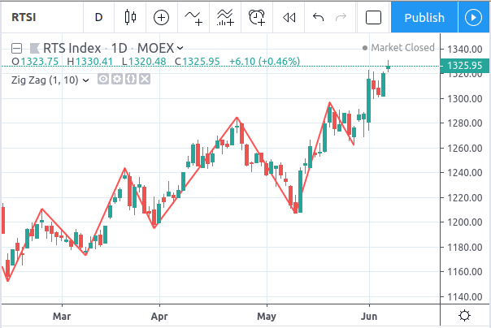

::

    //@version=4
    study("Zig Zag", overlay=true)
    
    dev_threshold = input(title="Deviation (%)", type=input.float, defval=5, minval=1, maxval=100)
    depth = input(title="Depth", type=input.integer, defval=10, minval=1)
    
    pivots(src, length, isHigh) =>
        p = nz(src[length])
    
        if length == 0
            [bar_index, p]
        else
            isFound = true
            for i = 0 to length - 1
                if isHigh and src[i] > p
                    isFound := false
                if not isHigh and src[i] < p
                    isFound := false
            
            for i = length + 1 to 2 * length
                if isHigh and src[i] >= p
                    isFound := false
                if not isHigh and src[i] <= p
                    isFound := false
        
            if isFound and length * 2 <= bar_index
                [bar_index[length], p]
            else
                [int(na), float(na)]
    
    [iH, pH] = pivots(high, floor(depth / 2), true)
    [iL, pL] = pivots(low, floor(depth / 2), false)
    
    calc_dev(base_price, price) =>
        100 * (price - base_price) / base_price
    
    var line lineLast = na
    var int iLast = 0
    var float pLast = 0
    var bool isHighLast = true // otherwise the last pivot is a low pivot
    var int linesCount = 0
    
    pivotFound(dev, isHigh, index, price) =>
        if isHighLast == isHigh and not na(lineLast)
            // same direction
            if isHighLast ? price > pLast : price < pLast
                if linesCount <= 1
                    line.set_xy1(lineLast, index, price)
                line.set_xy2(lineLast, index, price)
                [lineLast, isHighLast, false]
            else
                [line(na), bool(na), false]
        else // reverse the direction (or create the very first line)
            if na(lineLast)
                id = line.new(index, price, index, price, color=color.red, width=2)
                [id, isHigh, true]
            else
                // price move is significant
                if abs(dev) >= dev_threshold
                    id = line.new(iLast, pLast, index, price, color=color.red, width=2)
                    [id, isHigh, true]
                else
                    [line(na), bool(na), false]
    
    if not na(iH) and not na(iL) and iH == iL
        dev1 = calc_dev(pLast, pH)
        [id2, isHigh2, isNew2] = pivotFound(dev1, true, iH, pH)
        if isNew2
            linesCount := linesCount + 1
        if not na(id2)
            lineLast := id2
            isHighLast := isHigh2
            iLast := iH
            pLast := pH
        
        dev2 = calc_dev(pLast, pL)
        [id1, isHigh1, isNew1] = pivotFound(dev2, false, iL, pL)
        if isNew1
            linesCount := linesCount + 1
        if not na(id1)
            lineLast := id1
            isHighLast := isHigh1
            iLast := iL
            pLast := pL
        
    else
        if not na(iH)
            dev1 = calc_dev(pLast, pH)
            [id, isHigh, isNew] = pivotFound(dev1, true, iH, pH)
            if isNew
                linesCount := linesCount + 1
            if not na(id)
                lineLast := id
                isHighLast := isHigh
                iLast := iH
                pLast := pH
        else
            if not na(iL)
                dev2 = calc_dev(pLast, pL)
                [id, isHigh, isNew] = pivotFound(dev2, false, iL, pL)
                if isNew
                    linesCount := linesCount + 1
                if not na(id)
                    lineLast := id
                    isHighLast := isHigh
                    iLast := iL
                    pLast := pL

Limits
------

Total number of drawings
^^^^^^^^^^^^^^^^^^^^^^^^

Drawing objects consume server resources, which is why there is a limit to the total number of drawings
per study or strategy. When too many drawings are created, old ones are automatically deleted by the Pine runtime,
in a process referred to as *garbage collection*.

This code creates a drawing on every bar::

    //@version=4
    study("My Script", overlay=true)
    label.new(bar_index, high)

Scrolling the chart left, one will see there are no drawings after approximately 50 bars:

.. image:: images/drawings_total_number_limit.png

You can change the drawing limit to a value in range from 1 to 500 using the max_lines_count and max_labels_count parameters for the study and strategy functions::

    //@version=4
    study("My Script", overlay=true, max_labels_count=100)
    label.new(bar_index, high)

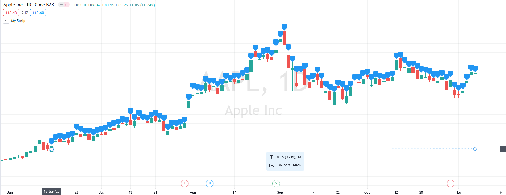

Additional securities
^^^^^^^^^^^^^^^^^^^^^

Pine code sometimes uses additional symbols and/or timeframes with the :doc:`security <Context_switching_the_security_function>` function. Drawing functions can only be used in the main symbol's context.

max_bars_back of time
^^^^^^^^^^^^^^^^^^^^^

Use of ``barstate.isrealtime`` in combination with drawings may sometimes produce unexpected results.
This code's intention, for example, is to ignore all historical bars and create a label drawing on the *realtime* bar::

    //@version=4
    study("My Script", overlay=true)

    if barstate.isrealtime
        label.new(bar_index[10], na, text="Label", yloc=yloc.abovebar)

It will, however, fail at runtime. The reason for the error is that Pine cannot determine the buffer size
for historical values of the ``time`` plot, even though the ``time`` built-in variable isn't mentioned in the code.
This is due to the fact that the built-in variable ``bar_index`` uses the ``time`` series in its inner workings.
Accessing the value of the bar index 10 bars back requires that the history buffer size of the ``time`` series
be of size 10 or more.

In Pine, there is a mechanism that automaticaly detects the required historical buffer size for most cases.
Autodetection works by letting Pine code access historical values any number of bars back for a limited duration.
In this script's case, the ``if barstate.isrealtime`` condition prevents any such accesses to occur,
so the required historical buffer size cannot be inferred and the code fails.

The solution to this conundrum is to use the `max_bars_back <https://www.tradingview.com/pine-script-reference/v4/#fun_max_bars_back>`__ function to explicitly set the historical buffer size for the ``time`` series::

    //@version=4
    study("My Script", overlay=true)

    max_bars_back(time, 10)

    if barstate.isrealtime
        label.new(bar_index[10], na, text="Label", yloc=yloc.abovebar)

Such occurrences are confusing, but rare. In time, the Pine team hopes to eliminate them.
