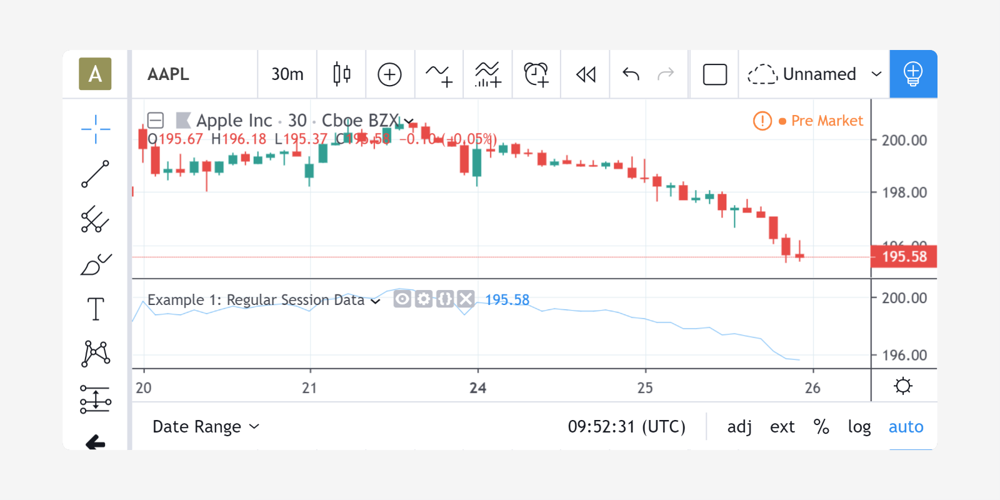

..    include:: <isonum.txt>

Extended and regular sessions
=============================

On TradingView you can access extended hours sessions by
*right-clicking* on a chart and choosing *Settings* |rarr|
*Symbol* |rarr| *Extended Hours (Intraday only)*.
There are two types of sessions: *regular* (excluding pre- and post-market
data) and *extended* (including pre- and post-market data).
Pine scripts may request additional session data using the
`security <https://www.tradingview.com/pine-script-reference/v4/#fun_security>`__ function.

The ``security`` function can be called with a symbol name
(*"EXCHANGE_PREFIX:TICKER"*, e.g., "BATS:AAPL") as its first argument.
Used this way, the ``security`` function will return data for the regular session. For example::

    //@version=4
    study("Example 1: Regular Session Data")
    cc = security("BATS:AAPL", timeframe.period, close, true)
    plot(cc, style=plot.style_linebr)

If you want the ``security`` call to return extended session data, you
must first use the `tickerid <https://www.tradingview.com/pine-script-reference/#fun_tickerid>`__ function
to build ``security`` call's first argument::

    //@version=4
    study("Example 2: Extended Session Data")
    t = tickerid("BATS", "AAPL", session.extended)
    cc = security(t, timeframe.period, close, true)
    plot(cc, style=plot.style_linebr)

.. image:: images/Pine_Extended_Session_Data.png

Notice that the previous chart's gaps in the script's plot are now filled. Also keep in mind
that the background coloring on the chart is not produced by our example scripts;
it is due to the chart's settings showing extended hours.

The first argument of the ``tickerid`` function is an exchange prefix ("BATS") and the
second argument is a ticker ("AAPL"). The third argument specifies the type
of the session (``session.extended`` or ``session.regular``). So *Example 1*
could be rewritten as::

    //@version=4
    study("Example 3: Regular Session Data (using tickerid)")
    t = tickerid("BATS", "AAPL", session.regular)
    cc = security("BATS:AAPL", timeframe.period, close, true)
    plot(cc, style=plot.style_linebr)

If you want to request the same session specification used for the chart's main
symbol, omit the third argument; it is optional. Or, if you want your code to
explicitly declare your intention, use the ``syminfo.session``
built-in variable as the third argument to ``tickerid`` function, as it
holds the session type of the chart's main symbol::

    //@version=4
    study("Example 4: Same as Main Symbol Session Type Data")
    t = tickerid("BATS", "AAPL", syminfo.session)
    cc = security(t, timeframe.period, close, true)
    plot(cc, style=plot.style_linebr)
