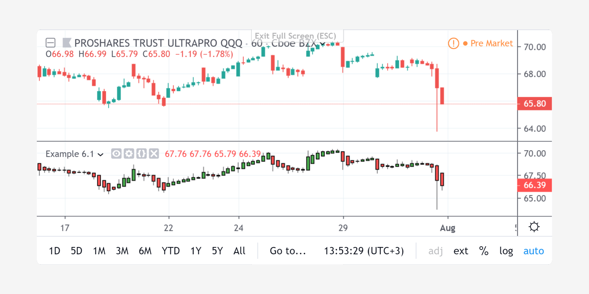
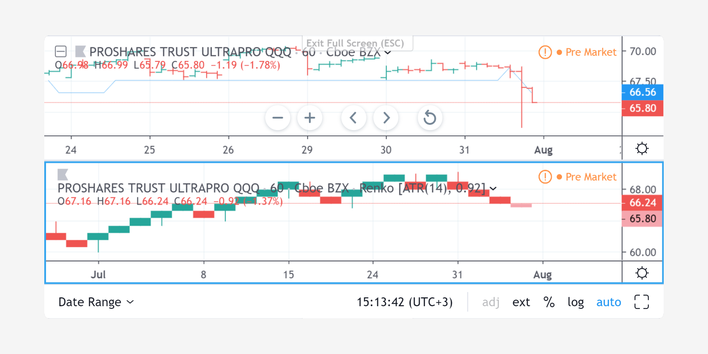
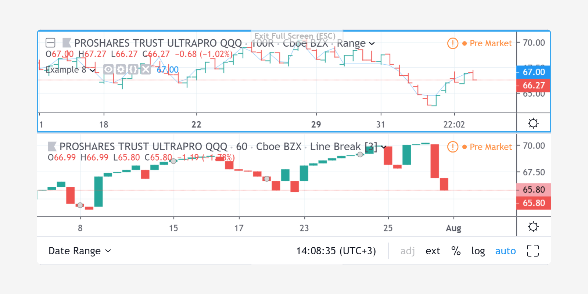
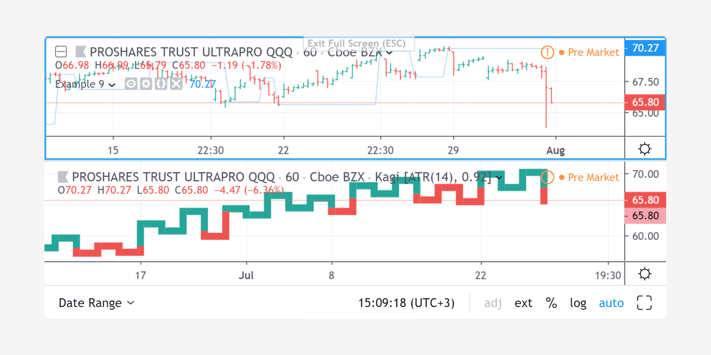
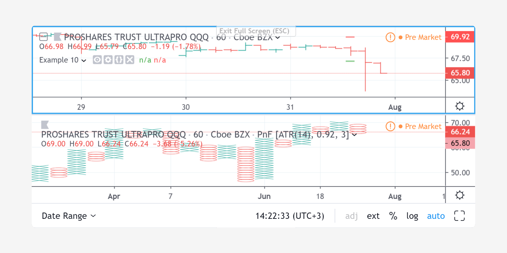

Non-standard chart types data
=============================

.. contents:: :local:
    :depth: 2

These functions allow scripts to fetch information from non-standard
bars or chart types, regardless of the type of chart the script is running on.
They are ``heikinashi``, ``renko``,
``linebreak``, ``kagi`` and ``pointfigure``. All of them work in the
same manner; they create a special ticker identifier to be used as
the first argument in a ``security`` function call.

heikinashi function
-------------------

*Heikin-Ashi* means *average bar* in Japanese. The open, high, low and close
prices of Heikin-Ashi candlesticks are synthetic; they are not actual prices.
Each value is calculated using combinations of normal OHLC
values from the current and previous bar. The calculations used make Heikin-Ashi bars
less noisy than normal candlesticks.

The `heikinashi <https://www.tradingview.com/pine-script-reference/v4/#fun_heikinashi>`__
function creates a special ticker identifier for
requesting Heikin-Ashi data with the ``security`` function.

This script requests low prices of Heikin-Ashi bars and plots them on
top of the usual candlesticks::

    //@version=4
    study("Example 5", overlay=true)
    ha_t = heikinashi(syminfo.tickerid)
    ha_low = security(ha_t, timeframe.period, low)
    plot(ha_low)

.. image:: images/Pine_Heikinashi.png

Note that the low prices of Heikin-Ashi bars are different from the
low prices of the normal candlesticks.

If you wanted to switch off extended hours data in *Example 5*, you would
need to use the ``tickerid`` function first, instead of using the ``syminfo.tickerid``
variable directly::

    //@version=4
    study("Example 6", overlay=true)
    t = tickerid(syminfo.prefix, syminfo.ticker, session.regular)
    ha_t = heikinashi(t)
    ha_low = security(ha_t, timeframe.period, low, gaps=barmerge.gaps_on)
    plot(ha_low, style=plot.style_linebr)

Note that we use an additional fourth parameter with ``security``: ``gaps=barmerge.gaps_on``,
which instructs the function not to use previous values to fill slots where data is absent.
This means we will get empty areas during extended hours.
To be able to see this on the chart, we also need to use a special plot
style (``style=plot.style_linebr``), the *Line With Breaks* style.

You may plot Heikin-Ashi bars from a script so they look exactly like a
chart's Heikin-Ashi bars::

    //@version=4
    study("Example 6.1")
    ha_t = heikinashi(syminfo.tickerid)
    ha_open = security(ha_t, timeframe.period, open)
    ha_high = security(ha_t, timeframe.period, high)
    ha_low = security(ha_t, timeframe.period, low)
    ha_close = security(ha_t, timeframe.period, close)
    palette = ha_close >= ha_open ? color.green : color.red
    plotcandle(ha_open, ha_high, ha_low, ha_close, color=palette)

You will find more information on the `plotcandle <https://www.tradingview.com/pine-script-reference/v4/#fun_plotcandle>`__
and `plotbar <https://www.tradingview.com/pine-script-reference/v4/#fun_plotbar>`__ functions in
the :doc:`/annotations/Custom_OHLC_bars_and_candles` section.

renko function
--------------

*Renko* bars only plot price movements, without taking time or
volume into consideration. They are constructed from ticks and look like
bricks stacked in adjacent columns [#ticks]_. A new brick is drawn after the price
passes the top or bottom by a predetermined amount.

::

    //@version=4
    study("Example 7", overlay=true)
    renko_t = renko(syminfo.tickerid, "ATR", 10)
    renko_low = security(renko_t, timeframe.period, low)
    plot(renko_low)

Please note that you cannot plot Renko bricks from Pine script exactly
as they look. You can only get a series of numbers similar to
OHLC values for Renko bars and use them in your algorithms.

For detailed information, see `renko <https://www.tradingview.com/pine-script-reference/v4/#fun_renko>`__.

linebreak function
------------------

The *Line Break* chart type displays a series of vertical boxes that are based on
price changes [#ticks]_.

::

    //@version=4
    study("Example 8", overlay=true)
    lb_t = linebreak(syminfo.tickerid, 3)
    lb_close = security(lb_t, timeframe.period, close)
    plot(lb_close)

Please note that you cannot plot Line Break boxes from Pine script
exactly as they look. You can only get a series of numbers similar to
OHLC values for Line Break charts and use them in your algorithms.

For detailed information, see `linebreak <https://www.tradingview.com/pine-script-reference/v4/#fun_linebreak>`__.

kagi function
-------------

*Kagi* charts are made of a continuous line that changes directions.
The direction changes when the price changes [#ticks]_
beyond a predetermined amount.

::

    //@version=4
    study("Example 9", overlay=true)
    kagi_t = kagi(syminfo.tickerid, 1)
    kagi_close = security(kagi_t, timeframe.period, close)
    plot(kagi_close)

Please note that you cannot plot Kagi lines from Pine script exactly as
they look. You can only get a series of numbers similar to OHLC
values for Kagi charts and use them in your algorithms.

For detailed information, see `kagi <https://www.tradingview.com/pine-script-reference/v4/#fun_kagi>`__.

pointfigure function
--------------------

*Point and Figure* (PnF) charts only plot price movements [#ticks]_, without
taking time into consideration. A column of X's is plotted as the price
rises, and O's are plotted when price drops.

Please note that you cannot plot PnF X's and O's from Pine script
exactly as they look. You can only get a series of numbers that are
similar to OHLC values for PnF charts and use them in your algorithms.
Every column of X's or O's is represented with four numbers. You may
think of them as synthetic OHLC PnF values.

::

    //@version=4
    study("Example 10", overlay=true)
    pnf_t = pointfigure(syminfo.tickerid, "hl", "ATR", 14, 3)
    pnf_open = security(pnf_t, timeframe.period, open, true)
    pnf_close = security(pnf_t, timeframe.period, close, true)
    plot(pnf_open, color=color.green, style=plot.style_linebr, linewidth=4)
    plot(pnf_close, color=color.red, style=plot.style_linebr, linewidth=4)

For detailed information, see `pointfigure <https://www.tradingview.com/pine-script-reference/v4/#fun_pointfigure>`__.

.. rubric:: Footnotes

.. [#ticks] On TradingView, Renko, Line Break, Kagi and PnF chart types are generated from OHLC values from a lower timeframe.
   These chart types thus represent only an approximation of what they would be like if they were generated from tick data.
