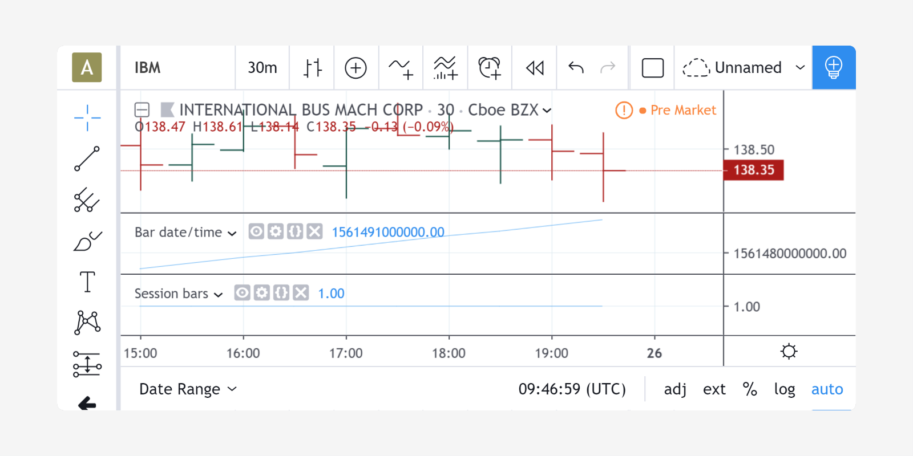
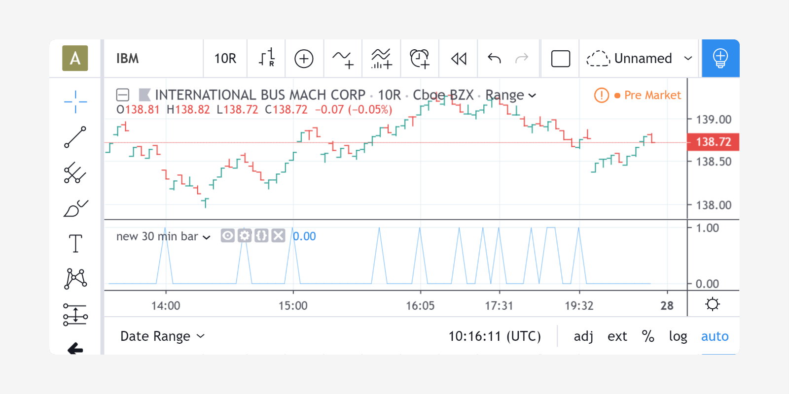
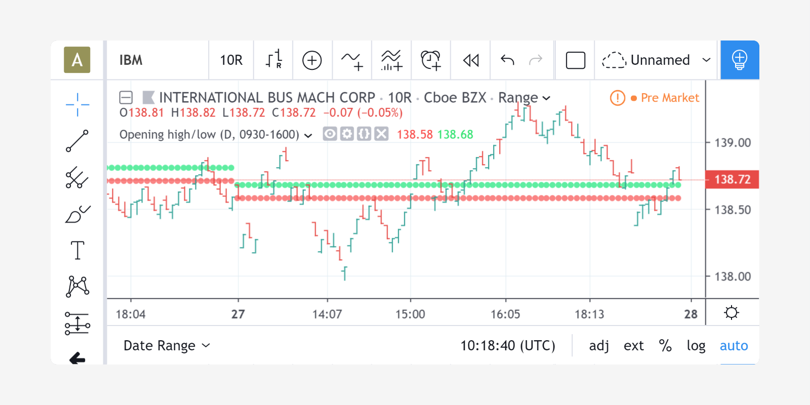

Session and time information
============================

.. contents:: :local:
    :depth: 2

The "time" function and variable
--------------------------------

Pine provides means to work with trade session, time
and date information. On this IBM chart at *30 minutes*,
two scripts are running: "Bar date/time" and "Session bars".

This is the "Bar date/time" script:

::

    //@version=4
    study("Bar date/time")
    plot(time)

The `time <https://www.tradingview.com/pine-script-reference/v4/#var_time>`__
variable returns the date/time (timestamp) of each bar's opening time in `UNIX
format <https://en.wikipedia.org/wiki/Unix_time>`__ [#millis]_ and in the exchange's timezone.
As can be seen from the screenshot, the ``time`` value on the
last bar is equal to 1397593800000. This value is the number of
*milliseconds* that have passed since 00:00:00 UTC, 1 January, 1970 and
corresponds to Tuesday, 15th of April, 2014 at 20:30:00 UTC.
The chart's time gauge in the screenshot shows the time of the last bar
as 2014-04-15 16:30 because it has a 4-hour difference between the exchange's timezone,
which is the default time returned by the ``time`` function.

The second script is "Session bars"::

    //@version=4
    study("Session bars")
    t = time(timeframe.period, "0930-1600")
    plot(na(t) ? 0 : 1)

This shows how the user can distinguish between regular session and extended hours bars
by using the built-in
`time <https://www.tradingview.com/pine-script-reference/v4/#fun_time>`__
function rather than the ``time`` variable. Note that the background behind these bars
is colored because of the chart's settings; not because of the script.
The ``time`` function returns the time of the
bar's start in milliseconds UNIX time, or ``na`` if the bar is located outside
the given trade session (09:30--16:00 in our example). The ``time`` function accepts
two arguments: the ``resolution`` used to determine the timestamp of bars
and ``session``, the session specification in the form of
a string containing the beginning and end of the trade
session in the exchange's timezone. The string "0930-1600" corresponds
to the trade session of the IBM symbol. These are examples of trade session
specifications:

0000-0000
   A monday to friday 24-hour session beginning at midnight.

0900-1600,1700-2000
   A session that begins at 9:00, breaks from 16:00 to 17:00 and continues until 20:00.
   Applies to Monday through Friday.

2000-1630:1234567
   An overnight session that begins at 20:00 and ends at
   16:30 the next day.

0930-1700:146
   A session that begins at 9:30 and
   ends at 17:00 on Sundays (1), Wednesdays (4) and Fridays (6) (other days
   of the week are days off).

24x7
   A complete 24-hour session beginning at 00:00 every day.

0000-0000:1234567
   Same as "24x7".

0000-0000:23456
   Same as previous example, but only Monday to Friday.

1700-1700:23456
   An *overnight session*. Monday session starts
   Sunday at 17:00 and ends Monday at 17:00. Applies to Monday through Friday.
   Equivalent to 1700-1700

1000-1001:26
   A weird session that lasts only one minute on
   Mondays (2) and one minute on Fridays (6).

Session specification used for the ``time`` function's
second argument does not need to correspond to the symbol's real trade
session. Hypothetical session specifications can be used to highlight
other bars of a data series.

Pine provides an overloaded version of the ``time`` function which does not require
custom session specification. This version of the function uses the
regular session of a symbol. For example, it is possible to
highlight the beginning of each half-hour bar on a minute chart in
the following way::

    //@version=4
    study("new 30 min bar")
    is_newbar(res) =>
        t = time(res)
        not na(t) and (na(t[1]) or t > t[1])
    plot(is_newbar("30") ? 1 : 0)

The previous example's ``is_newbar`` custom function can be used
in many situations. Here, we use it to display the market's opening
high and low on an intraday chart::

    //@version=4
    study("Opening high/low", overlay=true)

    highTimeFrame = input("D", type=input.resolution)
    sessSpec = input("0930-1600", type=input.session)

    is_newbar(res, sess) =>
        t = time(res, sess)
        na(t[1]) and not na(t) or t[1] < t

    newbar = is_newbar("1440", sessSpec)

    var float s1 = na
    var float s2 = na
    if newbar
        s1 := low
        s2 := high

    plot(s1, style=plot.style_circles, linewidth=3, color=color.red)
    plot(s2, style=plot.style_circles, linewidth=3, color=color.lime)

Pay attention to the variables ``highTimeFrame`` and ``sessSpec``. They
are defined using the `input <http:////www.tradingview.com/pine-script-reference/v4/#fun_input>`__ function
and its ``type`` parameter to make their type explicit.

Built-in variables for working with time
----------------------------------------

Pine's standard library has an assortment of built-in variables and functions which
make it possible to use time in the script's logic.

The most basic variables:

-  `time <https://www.tradingview.com/pine-script-reference/v4/#var_time>`__ --- UNIX time of the *current bar start* in milliseconds, UTC timezone.
-  `timenow <https://www.tradingview.com/pine-script-reference/v4/#var_timenow>`__ --- Current UNIX time in milliseconds, UTC timezone.
-  `syminfo.timezone <https://www.tradingview.com/pine-script-reference/v4/#var_syminfo{dot}timezone>`__ --- Exchange timezone of the chart main symbol series.

Variables that give information about the current bar start time:

-  `year <https://www.tradingview.com/pine-script-reference/v4/#var_year>`__ --- Current bar year.
-  `month <https://www.tradingview.com/pine-script-reference/v4/#var_month>`__ --- Current bar month.
-  `weekofyear <https://www.tradingview.com/pine-script-reference/v4/#var_weekofyear>`__ --- Week number of current bar.
-  `dayofmonth <https://www.tradingview.com/pine-script-reference/v4/#var_dayofmonth>`__ --- Date of current bar.
-  `dayofweek <https://www.tradingview.com/pine-script-reference/v4/#var_dayofweek>`__ --- Day of week for current bar. You can use
   ``sunday``, ``monday``, ``tuesday``, ``wednesday``, ``thursday``, ``friday`` and ``saturday`` variables for comparisons.
-  `hour <https://www.tradingview.com/pine-script-reference/v4/#var_hour>`__ --- Hour of the current bar start time (in exchange timezone).
-  `minute <https://www.tradingview.com/pine-script-reference/v4/#var_minute>`__ --- Minute of the current bar start time (in exchange timezone).
-  `second <https://www.tradingview.com/pine-script-reference/v4/#var_second>`__ --- Second of the current bar start time (in exchange timezone).

Functions for UNIX time "construction":

-  `year(t) <https://www.tradingview.com/pine-script-reference/v4/#fun_year>`__ --- Returns year for provided UTC time ``t``.
-  `month(t) <https://www.tradingview.com/pine-script-reference/v4/#fun_month>`__ --- Returns month for provided UTC time ``t``.
-  `weekofyear(t) <https://www.tradingview.com/pine-script-reference/v4/#fun_weekofyear>`__ --- Returns week of year for provided UTC time ``t``.
-  `dayofmonth(t) <https://www.tradingview.com/pine-script-reference/v4/#fun_dayofmonth>`__ --- Returns day of month for provided UTC time ``t``.
-  `dayofweek(t) <https://www.tradingview.com/pine-script-reference/v4/#fun_dayofweek>`__ --- Returns day of week for provided UTC time ``t``.
-  `hour(t) <https://www.tradingview.com/pine-script-reference/v4/#fun_hour>`__ --- Returns hour for provided UTC time ``t``.
-  `minute(t) <https://www.tradingview.com/pine-script-reference/v4/#fun_minute>`__ --- Returns minute for provided UTC time ``t``.
-  `second(t) <https://www.tradingview.com/pine-script-reference/v4/#fun_second>`__ --- Returns second for provided UTC time ``t``.
-  `timestamp(year, month, day, hour, minute) <https://www.tradingview.com/pine-script-reference/v4/#fun_timestamp>`__ ---
   Returns UNIX time of specified date and time. Note, there is also an overloaded version with an additional ``timezone`` parameter.

All these variables and functions return time in the **exchange time zone**,
except for the ``time`` and ``timenow`` variables which return time in **UTC timezone**.

.. rubric:: Footnotes

.. [#millis] UNIX time is measured in seconds. Pine Script uses UNIX time multiplied by 1000, so it's in millisecods.

