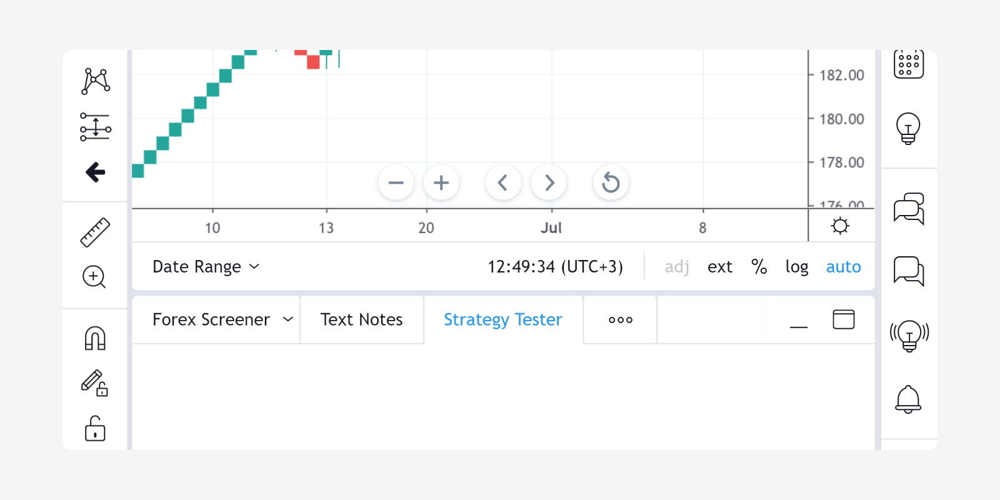
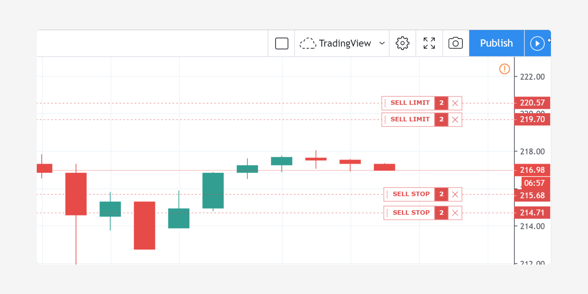

Strategies
==========

.. contents:: :local:
    :depth: 2

..    include:: <isonum.txt>

A *strategy* is a Pine script that can send, modify and cancel *buy/sell orders*.
Strategies allow you to perform *backtesting* (emulation of a
strategy trading on historical data) and *forwardtesting* (emulation
of a strategy trading on real-time data) according to your
algorithms.

A strategy written in Pine has many of the same capabilities
as a Pine *study*, a.k.a. *indicator*. When you write a strategy, it must start
with the `strategy <https://www.tradingview.com/pine-script-reference/v4/#fun_strategy>`__
annotation call (instead of ``study``). Strategies may plot data,
but they can also place, modify and cancel orders. They also have
access to essential strategy performance information through specific
keywords. The same information is available externally in the *Strategy
Tester* tab. Once a strategy is calculated on historical data, you can
see hypothetical order fills.

A simple strategy example
-------------------------

::

    //@version=4
    strategy("test")
    if bar_index > 4000
        strategy.entry("buy", strategy.long, 10, when=strategy.position_size <= 0)
        strategy.entry("sell", strategy.short, 10, when=strategy.position_size > 0)
    plot(strategy.equity)

As soon as the script is compiled and applied to a chart, you can see
filled order marks on it and how your balance was changing during
backtesting (*equity* curve). This is a very basic strategy that buys and
sells on every bar.

The ``strategy("test")`` line states that the script is a strategy
named "test". ``strategy.entry()`` is a command that can be used to send both
"buy" and "sell" orders. ``plot(strategy.equity)`` plots the equity
curve.

Applying a strategy to a chart
------------------------------

To test your strategy, apply it to the chart. Use the symbol and time
intervals that you want to test. You can use a built-in strategy from
the *Indicators & Strategies* dialog box, or write your own.

.. note:: When applying strategies to :doc:`non-standard types of charts <Non-standard_chart_types_data>`
   (Heikin Ashi, Renko, etc.), it is very important to realize that results
   will not reflect real market conditions. Orders on these types of charts will be
   executed at the synthetic price levels used on these charts,
   which often **do not reflect real market prices** and thus lead
   to unrealistic backtesting results. We therefore highly recommend
   using only standard chart types for backtesting strategies.

Backtesting and forwardtesting
------------------------------

On TradingView, strategies are calculated on all the chart's available historical
data (*backtesting*), and then automatically continue calculations when real-time data comes in (*forwardtesting*).

By default, during both historical and real-time calculation, code is calculated on
the bar's close.

When forwardtesting, you have the option of configuring script calculation to occur
on every real-time tick. To enable this, check the *Recalculate On Every Tick*  option in
the strategy's *Settings/Properties*, or specify it in the script's code
using: ``strategy(..., calc_on_every_tick=true)``.

You can set the strategy to perform one additional calculation after an
order is filled. For this you need to check *Recalculate After Order
filled* in the strategy's *Settings/Properties*, or do it in the script's code
using: ``strategy(..., calc_on_order_fills=true)``.

Broker emulator
---------------

TradingView uses a *broker emulator* when running strategies. Unlike
in real trading, the emulator only fills orders at chart prices, which is
why an order can only be filled on the next tick in forwardtesting and on
the next bar or later in backtesting, i.e., after the strategy calculates.

The following logic is used to emulate order fills:

#. If the bar's high is closer to bar's open than the bar's low,
   the broker emulator assumes that intrabar price was moving this way:
   open → high → low → close.
#. If the bar's low is closer to bar's open than the bar's high,
   the broker emulator assumes that intrabar price was moving this way:
   open → low → high → close.
#. The broker emulator assumes that there are no gaps inside bars, meaning
   the full range of intrabar prices is available for order execution.
#. Even if the *Recalculate On Every Tick* option is
   enabled  in strategy properties (or the script's ``strategy`` call uses
   ``calc_on_every_tick=true``), the broker emulator's behavior still uses the above logic.

.. image:: images/Filled_stategy.png

Here is a strategy demonstrating how orders are filled by the broker
emulator::

    //@version=4
    strategy("History SAW demo", overlay=true, pyramiding=100, calc_on_order_fills=true)
    strategy.entry("LE", strategy.long)

This code is calculated once per bar on the close, but
an additional calculation occurs as soon as an order is filled. That
is why you can see 4 filled orders on every bar: 2 orders on open, 1
order on high and 1 order on low. This is for backtesting. In
real-time, orders would be executed on every new tick.

It is also possible to emulate an *order queue*. The setting is called
*Verify Price For Limit Orders* and can be found in strategy properties,
or set in the script's code with ``strategy(..., backtest_fill_limits_assumption=X)``.
The specified value is a minimum price movements in number of points/pips (default value is 0).
A limit order is filled if the current price is better (higher for sell
orders, lower for buy orders) by the specified number of points/pips.
The execution price still matches the limit order price. Example:

* ``backtest_fill_limits_assumption = 1``. Minimum price movement is ``0.25``.

* A buy limit order is placed at price ``12.50``.

* Current price is ``12.50``.

* The order cannot be filled at the current price because
  ``backtest_fill_limits_assumption = 1``. To fill the order the price must
  be ``0.25*1`` lower. The order is put in the queue.

* Assume that the next tick comes at price ``12.00``. This price is 2 points
  lower, meaning the condition ``backtest_fill_limits_assumption = 1``
  is satisfied, so the order should be filled. The order is filled at
  ``12.50`` (original order price), even if the price is not available
  anymore.

Order placement commands
------------------------

All keywords related to strategies start with a
``strategy.`` prefix. The following commands are used for placing
orders: ``strategy.entry``, ``strategy.order`` and ``strategy.exit``.

`strategy.entry <https://www.tradingview.com/pine-script-reference/v4/#fun_strategy{dot}entry>`__
   This command only places entry orders. It is
   affected by the ``pyramiding`` setting in the strategy's properties and by
   the ``strategy.risk.allow_entry_in`` function. If there is an open
   market position when an opposite direction order is generated, the
   number of contracts/shares/lots/units will be increased by the number
   of currently open contracts (script equivalent: ``strategy.position_size + quantity``).
   As a result, the size of the opened market position will be equal to the order size specified in
   the ``strategy.entry`` command.

`strategy.order <https://www.tradingview.com/pine-script-reference/v4/#fun_strategy{dot}order>`__
   This command places both entry and exit orders. It is not affected by pyramiding settings or by the
   ``strategy.risk.allow_entry_in`` function. It allows you to create
   complex entry and exit order constructions when the functionality of
   ``strategy.entry`` and ``strategy.exit`` will not do.

`strategy.exit <https://www.tradingview.com/pine-script-reference/v4/#fun_strategy{dot}exit>`__
   This command allows you to exit a market position
   or form multiple exit order strategies using a stop loss,
   profit target or trailing stop. All such orders are part of the same
   ``strategy.oca.reduce`` group. An exit order cannot be placed if
   there is no open market position or there is no active entry order
   (an exit order is bound to the ID of an entry order). It is not possible
   to exit a position with a market order using the command
   ``strategy.exit``. For this, the `strategy.close <https://www.tradingview.com/pine-script-reference/v4/#fun_strategy{dot}close>`__
   or `strategy.close_all <https://www.tradingview.com/pine-script-reference/v4/#fun_strategy{dot}close_all>`__
   commands should be used.
   If the number of contracts/shares/lots/units specified for the ``strategy.exit`` is
   less than the size of current open positions, the exit will be
   partial. It is possible to exit from the same entry order more
   than once using the same exit order ID, which allows you to create
   exit strategies with multiple levels. In cases where a market position
   is formed by multiple entry orders (pyramiding enabled), each exit
   order must be linked to a matching entry order.

Example 1::

    //@version=4
    strategy("revers demo")
    if bar_index > 4000
        strategy.entry("buy", strategy.long, 4, when=strategy.position_size <= 0)
        strategy.entry("sell", strategy.short, 6, when=strategy.position_size > 0)
    plot(strategy.equity)

The above strategy constantly reverses market position from +4 to -6,
back and forth, which the plot shows.

Example 2::

    //@version=4
    strategy("exit once demo")
    strategy.entry("buy", strategy.long, 4, when=strategy.position_size <= 0)
    strategy.exit("bracket", "buy",  2, profit=10, stop=10)

This strategy demonstrates a case where a market position is never
closed because it uses a partial exit order to close the market position
and it cannot be executed more than once. If you double the line
for exiting, the strategy will close the market position completely.

Example 3::

    //@version=4
    strategy("Partial exit demo")
    if bar_index > 4000
        strategy.entry("buy", strategy.long, 4, when=strategy.position_size <= 0)
    strategy.exit("bracket1", "buy",  2, profit=10, stop=10)
    strategy.exit("bracket2", "buy",  profit=20, stop=20)

This code generates 2 levels of brackets (2 take profit orders and 2
stop loss orders). Both levels are activated at the same time: first
level to exit 2 contracts and the second one to exit all the rest.

The first take profit and stop loss orders (level 1) are in an :ref:`OCA group <oca_groups>`.
The other orders (level 2) are in another OCA group. This means
that as the order from level 1 is filled, the orders from level 2
are not cancelled; they stay active.

Every command placing an order has an ID (string value) which is a unique order
identifier. If an order with the same ID is already placed but not yet
filled, the last command modifies the existing order. If modification is
not possible (conversion from buy to sell), the old order is cancelled and
the new order is placed. ``strategy.entry`` and ``strategy.order`` work
with the same IDs (they can modify the same entry order).
``strategy.exit`` works with other order IDs (it is possible to have an
entry order and an exit order with the same ID).

To cancel a specific order using its ID, the
`strategy.cancel(string ID) <https://www.tradingview.com/pine-script-reference/#fun_strategy{dot}cancel>`__
command should be used. To cancel all pending
orders the `strategy.cancel_all() <https://www.tradingview.com/pine-script-reference/#fun_strategy{dot}cancel_all>`__
command should be used. Strategy orders are placed as soon as their conditions are satisfied and command
is called in code. The broker emulator doesn't execute orders before the next
tick comes after the code was calculated, while in real trading
an order can get filled sooner. When a market order is generated at the close of the current bar,
the broker emulator only executes it at the open price of the next.

Example::

    //@version=4
    strategy("next bar open execution demo")
    if bar_index > 4000
        strategy.order("buy", strategy.long, when=strategy.position_size == 0)
        strategy.order("sell", strategy.short, when=strategy.position_size != 0)

If this code is applied to a chart, all orders are filled at the open of
every bar.

Conditions for order placement (``when``, ``pyramiding``, ``strategy.risk``)
are checked when the script is calculated. If all
conditions are satisfied, the order is placed. If any condition is not
satisfied, the order is not placed. It is important to cancel price
orders (limit, stop and stop-limit orders).

Example (for MSFT, 1D)::

    //@version=4
    strategy("Priced Entry demo")
    var c = 0
    if year > 2014
        c := c + 1
    if c == 1
        strategy.entry("LE1", strategy.long, 2, stop = high + 35 * syminfo.mintick)
        strategy.entry("LE2", strategy.long, 2, stop = high + 2 * syminfo.mintick)

Even though pyramiding is disabled, both these orders are filled in
backtesting because when they are generated there is no opened long
market position. Both orders are placed and when price satisfies order
execution conditions, they both get executed. It is recommended to put the
orders in an OCA group using ``strategy.oca.cancel``. This way
only one order is filled and the other one is cancelled. Here is the
modified code::

    //@version=4
    strategy("Priced Entry demo")
    var c = 0
    if year > 2014
        c := c + 1
    if c == 1
        strategy.entry("LE1", strategy.long, 2, stop = high + 35 * syminfo.mintick, oca_type = strategy.oca.cancel, oca_name = "LE")
        strategy.entry("LE2", strategy.long, 2, stop = high + 2 * syminfo.mintick, oca_type = strategy.oca.cancel, oca_name = "LE")

If, for some reason, order placing conditions are not met when executing
the command, the entry order will not be placed. For example, if
pyramiding settings are set to 2, the existing position already contains two
entries and the strategy tries to place a third one, it will not be
placed. Entry conditions are evaluated at the order generation stage and
not at the execution stage. Therefore, if you submit two price type
entries with pyramiding disabled, once one of them is executed the other
will not be cancelled automatically. To avoid issues we recommend using
``strategy.oca.cancel`` groups for entries so when one entry order is filled the
others are cancelled.

The same is true for price type exits. Orders will be placed once their
conditions are met, i.e., an entry order with a matching ID is filled.

Closing market position
-----------------------

Despite the fact that it is possible to exit from a specific entry in code, when
orders are shown in the *List of Trades* in the *Strategy Tester* tab, they all
are linked according to FIFO (first in, first out) rules. If an entry order
ID is not specified for an exit order in code, the exit order closes the
first entry order that opened market position. Let's study the following
example::

    //@version=4
    strategy("exit Demo", pyramiding=2, overlay=true)
    strategy.entry("Buy1", strategy.long, 5,
                   when = strategy.position_size == 0 and year > 2014)
    strategy.entry("Buy2", strategy.long,
                   10, stop = strategy.position_avg_price +
                   strategy.position_avg_price*0.1,
                   when = strategy.position_size == 5)
    strategy.exit("bracket", loss=10, profit=10, when=strategy.position_size == 15)

The code given above places 2 orders sequentially: "Buy1" at market
price and "Buy2" at a 10% higher price (stop order). The exit order is placed
only after entry orders have been filled. If you apply the code to a
chart, you will see that each entry order is closed by an exit order,
though we did not specify entry order ID to close in this line:
``strategy.exit("bracket", loss=10, profit=10, when=strategy.position_size == 15)``

Another example::

    //@version=4
    strategy("exit Demo", pyramiding=2, overlay=true)
    strategy.entry("Buy1", strategy.long, 5, when = strategy.position_size == 0)
    strategy.entry("Buy2", strategy.long,
                10, stop = strategy.position_avg_price +
                strategy.position_avg_price*0.1,
                when = strategy.position_size == 5)
    strategy.close("Buy2",when=strategy.position_size == 15)
    strategy.exit("bracket", "Buy1", loss=10, profit=10, when=strategy.position_size == 15)
    plot(strategy.position_avg_price)

-  It opens a 5-contract long position with the order "Buy1".
-  It extends the long position by purchasing 10 more contracts at 10%
   higher price with the order "Buy2".
-  The exit order (strategy.close) to sell 10 contracts (exit from
   "Buy2") is filled.

If you take a look at the plot, you can see that average entry price =
"Buy2" execution price and our strategy closed exactly this entry order,
while on the *Trade List* tab we can see that it closed the first "Buy1"
order and half of the second "Buy2". It means that no matter which
entry order you specify for your strategy to close, the broker emulator
will still close the first one, according to FIFO rules. It works
the same way as when trading with a real broker.

.. _oca_groups:

OCA groups
----------

It is possible to put orders in 2 different One-Cancells-All (OCA) groups in Pine Script.

`strategy.oca.cancel <https://www.tradingview.com/pine-script-reference/v4/#var_strategy{dot}oca{dot}cancel>`__
   As soon as an order from the group is filled
   (even partially) or cancelled, the other orders from the same group
   get cancelled. One should keep in mind that if order prices are the
   same or they are close, more than 1 order of the same group may be
   filled. This OCA group type is available only for entry orders
   because all exit orders are placed in ``strategy.oca.reduce``.

Example::

    //@version=4
    strategy("oca_cancel demo")
    if year > 2014 and year < 2016
        strategy.entry("LE", strategy.long, oca_type = strategy.oca.cancel, oca_name="Entry")
        strategy.entry("SE", strategy.short, oca_type = strategy.oca.cancel, oca_name="Entry")

You may think that this is a reverse strategy since pyramiding is not
allowed, but in fact both orders will get filled because they are market
orders, which means they are to be executed immediately at the current price.
The second order doesn't get cancelled because both are filled almost at
the same moment and the system doesn't have time to process the first order
fill and cancel the second one before it gets executed. The same would
happen if these were price orders with same or similar prices. The strategy
places all orders allowed according to market position, etc.

The strategy places all orders that do not contradict the rules (in our
case market position is flat, therefore any entry order can be filled).
At each tick calculation, firstly all orders with the satisfied
conditions are executed and only then the orders from the group where an
order was executed are cancelled.

`strategy.oca.reduce <https://www.tradingview.com/pine-script-reference/v4/#var_strategy{dot}oca{dot}reduce>`__
   This group type allows multiple orders
   within the group to be filled. As one of the orders within the group
   starts to be filled, the size of other orders is reduced by the
   filled contracts amount. It is very useful for the exit strategies.
   Once the price touches your take-profit order and it is being filled,
   the stop-loss is not cancelled but its amount is reduced by the
   filled contracts amount, thus protecting the rest of the open
   position.

`strategy.oca.none <https://www.tradingview.com/pine-script-reference/v4/#var_strategy{dot}oca{dot}none>`__
   The order is placed outside of the group
   (default value for the ``strategy.order`` and ``strategy.entry`` functions).

Every group has its own unique id, like orders. If
two groups have the same id, but different type, they will be considered a
different groups. Example::

    //@version=4
    strategy("My Script")
    if year > 2014 and year < 2016
        strategy.entry("Buy", strategy.long, oca_name="My oca", oca_type=strategy.oca.reduce)
        strategy.exit("FromBy", "Buy", profit=100, loss=200, oca_name="My oca")
        strategy.entry("Sell", strategy.short, oca_name="My oca", oca_type=strategy.oca.cancel)
        strategy.order("Order", strategy.short, oca_name="My oca", oca_type=strategy.oca.none)

"Buy" and "Sell" will be placed in different groups as their type is
different. "Order" will be outside of any group as its type is set to
``strategy.oca.none``. Moreover, "Buy" will be placed in the exit group
as exits are always placed in the ``strategy.oca.reduce_size`` type
group.

Risk management
---------------

It is not easy to create a universally profitable strategy. Usually,
strategies are created for certain market patterns and can produce
uncontrollable losses when applied to other data. Therefore, stopping
auto trading when too many losses occur is important. A
special group of strategy commands help you manage risk. They all start with
the ``strategy.risk.`` prefix.

In any given strategy you can combine any number of risk management criteria
in any combination. Every risk category command is calculated at every tick as
well as at every order execution event, regardless of the
``calc_on_order_fills`` strategy setting. There is no way to disable
any risk rule at runtime from a script. Regardless of where in the script
the risk rule is located it will always be applied unless the line with
the rule is deleted and the script is recompiled.

When a risk management rule is triggered, no orders will be generated
starting from the next calculation of the script.
Therefore, if a strategy has several rules of the same type with
different parameters, it will stop calculating when the rule with the
most strict parameters is triggered. When a strategy is stopped, all
unexecuted orders are cancelled and then a market order is sent to close
the position if it is not flat.

Furthermore, it is worth remembering that when using resolutions higher
than 1 day, the whole bar is considered to be 1 day for the rules
starting with prefix ``strategy.risk.max_intraday_``.

Example (MSFT, 1)::

    //@version=4
    strategy("multi risk demo", overlay=true, pyramiding=10, calc_on_order_fills = true)
    if year > 2014
        strategy.entry("LE", strategy.long)
    strategy.risk.max_intraday_filled_orders(5)
    strategy.risk.max_intraday_filled_orders(2)

The position will be closed and trading will be stopped until the end of
every trading session after two orders are executed within this session,
as the second rule is triggered earlier and is valid until the end of
the trading session.

One should remember that the ``strategy.risk.allow_entry_in`` rule is
applied to entries only so it will be possible to enter in a trade using
the ``strategy.order`` command, as this command is not an entry command
per se. Moreover, when the ``strategy.risk.allow_entry_in`` rule is
active, entries in a "prohibited trade" become exits instead of reverse
trades.

Example (MSFT, 1D)::

    //@version=4
    strategy("allow_entry_in demo", overlay=true)
    if year > 2014
        strategy.entry("LE", strategy.long, when=strategy.position_size <= 0)
        strategy.entry("SE", strategy.short, when=strategy.position_size > 0)
    strategy.risk.allow_entry_in(strategy.direction.long)

As short entries are prohibited by the risk rules,
long exit trades will be made instead of reverse trades.

Currency
--------

TradingView strategies can operate in a currency that is different from the
instrument's currency. *Net Profit* and *Open Profit* are recalculated in the
account currency. Account currency is set in the strategy properties'
*Base Currency* drop-down list or in the script via the
``strategy(..., currency=currency.*)`` parameter.
Performance report values are calculated in the selected currency.

Trade profit (open or closed) is calculated based on the profit in the
instrument currency multiplied by the cross-rate on the *close* of the
trading day previous to the bar where the strategy is calculated.

Example: we trade EURUSD, D and have selected ``currency.EUR`` as the strategy
currency. Our strategy buys and exits the position using 1 point
profit target or stop loss.

::

    //@version=4
    strategy("Currency test", currency=currency.EUR)
    if year > 2014
        strategy.entry("LE", true, 1000)
        strategy.exit("LX", "LE", profit=1, loss=1)
    profit = strategy.netprofit
    plot(abs((profit - profit[1])*100), "1 point profit", color=color.blue, linewidth=2)
    plot(1 / close[1], "prev usdeur", color=color.red)

After adding this strategy to the chart we can see that the plot lines
are matching. This demonstrates that the rate to calculate the profit
for every trade was based on the *close* of the previous day.

When trading on intra-day resolutions, the cross-rate on the close of the
trading day previous to the bar where the strategy is calculated will be
used and it will not change during the trading session.

When trading on resolutions higher than 1 day, the cross-rate on the
close of the trading day previous to the close of the bar where the
strategy is calculated will be used. Let's say we trade on a weekly
chart, then the cross rate on Thursday's session close will always be
used to calculate the profits.

In real-time, yesterday's session close rate is used.
