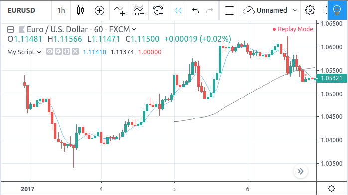
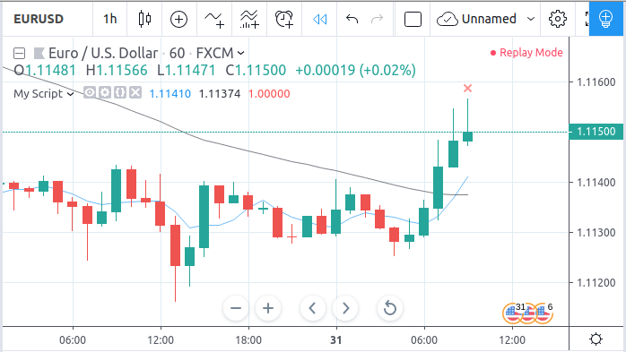

Execution model
===============

.. contents:: :local:
    :depth: 2

Pine code is always calculated based on some OHLCV symbol data. This is data of chart main symbol to which a Pine study is applied.
Any symbol data set has a limited number of bars. If a user scrolls the chart to the left (oldest bars) then all the bars are not loaded immediately. Loading process stops when either there are no more bars for that particular symbol or the chart loads about 10000 bars [#all_available_bars]_.
A user may scroll the chart to the left until the very begininng (bar with index 0).
(see `bar_index <https://www.tradingview.com/pine-script-reference/v4/#var_bar_index>`__).

Bars that are closed are *historical bars*. If there is a trading session running and there have been trades recently (during bar's timeframe) then there is also a *current bar* on the chart that is being updated in realtime. After a while, *current bar* closes becoming a historical bar and new current bar opens. All bars that are created outside of session hours are considered as historicial (since there are no trades).

In general, Pine indicator runs on all historical bars as well as on realtime updates of the current bar (if there are any) afterwards.

Calculation based on historical bars
------------------------------------

Let's take a simple script as an example::

    //@version=4
    study("My Script", overlay=true)
    src = close
    a = sma(src, 5)
    b = sma(src, 50)
    c = cross(a, b)
    plot(a, color=color.blue)
    plot(b, color=color.black)
    plotshape(c, color=color.red)

In more detail, calculation of Pine indicator starts from the very first bar (which has a 0 index). The built-in variables ``open``, ``high``, ``low``, ``close``, ``volume``
and ``time`` get corresponding values from the bar and the script calculates from the first statement to the last. This calculation produces study output
values (which are plot, plotshape, drawing objects, strategy orders or other values) for that particular time point, associated with the bar.
Then, in the same manner, the second bar (with 1 index) is processed and so on until all the historical bars are processed.
Thus, Pine script is executed **once per historical bar**:

Then, indicator switches to a special mode to process realtime updates.

Calculation based on realtime bars
----------------------------------

Pine indicator calculation on realtime bar updates is slightly different comapred to historical bars because of
the additional *commit* and *rollback* actions on script variables.

In realtime processing mode, Pine indicator is executed **once per bar update** plus there is a

    * variables rollback **before every intra-bar update**
    * variables commit **after every closing bar update**

All the script variables are set to their most recent commited values (or initial values, if there were no commits yet) during a rollback .
Variables commit is a finalization of variables' values on the current bar. Commit makes variable values immutable on that particular bar.
This happens only once per bar when the bar closes.

In more detail, imageine there is a current bar (the latest bar) with a close price equal to 1.11500:

With such a close price value, indicator calculates ``c = cross(a, b)`` to ``true``,
thus there is a red cross on the last bar on the chart (as shown on the screenshot).
Imagine that in the next moment close price would go down, so script is going to recalculate.
Before that, all the variables are rolled back to their last commited values and then ``a`` variable could be less than ``b`` variable.
In such a case ``c = cross(a, b)`` can become ``false`` and red cross on the
current bar would be erased. Values of script variables on the current bar may change (roll back and become another value)
many times until they will be calculated for the last time as a result of the closing bar update
(the next data update would create a new bar). Those values become historical values, it is said that they are *commited* then.

Rollback and commit are very important, they give scripts an ability to be independent from price moves within a bar which in turn
reduces *repainting* problems.

Additional resources
--------------------

A number of built-in variables ``barstate.*`` provide information about the current type of bar update
(e.g., historical, realtime, intra-bar, closing update etc.), :doc:`/essential/Bar_states_Built-in_variables_barstate`.

Calculation of strategies is more complex than calculation of indicators, :doc:`/essential/Strategies`.

.. rubric:: Footnotes

.. [#all_available_bars] Upper limit for the total number of bars on chart is about 10000 for *Pro/Premium* users. *Free* users are able to
   see about 5000 bars.

