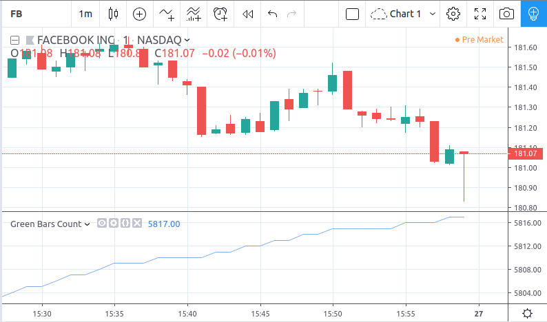

Expressions, declarations and statements
========================================

.. contents:: :local:
    :depth: 2

Expressions
-----------

An expression is a sequence where operators or function
calls are applied to operands (variables or values) to define the calculations
and actions required by the script. Expressions in Pine almost always
produce a result (exceptions are the functions
``study``, ``fill``, ``strategy.entry``, etc., which produce side effects and will be covered
later).

Here are some examples of simple expressions::

    (high + low + close)/3
    sma(high - low, 10) + sma(close, 20)

.. _variable_declaration:

Variable declaration
--------------------

Variables in Pine are declared with the special symbol ``=`` and an optional ``var`` keyword
in one of the following ways:

.. code-block:: text

    <identifier> = <expression>
    <type> <identifier> = <expression>
    var <identifier> = <expression>
    var <type> <identifier> = <expression>

``<identifier>`` is the name of the declared variable, see :doc:`Identifiers`.

``<type>`` can be one of the predefined keywords: ``float``, ``int``, ``bool``, ``color``, ``string``, ``line`` or ``label``.
However, in most cases, an explicit type declaration is redundant because type is automatically inferred from the ``<expression>``
on the right of the ``=`` at compile time, so the decision to use them is often a matter of preference. For example::

    baseLine0 = na          // compile time error!
    float baseLine1 = na    // OK
    baseLine2 = float(na)   // OK

In the first line of the example, the compiler cannot determine the type of the ``baseLine0`` variable because ``na`` is a generic value of no particular type. The declaration of the ``baseLine1`` variable is correct because its ``float`` type is declared explicitly.
The declaration of the ``baseLine2`` variable is also correct because its type can be derived from the expression ``float(na)``, which is an explicit cast of ``na`` value to ``float`` type. The declarations of ``baseLine1`` and ``baseLine2`` are equivalent.

The ``var`` keyword is a special modifier that instructs the compiler to *create and initialize the variable only once*. This behavior is very useful in cases where a variable's value must persist through the iterations of a script across successive bars. For example, suppose we'd like to count the number of green bars on the chart::

    //@version=4
    study("Green Bars Count")
    var count = 0
    isGreen = close >= open
    if isGreen
        count := count + 1
    plot(count)

Without the ``var`` modifier, variable ``count`` would be reset to zero (thus losing it's value) every time a new bar update triggered a script recalculation.

In Pine v3 the study "Green Bars Count" could be written without using the ``var`` keyword::

    //@version=3
    study("Green Bars Count")
    count = 0                       // These two lines could be replaced in v4
    count := nz(count[1], count)    // with 'var count = 0'
    isGreen = close >= open
    if isGreen
        count := count + 1
    plot(count)

The v4 code is more readable and can be more efficient if, for example, the ``count`` variable is
initialized with an expensive function call instead of ``0``.

Examples of simple variable declarations::

    src = close
    len = 10
    ma = sma(src, len) + high

Examples with type modifiers and var keyword::

    float f = 10            // NOTE: while the expression is of type int, the variable is float
    i = int(close)          // NOTE: explicit cast of float expression close to type int
    r = round(close)        // NOTE: round() and int() are different... int() simply throws fractional part away
    var hl = high - low

Example, illustrating the effect of ``var`` keyword::

    // Creates a new label object on every bar:
    label lb = label.new(bar_index, close, text="Hello, World!")

    // Creates a label object only on the first bar in history:
    var label lb = label.new(bar_index, close, text="Hello, World!")

.. _variable_assignment:

Variable assignment
-------------------

A mutable variable is a variable which can be given a new value.
The operator ``:=`` must be used to give a new value to a variable.
A variable must be declared before you can assign a value to it
(see declaration of variables :ref:`above<variable_declaration>`).

The type of a variable is identified at declaration time. From then on, a variable can
be given a value of expression only if both the expression and the
variable belong to the same type, otherwise a
compilation error will occur.

Variable assignment example::

    //@version=4
    study("My Script")
    price = close
    if hl2 > price
        price := hl2
    plot(price)

.. _if_statement:

if statement
------------

An ``if`` statement defines a block of statements to be executed when
the ``if``'s conditional expression evaluates to ``true``, and optionally,
an alternative block to be executed when the expression is ``false``.

General code form:

.. code-block:: text

    <var_declarationX> = if <condition>
        <var_decl_then0>
        <var_decl_then1>
        ...
        <var_decl_thenN>
    else if [optional block]
        <var_decl_else0>
        <var_decl_else1>
        ...
        <var_decl_elseN>
    else
        <var_decl_else0>
        <var_decl_else1>
        ...
        <var_decl_elseN>
        <return_expression_else>

where:

-  ``var_declarationX`` --- this variable is assigned the value of the ``if``
   statement as a whole.
-  ``condition`` --- if the ``condition`` expression is true, the logic from the *then* block immediately following the ``if`` first line
   (``var_decl_then0``, ``var_decl_then1``, etc.) is used, if the
   ``condition`` is false, the logic from the *else* block
   (``var_decl_else0``, ``var_decl_else1``, etc.) is used.
-  ``return_expression_then``, ``return_expression_else`` --- the last
   expression from the *then* block or from the *else* block will
   determine the final value of the whole ``if`` statement.

The type of the returning value of the ``if`` statement is determined by the type of
``return_expression_then`` and ``return_expression_else``. Their types
must match. It is not possible to return an integer value from the *then* block
if the *else* block returns a string value.

Example::

    // This code compiles
    x = if close > open
        close
    else
        open
    // This code doesn't compile
    x = if close > open
        close
    else
        "open"

It is possible to omit the *else* block. In this case, if the ``condition``
is false, an *empty* value (``na``, ``false``, or ``""``) will be assigned to the
``var_declarationX`` variable.

Example::

    x = if close > open
        close
    // If current close > current open, then x = close.
    // Otherwise the x = na.
    
It is possible to use either multiple *else if* blocks or none at all.

Example::

    x = if open > close
        5
    else if high > low
        close
    else
        open
        
The *then*, *else if* and *else* blocks are shifted by four spaces [#tabs]_. ``if`` statements can
be nested by adding four more spaces::

    x = if close > open
        b = if close > close[1]
            close
        else
            close[1]
        b
    else
        open

It is possible and quite frequent to ignore the resulting value of an ``if`` statement
(``var_declarationX =`` can be omited). This form is used when you need the
side effect of the expression, for example in :doc:`strategy trading</essential/Strategies>`:

::

    if (crossover(source, lower))
        strategy.entry("BBandLE", strategy.long, stop=lower,
                       oca_name="BollingerBands",
                       oca_type=strategy.oca.cancel, comment="BBandLE")
    else
        strategy.cancel(id="BBandLE")

.. _for_statement:

for statement
-------------

The ``for`` statement allows to execute a number of instructions repeatedly:

.. code-block:: text

    <var_declarationX> = for <i> = <from> to <to> by <step>
        <var_decl0>
        <var_decl1>
        ...
        continue
        ...
        break
        ...
        <var_declN>
        <return_expression>

where:

-  ``i`` --- a loop counter variable.
-  ``from`` --- start value of the counter.
-  ``to`` --- end value of the counter. When the counter becomes greater
   than ``to`` (or less than ``to`` in the case where ``from > to``) the
   loop is stopped.
-  ``step`` --- loop step. Optional. Default is 1. If
   ``from`` is greater than ``to``, the loop step will automatically change direction; no need to use a negative step.
-  ``var_decl0``, ... ``var_declN``, ``return_expression`` --- body of the loop. It
   must be indented by 4 spaces [#tabs]_.
-  ``return_expression`` --- returning value. When a loop is finished or
   broken, the returning value is assigned to ``var_declarationX``.
-  ``continue`` --- a keyword. Can only be used in loops. It jumps to the loop's
   next iteration.
-  ``break`` --- a keyword. Can be used only in loops. It exits the loop.

``for`` loop example:

::

    //@version=4
    study("For loop")
    my_sma(price, length) =>
        sum = price
        for i = 1 to length-1
            sum := sum + price[i]
        sum / length
    plot(my_sma(close,14))

Variable ``sum`` is a :ref:`mutable variable <variable_assignment>` so a
new value can be given to it by the operator ``:=`` in the loop's body.
Note that we recommend using the built-in
`sma <https://www.tradingview.com/pine-script-reference/v4/#fun_sma>`__
function for simple moving averages, as it calculates faster.

Note that some built-in functions may behave unexpectedly in for loop. Let's look at the following
example:

::

    //@version=4
    study("RMA in for loop")
    sum = 0.0
    for i = 1 to 2
        sum := sum + rma(close, i)
    plot(sum)

While you may expect that ``sum`` will contain ``rma(close, 1) + rma(close, 2)``, this is not so.
It will contain ``rma(close, 1) + rma(close, 1)`` because once ``rma`` is initialized with
length 1, this length is stored until the script is removed from chart. To avoid this you may
use your own, stateless function implementation. This is the list of built-in functions which have
the same behavior:

- ``rma(source, length)``: ``length`` is stateful.
- ``ema(source, length)``: ``length`` is stateful.
- ``valuewhen(condition, source, occurrence)``: ``occurrence`` is stateful.
- ``rsi(x, y)``: when ``y`` is of type integer and behaves like a length, ``y`` is stateful.

.. rubric:: Footnotes

.. [#tabs] TradingView's *Pine Editor* automatically replaces **Tab** with 4 spaces.
