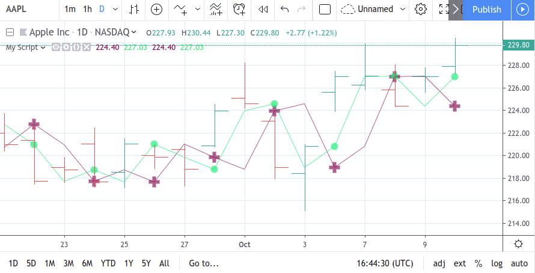
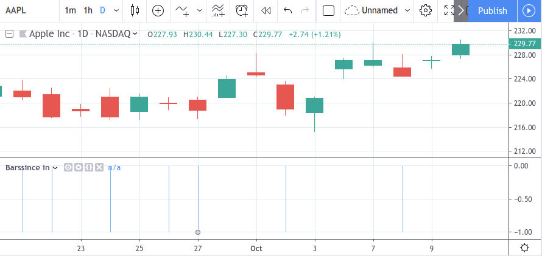
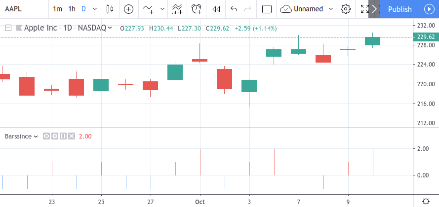

Functions and annotations
=========================

Pine Script distinguishes between *functions* and *annotation functions* (or just *annotations*).
Syntactically they are similar, but they serve different purposes.

While functions are generally used to calculate values and for the result they return,
annotations are mostly used for their side effects and only occasionally for the result some of them return.

Functions may be built-in, such as
`sma <https://www.tradingview.com/pine-script-reference/v4/#fun_sma>`__,
`ema <https://www.tradingview.com/pine-script-reference/v4/#fun_ema>`__,
`rsi <https://www.tradingview.com/pine-script-reference/v4/#fun_rsi>`__,
or :doc:`user-defined <Declaring_functions>`. All annotations are built-in.

The side effects annotations are used for include:

-  assigning a name or other global properties to a script using
   `study <https://www.tradingview.com/pine-script-reference/v4/#fun_study>`__
   or `strategy <https://www.tradingview.com/pine-script-reference/v4/#fun_strategy>`__
-  determining the inputs of a script using
   `input <https://www.tradingview.com/pine-script-reference/v4/#fun_input>`__
-  determining the outputs of a script using
   `plot <https://www.tradingview.com/pine-script-reference/v4/#fun_plot>`__

In addition to having side effects, a few annotations such as ``plot`` and ``hline``
also return a result which may be used or not. This result, however, can only be used in other annotations
and can't take part in the script's calculations
(see `fill <https://www.tradingview.com/pine-script-reference/v4/#fun_fill>`__ annotation).

A detailed overview of Pine annotations can be found :doc:`here </annotations/index>`.

Syntactically, user-defined functions, built-in functions and annotation
functions are similar, i.e., we call them by name with a list of
arguments in parentheses. Differences between them are mostly semantic, except
for the fact that annotations and
built-in functions accept keyword arguments while user-defined functions
do not.

Example of an annotation call with positional arguments::

    study('Example', 'Ex', true)

The same call with keyword arguments::

    study(title='Example', shorttitle='Ex', overlay=true)

It's possible to mix positional and keyword arguments. Positional
arguments must go first and keyword arguments should follow them. So the
following call is not valid:

::

    study(precision=3, 'Example') // Compilation error!
    
    
Execution of Pine functions and historical context inside function blocks
-------------------------------------------------------------------------

The history of series variables used inside Pine functions is created through each successive call to the function. If the function is not called on each bar the script runs on, this will result in disparities between the historic values of series inside vs outside the function's local block. Hence, series referenced inside and outside the function using the same index value will not refer to the same point in history if the function is not called on each bar.

Let's look at this example script where the ``f`` and ``f2`` functions are called every second bar::

   //@version=4
   study("My Script", overlay=true)

   // Returns the value of "a" the last time the function was called 2 bars ago.
   f(a) => a[1]
   // Returns the value of last bar's "close", as expected.
   f2() => close[1]

   oneBarInTwo = bar_index % 2 == 0
   plot(oneBarInTwo ? f(close) : na, color=color.maroon, linewidth=6, style=plot.style_cross)
   plot(oneBarInTwo ? f2() : na, color=color.lime, linewidth=6, style=plot.style_circles)
   plot(close[2], color=color.maroon)
   plot(close[1], color=color.lime)

As can be seen with the resulting plots, ``a[1]`` returns the previous value of a in the function's context, so the last time ``f`` was called two bars ago — not the close of the previous bar, as ``close[1]`` does in ``f2``. This results in ``a[1]`` in the function block referring to a different past value than ``close[1]`` even though they use the same index of 1.

Why this behavior?
^^^^^^^^^^^^^^^^^^

This behavior is required because forcing execution of functions on each bar would lead to unexpected results, as would be the case for a ``label.new`` function call inside an if branch, which must not execute unless the if condition requires it.

On the other hand, this behavior leads to unexpected results with certain built-in functions which require being executed each bar to correctly calculate their results. Such functions will not return expected results if they are placed in contexts where they are not executed every bar, such as if branches.

The solution in these cases is to take those function calls outside their context so they can be executed on every bar.

In this script, ``barssince`` is not called on every bar because it is inside a ternary operator's conditional branch::

   //@version=4
   study("Barssince",overlay=false)
   res = close>close[1] ? barssince(close<close[1]) : -1
   plot(res, style=plot.style_histogram, color=res >= 0 ? color.red : color.blue)

This leads to incorrect results because ``barssince`` is not executed on every bar:

The solution is to take the barssince call outside the conditional branch to force its execution on every bar::

   //@version=4		
   study("Barssince",overlay=false)
   b = barssince(close<close[1])
   res = close>close[1] ? b : -1
   plot(res, style=plot.style_histogram, color=res >= 0 ? color.red : color.blue)

Using this technique we get the expected output:

Exceptions
^^^^^^^^^^

Not all built-in functions need to be executed every bar. These are the functions which do not require it, and so do not need special treatment::

   abs, acos, asin, atan, ceil, cos, dayofmonth, dayofweek, exp, floor, heikinashi, hour, kagi, 
   linebreak, log, log10, max, min, minute, month, na, nz, pow, renko, round, second, sign, sin, 
   sqrt, tan, tickerid, time, timestamp, tostring, weekofyear, year	

.. note:: Functions called from within a ``for`` loop use the same context in each of the loop's iterations. In the example below, each ``lowest`` call on the same bar uses the value that was passed to it (i.e., ``bar_index``), so function calls used in loops do not require special treatment.

::

   //@version=4
   study("My Script")
   va = 0.0
   for i = 1 to 2 by 1
       if (i + bar_index) % 2 == 0
           va := lowest(bar_index, 10)  // same context on each call
   plot(va)
