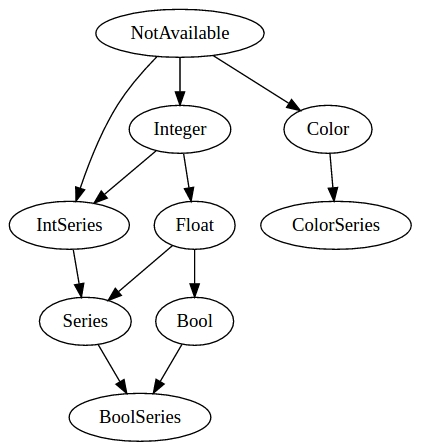
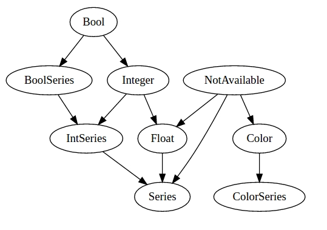

Type system
===========

The basic type of data in Pine is a list of values, named *series*.
Examples of built-in series variables are: ``open``, ``high``, ``low``,
``close``, ``volume``. The size of these vectors are equal to the
quantity of available bars based on the current ticker and timeframe
(resolution). The series may contain numbers or a special value ``na``
(meaning that value is *not available*, further information about ``na`` values
can be found :ref:`here <history_referencing_operator>`). 
Any expression that contains a series variable will be treated as a
series itself. For example::

    a = open + close // addition of two series
    b = high / 2     // division of a series variable
                     // to the integer literal constant (b will be a
                     // series)
    c = close[1]     // Referring to the previous ``close`` value

.. note:: The operator ``[]`` also returns a value of a series type.

Pine has two types to represent numbers: *integer* and *float*. The
result of an arithmetical expression containing only numbers will be a
number itself.

There is a *string* type which is used for the indicators names,
inputs, line graphs, names of tickers, resolutions, trade sessions, etc.

Also Pine has a *bool* type. There are two built-in constants: ``true``
and ``false``.

And the last basic type is *color*. Apart from configuring a color
value directly with a literal (in hexadecimal format), in the language
there are more convenient, built-in variables of the type *color*. For
basic colors there are: ``black``, ``silver``, ``gray``, ``white``,
``maroon``, ``red``, ``purple``, ``fuchsia``, ``green``, ``lime``,
``olive``, ``yellow``, ``navy``, ``blue``, ``teal``, ``aqua``,
``orange``. It is possible to change transparency of the color using
build-in function
`color <https://www.tradingview.com/study-script-reference/#fun_color>`__.

A few function annotations (in particular ``plot`` and ``hline``) return
values which represent objects created on the chart. The function
``plot`` returns an object of the type *plot*, represented as a line
or diagram on the chart. The function ``hline`` returns an object of the
type *hline*, represented as a horizontal line. These objects can be
passed to the `fill <https://www.tradingview.com/study-script-reference/#fun_fill>`__ 
function to color the area in between them.

Finally, there is also a *void* type in Pine Script. Some functions with *side effect* 
return void result. For example a 
`strategy.entry <https://www.tradingview.com/study-script-reference/#fun_strategy{dot}entry>`__.

Type cast rules
---------------

In the following picture arrow means ability to cast one type to
another. For example *NotAvailable* type (type of the ``na`` variable), can be
cast to any of *color*, *integer*, *float* or *series* types. But
*color* can only be casted to *color series* type.

.. note:: Pine type system was changed in version 3. See :ref:`pine_script_release_notes`. See also type casts
   graph for version 2:
   
   |Pine_Types_v2|

