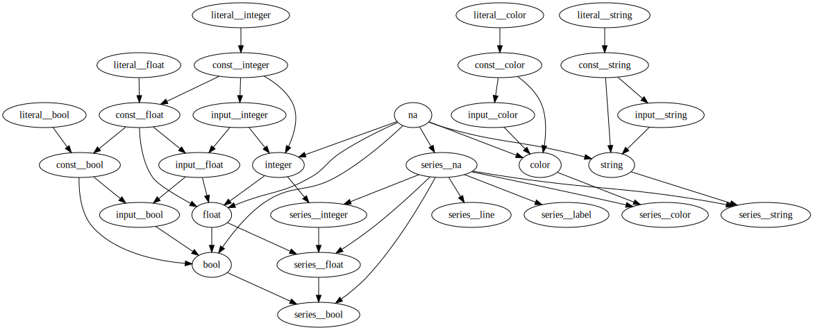

Type system
===========

.. contents:: :local:
    :depth: 2

.. include:: <isonum.txt>

Pine has 7 fundamental data types. They are: 
*float*, *int*, *bool*, *color*, *string*, *line*, *label*. 
All of these types exist in several modified forms. There are 5 forms of types:
*literal*, *const*, *input*, *simple* and a *series*. For example, Pine compiler distincts 
a *literal bool* type, an *input bool* type, a *series bool* type and so on.

There is also a *void* type, a *na* (not available) value and a compound *tuple* type.

Type forms
----------

Literal
^^^^^^^

A *literal* is a special notation for representing a fixed value in source code. This fixed value itself is an 
expression and such expressions have literal form of a corresponding type. In Pine there are only 4 literal types:
    
    * *literal float* (e.g. ``3.14``)
    * *literal int* (e.g. ``42``)
    * *literal bool* (e.g. ``true``, ``false``)
    * *literal string* (e.g. ``"A text literal"``)

.. note:: In Pine well-known built-in names ``open``, ``high``, ``low``, ``close``, ``volume``, ``time``, 
    ``hl2``, ``hlc3``, ``ohlc4`` that represent market prices are not literals. They have a *series* type, read below.

Const
^^^^^

Values of *const* type are the ones that
    
    * do not change during the script execution
    * their value is known (or can be calculated by compiler) at compile time

For example::
    
    c1 = 0
    c2 = c1 + 1
    c3 = c1 + 1
    if open > close
        c3 := 0

Type of ``c1`` value is *const float* because it is initialized with *literal* expression.
Type of ``c2`` value is *const float* too, because it is initialized with an arithmetic expression of *const float* type.
Type of ``c3`` value is *series float* because it changes in runtime.

Input
^^^^^

Values of *input* type are the ones that

    * do not change during the script execution
    * unknown at script compile time
    * they are values that come from `input <https://www.tradingview.com/study-script-reference/v4/#fun_input>`__ function

For example::

    p = input(10, title="Period")

Type of ``p`` variable is *input integer*. 

Simple
^^^^^^

Values of *simple* type are the ones that

    * do not change during the script execution
    * unknown at script compile time

They are values that come from the main chart symbol information. For example, `syminfo.mintick <https://www.tradingview.com/study-script-reference/v4/#var_syminfo{dot}mintick>`__
built-in variable has type *float* (we don't call it *simple float*, just *float*).

Series
^^^^^^

Finally, values of *series* type are the ones that

    * change during the script execution
    * every series variable stores a sequence of values that are associated with bars of main chart symbol
    * history values (associated with closed bars) of a series variable are available for reading (with the ``[]`` operator)
    * only the last (associated with the current bar) series value is available for both reading and writing

*series* data type is probably the most common data type in Pine.
Examples of built-in series variables are: ``open``, ``high``, ``low``,
``close``, ``volume`` and ``time``. The size of these lists are equal to the
quantity of available bars based on the current ticker and timeframe
(resolution). The series may contain numbers or a special value ``na``
(meaning that value is *not available*, further information about ``na`` values
can be found :ref:`here <history_referencing_operator>`). 
Any expression that contains a series variable will be treated as a
series itself. For example::

    a = open + close // addition of two series
    b = high / 2     // division of a series variable
                     // to the integer literal constant (b will be a
                     // series)
    c = close[1]     // Referring to the previous ``close`` value

.. note:: The operator ``[]`` also returns a value of a series type.

Fundamental types
-----------------

int
^^^

Integral-valued literals can be presented only in the decimal system.
For example::

    1
    750
    94572
    100

There are all 5 forms of int type in Pine:

    * *literal int*
    * *const int*
    * *input int*
    * *int* 
    * *series int*

float
^^^^^

Floating-point literals in comparison with integral-valued literals contain a
delimiter (the symbol ``.``) and/or the symbol ``e`` (which means
"multiply by 10 to the power of X", where X is the number after the
symbol ``e``) or both. Examples::

    3.14159    // 3.14159
    6.02e23    // 6.02 * 10^23
    1.6e-19    // 1.6 * 10^-19
    3.0        // 3.0

The first number is the rounded number Pi (π), the second number is very
large, while the third is very small. The fourth number is simply the
number ``3`` as a floating point number.

.. note:: It's possible to use uppercase ``E`` instead of lowercase ``e``.

There are all 5 forms of float type in Pine:

    * *literal float*
    * *const float*
    * *input float*
    * *float* 
    * *series float*

bool
^^^^

There are only two literals for representing logical values::

    true    // true value
    false   // false value

There are all 5 forms of bool type in Pine:

    * *literal bool*
    * *const bool*
    * *input bool*
    * *bool* 
    * *series bool*

color
^^^^^

Color literals have the following format: ``#`` followed by 6 or 8
hexadecimal digits matching RGB or RGBA value. The first two digits
determine the value for the **red** color component, the second two --- for
**green**, and the third pair --- the value for the **blue** component. 
Each component value is a hexadecimal number between ``00`` and ``FF`` (0 and 255 in decimal).

Fourth pair of digits is optional. When set, it specifies the **alpha** (opacity) 
component which value is also between ``00`` (fully transparent) and ``FF`` (fully opaque).
Examples::

    #000000                // black color
    #FF0000                // red color
    #00FF00                // green color
    #0000FF                // blue color
    #FFFFFF                // white color
    #808080                // gray color
    #3ff7a0                // some custom color
    #FF000080              // 50% transparent red color
    #FF0000FF              // same as #00FF00, fully opaque red color
    #FF000000              // completely transparent color

.. note:: When using hexadecimal figures it's possible to use them in
   either upper or lowercase.

There are all 5 forms of color type in Pine:

    * *literal color*
    * *const color*
    * *input color*
    * *color*
    * *series color*

One might wonder how to get a value of type *input color* if there is no color 
`input <https://www.tradingview.com/study-script-reference/v4/#fun_input>`__ in Pine. The answer is, 
with an arithmetic expression with other input types and color literals/constants. For example::

   b = input(true, "Use red color")
   c = b ? color.red : #000000  // c has color input type

There is an arithmetic expression with Pine ternary operator ``?:`` which involves
three different types: ``b`` of type *input bool*, ``color.red`` of type *const color* and ``#000000`` of 
type *literal color*. Pine compiler takes into account two things: Pine automatic type casting rules (see below), 
and available overloads of operator ``?:``. Thus the resulting type is the most narrow type that could be 
auto casted to and this is *input color* type.

Apart from configuring a color value directly with a literal (in hexadecimal format), 
in the language there are more convenient, built-in variables of the type *color*. For
basic colors there are: ``color.black``, ``color.silver``, ``color.gray``, ``color.white``,
``color.maroon``, ``color.red``, ``color.purple``, ``color.fuchsia``, ``color.green``, ``color.lime``,
``color.olive``, ``color.yellow``, ``color.navy``, ``color.blue``, ``color.teal``, ``color.aqua``,
``color.orange``. 

It is possible to change transparency of the color using
built-in function
`color.new <https://www.tradingview.com/study-script-reference/v4/#fun_color{dot}new>`__.

Here is an example of ``color.new`` usage::

    //@version=4
    study(title="Shading the chart's background", overlay=true)
    c = color.navy
    bgColor = (dayofweek == dayofweek.monday) ? color.new(c, 50) :
    (dayofweek == dayofweek.tuesday) ? color.new(c, 60) :
    (dayofweek == dayofweek.wednesday) ? color.new(c, 70) :
    (dayofweek == dayofweek.thursday) ? color.new(c, 80) :
    (dayofweek == dayofweek.friday) ? color.new(c, 90) :
    color.new(color.blue, 80)
    bgcolor(color=bgColor)

string
^^^^^^

String literals may be enclosed by single or double quotation marks, for
example::

    "This is a double quoted string literal"
    'This is a single quoted string literal'

Single or double quotation marks are completely the same --- you may use
what you prefer. The line that was written with double quotation marks
may contain a single quotation mark, just as a line that is written with
single quotation marks may contain double quotation marks::

    "It's an example"
    'The "Star" indicator'

If a user needs to put either double quotation marks in a line that is
enclosed by double quotation marks (or put single quotation marks in a
line that is enclosed by single quotation marks,) then they must be
preceded with backslash. For example::

    'It\'s an example'
    "The \"Star\" indicator"

There are all 5 forms of string type in Pine:

    * *literal string*
    * *const string*
    * *input string*
    * *string*
    * *series string*

line and label
^^^^^^^^^^^^^^

New drawing objects were introduced in Pine v4. These objects could be created with 
`line.new <https://www.tradingview.com/study-script-reference/v4/#fun_line{dot}new>`__ 
and `label.new <https://www.tradingview.com/study-script-reference/v4/#fun_label{dot}new>`__ 
functions. Their types are  *series line* and *series label* correspondingly.
There is only one series form of drawing types in Pine.

plot and hline
^^^^^^^^^^^^^^

A few function annotations (in particular ``plot`` and ``hline``) return
values which represent objects created on the chart. The function
``plot`` returns an object of the type *plot*, represented as a line
or diagram on the chart. The function ``hline`` returns an object of the
type *hline*, represented as a horizontal line. These objects can be
passed to the `fill <https://www.tradingview.com/study-script-reference/v4/#fun_fill>`__ 
function to color the area in between them.

void
----

There is a *void* type in Pine Script. All the functions and annotation functions with *side effect* 
return void result. For example a 
`strategy.entry <https://www.tradingview.com/study-script-reference/v4/#fun_strategy{dot}entry>`__,
`plotshape <https://www.tradingview.com/study-script-reference/v4/#fun_plotshape>`__ etc.

Void result from function means that it cannot be used in any arithmetic expression or to be assigned to a variable.

na value
--------

In Pine there is a special built-in variable ``na``, which is an acronym for *not available*.
Such a value means that an expression or a variable has actually no value (or value is not avaiable). This is very similar
to ``null`` value in Java or ``None`` in Python.

There are a few things to know about ``na`` values. First, ``na`` value could be automatically casted to almost any type.

Second, in some cases Pine compiler cannot automatically infer type for ``na`` value, because more that one automatic type cast rules 
could be applied. For example::
    
    myVar = na // Compilation error!

Compiler cannot guess, would ``myVar`` be used to plot something, e.g. ``plot(myVar)`` (and thus it's type is *series float*), or to set some text
``label.set_text(lb, text=myVar)`` (meaning that it's type is *series string*) and so on. 
Such cases could be resolved in a two equivalent ways::
    
    float myVar = na

or::
    
    myVar = float(na)

Third, to test if some value is *not available* or not, a special function `na <https://www.tradingview.com/study-script-reference/v4/#fun_na>`__ should be used. Do not use operator ``==`` against ``na`` value.
This is not guaranteed to work.

Tuples
------

In Pine Script there is a limited support for tuple types. A tuple is a immutable sequence of values that could be returned as a function call result.
For example::

    calcSumAndMul(a, b) =>
        sum = a + b
        mul = a * b
        [sum, mul]

In this example there is a 2-tuple on the last statement of function ``calcSumAndMul``. Tuple elements could be of an arbitrary type. 
There is also a special syntax for calling functions that return tuples. For example ``calcSumAndMul`` could be called::

    [s, m] = calcSumAndMul(high, low)

Value of local variable ``sum`` will be written to ``s`` variable of the outer scope. So as ``mul`` value will be written to ``m`` variable.

Type casting
------------

There is an automatic type casting in Pine Script. 
In the following picture an arrow means ability to automatically cast one type to
another:

For example::

    //@version=4
    study("My Script")
    plotshape(series=close)

Type of ``series`` parameter of ``plotshape`` function is *series bool*. But the function is called 
with ``close`` argument which type is *series float*. Types do not match, but there is
an automatic type cast rule *series float* |rarr| *series bool* (see the diagram) which does the conversion.

Sometimes there is no type conversion *X* |rarr| *Y*. That is why in Pine (since version 4) there are 
functions for explicit type casting. They are:
    
    * `int <https://www.tradingview.com/study-script-reference/v4/#fun_int>`__
    * `float <https://www.tradingview.com/study-script-reference/v4/#fun_float>`__
    * `string <https://www.tradingview.com/study-script-reference/v4/#fun_string>`__
    * `bool <https://www.tradingview.com/study-script-reference/v4/#fun_bool>`__
    * `color <https://www.tradingview.com/study-script-reference/v4/#fun_color>`__
    * `line <https://www.tradingview.com/study-script-reference/v4/#fun_line>`__
    * `label <https://www.tradingview.com/study-script-reference/v4/#fun_label>`__

Here is an example::

    //@version=4
    study("My Script")
    len = 10.0
    s = sma(close, len) // Compilation error!
    plot(s)
    
This code fails to compile with an error: **Add to Chart operation failed, reason: 
line 4: Cannot call `sma` with arguments (series[float], const float); available overloads: 
sma(series[float], integer) => series[float];**
Compiler says that type of ``len`` variable is *const float* but the ``sma`` function
expected ``integer``. There is no automatic type casting from *const float* to *integer*.
But an explicit type cast function could be used::

    //@version=4
    study("My Script")
    len = 10.0
    s = sma(close, int(len))
    plot(s)
